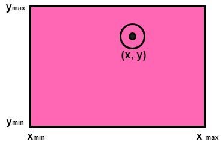
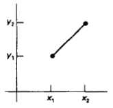
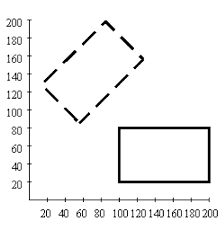
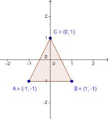
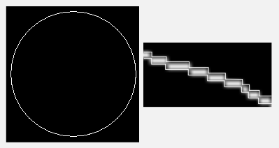
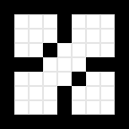
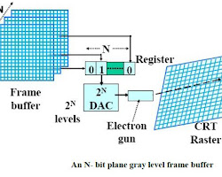

**Main Source : Various source from Google and Youtube**

**Low Level Graphics** refers to the fundamental and hardware-specific operations involved in generating graphics on a computer system. It involves working directly with the graphics hardware or utilizing low-level graphics libraries and APIs to perform basic graphics operations.

### Drawing Primitives

This is the process of rendering basic geometric shapes or elements in computer graphics. These operation are fundamental building blocks that can be combined to create more complex images.

- **Point** : A point is the simplest thing to draw, the only thing we do is changing a pixel color at some coordinates.

    
   Source : https://www.javatpoint.com/computer-graphics-point-clipping

- **Line** : A line need a start and end coordinates, we also need to determine the slope in case if it's not a straight line. To get the slope we can use the standard rise over run formula. After that, we will iterate over the pixel starting from the start point to the end point. The iteration is based on the slope and we will color the pixel on iteration.

  We can also set the thickness of a line, we only need to multiply the slope by the thickness factor.

    
   Source : https://www.programc.in/computer-graphics/points-and-lines-in-graphics.html

- **Shape**

  - **Square** : A square can be made from connecting 4 line.

      
    Source : http://what-when-how.com/introduction-to-computer-graphics-using-java-2d-and-3d/basic-principles-of-two-dimensional-graphics-introduction-to-computer-graphics-using-java-2d-and-3d-part-3/

  - **Triangle** : A triangle can also be made from connecting 3 line.

      
    Source : https://cglearn.codelight.eu/pub/computer-graphics/geometry-and-transformations-i

  - **Circle** : Commonly used algorithm to draw a circle is the Midpoint Circle Algorithm. A circle need a center point and radius. We will start drawing the bound outside the circle. The circle is divided by 8 and we will iterate over a small change in x and y coordinate, this can be thought as making a stair.

      
    Source : https://www.geeksforgeeks.org/draw-circle-c-graphics/

  - **Filled Shape** : A filled shape has a color inside it. To do this, we can draw the shape first, after that we will iterate over while also changing the pixel color in the region inside the shape.

    A simple algorithm to fill a shape is the flood fill. It begins changing pixel color at a point. The next thing is to check the neighboring pixels (up, down, left, and right). If the neighboring pixel has the same original color, move to that pixel and repeat steps 2 to 4 recursively. This process spreads the fill color throughout the connected region.

      
    Source : https://en.wikipedia.org/wiki/Flood_fill

### Framebuffer Manipulation

A buffer is a block of memory thats temporilaly holds data. In graphics, buffer is used to store graphics information such as coordinates and pixel color. Changing a graphics involve modifying the buffer, for example changing a pixe color involves calculating the memory addresses corresponding to the desired pixel positions and writing the appropriate color values to those addresses.

  
Source : https://ecomputernotes.com/computer-graphics/basic-of-computer-graphics/what-is-frame-buffer
