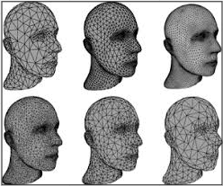

# Surfaces

**Main Source:**

- [**Intro to Graphics 11 — Surfaces**](https://youtu.be/EM73mJwfwLw)
- [**Intro to Graphics 12 — Triangular Meshes**](https://youtu.be/HV2dKIQcp6k)

**Surfaces** is outermost layer of a 3D object that is visible to the viewer. It is the part of the object that interacts with light and is therefore responsible for determining its appearance.

Surface are represented in some ways such as:

- Implicit Surfaces
- Meshes
- NURBS (Non-Uniform Rational B-Splines) Mesh
- Bezier Patches

### Implicit Surfaces

**Implicit surfaces**, which is mathematical representation of a surface that is defined by an implicit function. Implicit surfaces can have complex and irregular shapes, and are often used to model organic or natural shapes that are difficult to represent using polygons.

Source: [https://en.wikipedia.org/wiki/Implicit_surface](https://en.wikipedia.org/wiki/Implicit_surface)

### Meshes

Meshes are used to define shape, it is a collection of vertices, edges, and faces that define the shape and topology of a 3D object or surface. These vertices together are connected and forming shape, these are called **mesh types,** some of them are:

- Polygon Mesh
- NURBS (Non-Uniform Rational B-Splines) Mesh

### Polygon Mesh

It is made up of a collection of polygons, typically triangles, that are connected by their edges to form a continuous surface. Those polygons are typically modeled and defined using specialized software called 3D modeling software.

Each vertices has attribute to define their position and typically specified as a set of X, Y, and Z coordinates in 3D space.

  
Source: [https://en.wikipedia.org/wiki/Polygon_mesh](https://en.wikipedia.org/wiki/Polygon_mesh)

Polygonal mesh can have a smoother surface and the technique is called **Subdivision. I**dea behind subdivision is to take a coarse approximation of a surface, and then iteratively refine it to create a smoother and more detailed surface by subdividing the mesh into smaller sub-meshes.

One of the common used algorithm is **Catmull-Clark Subdivision.** It works by dividing each polygon into four smaller polygons, and then smoothing the resulting mesh to create a smoother surface.

  
Source: [https://download.autodesk.com/us/maya/2009help/index.html?url=Subdivision*surfaces_overview_What_are_subdivision_surfaces*.htm,topicNumber=d0e248732](https://download.autodesk.com/us/maya/2009help/index.html?url=Subdivision_surfaces_overview_What_are_subdivision_surfaces_.htm,topicNumber=d0e248732)

### Triangular Meshes

Triangular Meshes are subtype of polygonal mesh which is a triangle. The reason why triangle is used because it is the simplest polygon shape which provides more flexibility. Triangle doesn’t have fixed angle making it easier to define shape such as a distorted shape or other complex shapes.

  
Source: [https://www.graphics.rwth-aachen.de/publication/03149/](https://www.graphics.rwth-aachen.de/publication/03149/)

Triangle are defined using 3 vertices and edges, these vertices describe information such as position and color. Using triangle also provide us a way to represent a point called **Barycentric Coordinates**.

Barycentric Coordinates uses weighted sum of 3 points and we can represent a point by the combination of these 3 points. This way we can use interpolating technique to determine value or attribute of a point inside it.

For example, we determine the color by interpolating between these 3 vertices colors.

  
Source: [https://youtu.be/HV2dKIQcp6k?t=1251](https://youtu.be/HV2dKIQcp6k?t=1251)

  
Source: [https://youtu.be/HV2dKIQcp6k?t=1324](https://youtu.be/HV2dKIQcp6k?t=1324)

### NURBS (Non-Uniform Rational B-Splines) Mesh

A NURBS mesh is a mathematical representation of a surface that uses NURBS curve to represent the mesh. Because it’s defined using curve the main advantages is their ability to represent complex, smooth surfaces with a high degree of accuracy.

  
Source: [https://holocreators.com/blog/what-is-the-difference-between-a-nurbs-model-and-a-polygon-mesh/](https://holocreators.com/blog/what-is-the-difference-between-a-nurbs-model-and-a-polygon-mesh/)

### Bezier Patches

Bezier Patches uses bezier curve to defined surface. The advantage is they can be evaluated efficiently using recursive subdivision. However, Bezier patches can be difficult to edit or manipulate directly, as modifying the control points can result in unexpected changes to the shape of the surface.

  
Source: [https://en.wikipedia.org/wiki/Bézier_surface](https://en.wikipedia.org/wiki/B%C3%A9zier_surface)
