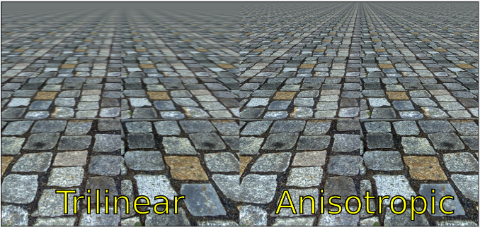

# Textures (Part 1)

**Main Source : [Intro to Graphics 13 - Textures](https://youtu.be/Yjv6hc4Zqjk)**

**Texture** refers to the surface characteristics of an object that are used to create its visual appearance. Texture can be thought of as a pattern or a image that is applied to the surface of a 3D model to create the appearance of different materials or surfaces, such as wood, metal, fabric, or skin.

The smallest unit of information is called pixel, in texture we call this **texel.** The process of accessing a specific texel in a texture map to determine the color or other properties of a surface at a specific point are called **Texture Sampling**.

Textures are typically created as 2D images, and they can be applied to the surface of a 3D model using a process called **texture mapping**. In texture mapping, the coordinate in texture images is called **Texture Space** while the 3D model is caled **Object Space**. Texture also consider object transformation, if the object is transformed (rotated, scaled, or translated), the texture will also be transformed with it.

### Texture Filtering

We have a texture and we want to map it to a point, we take a texel in the texture space and map it to the object. In many cases, the texture coordinates do not align exactly with the texels in the texture map.

  
Source : [https://youtu.be/Yjv6hc4Zqjk?t=1345](https://youtu.be/Yjv6hc4Zqjk?t=1345)

**Texture Filtering** is the process of interpolating between adjacent texels in a texture map to create a smooth appearance when the texture is applied to a 3D object. Texture is not directly mapped but it is just an approximation of the appearance of a surface.

There are some technique to address this issue :

- Nearest Neighbor Filtering
- Bilinear Filtering
- Bicubic Filtering

  
Source : [https://www.researchgate.net/figure/Interpolation-methods-Nearest-neighbour-interpolation-left-assigns-the-value-of-the_fig7_341509407](https://www.researchgate.net/figure/Interpolation-methods-Nearest-neighbour-interpolation-left-assigns-the-value-of-the_fig7_341509407)

### Nearest Neighbor Filtering

With nearest neighbor filtering, the **texel closest to the texture coordinate** is selected and used as the texture color for the pixel. This is easiest and fastest filtering but results in a blocky or pixelated appearance, as the edges between adjacent texels are clearly visible.

### Bilinear Filtering

With bilinear filtering, the **four nearest texels** surrounding the texture coordinate are sampled and their colors are blended together using linear interpolation to produce the final color of the pixel. This method produces a smoother appearance than nearest neighbor filtering.

  
Source : [https://youtu.be/Yjv6hc4Zqjk?t=1457](https://youtu.be/Yjv6hc4Zqjk?t=1457), [https://youtu.be/Yjv6hc4Zqjk?t=1741](https://youtu.be/Yjv6hc4Zqjk?t=1741)

### Bicubic Filtering

With bicubic filtering, a **4x4 matrix of the closest texels** surrounding the texture coordinate is sampled, and the color of the pixel is calculated using a cubic polynomial function that takes into account the colors and positions of the surrounding texels.

  
Source : [https://youtu.be/Yjv6hc4Zqjk?t=2135](https://youtu.be/Yjv6hc4Zqjk?t=2135)

### Texture Flickering

When an object is small, the texels in the texture map become larger relative to the size of the object, making individual texels more visible and causing the collide with other. In other word the texels is too big to fit in to each pixel.

In the image below, the closer texture looks okay, but further away you will see it become noised.

  
Source : [https://youtu.be/Yjv6hc4Zqjk?t=2458](https://youtu.be/Yjv6hc4Zqjk?t=2458)
Using bilinear filtering

When we move the camera the texture sampled will change, if texels is larger compared to pixel, the texels mapped can change color frequenly making it looks like flickering or shimmering.

The solution for this would to take more texel color into consideration and interpolate them.

  
Source : [https://youtu.be/Yjv6hc4Zqjk?t=2664](https://youtu.be/Yjv6hc4Zqjk?t=2664)

### Mipmapping

Another way to solve texture flicker issue is to use mipmapping. It’s a technique to make a lower resolution texture which are precomputed from texture maps. The texture are progressively smaller versions of the texture map and is called **mipmap level** which are usually halved from the previous.

The graphics hardware selects the appropriate level from the mipmap pyramid based on the distance between the object and the camera.

  
Source : [https://youtu.be/Yjv6hc4Zqjk?t=2974](https://youtu.be/Yjv6hc4Zqjk?t=2974)

  
Source : [https://en.wikipedia.org/wiki/Mipmap](https://en.wikipedia.org/wiki/Mipmap)

### Trilinear Filtering

Sometimes the mipmap level can be too high or too low, so if we use bilinear filter in each texture, an another linear interpolation is done between them creating a new texture filter called **Trilinear Filter**.

  
Source : [https://youtu.be/Yjv6hc4Zqjk?t=3340](https://youtu.be/Yjv6hc4Zqjk?t=3340)

### Anisotropic Filtering

While filtering texture for surfaces that are viewed at oblique angles, such as the surface of a road or a tiled floor, we may oversampled the required texture. This makes further away textuers appear to be blurry.

Anisotropic Filtering instead try to only sample the required texture by making a more smaller texel which improve the approximation.

  
Source : [https://youtu.be/Yjv6hc4Zqjk?t=3526](https://youtu.be/Yjv6hc4Zqjk?t=3526)

  
Source : [https://en.wikipedia.org/wiki/Anisotropic_filtering](https://en.wikipedia.org/wiki/Anisotropic_filtering)

### Texture Tiling

Texture may have limited amount of texels that it doesn’t fulfill to map all object surfaces. Texture Tiling is the process of making texture sufficient for mapping to object. Some texture tiling method include :

- **Repeat** : Texture is repeated seamlessly in both directions when the texture coordinates extend beyond the edges of the texture map. This creates a repeating pattern across the surface of the object.
- **Mirrored Repeat** : Same as repeat, but it alternates between mirroring the texture horizontally and vertically each time it repeats.
- **Clamp to Edge** : The texture coordinates are clamped to the edges of the texture map when they extend beyond the boundaries of the texture map. This creates a image color border around the edges of the texture.
- **Clamp to Border** : Same as clamp to edge but instead uses a user-defined solid border color.

  
Source : [https://community.khronos.org/t/how-to-get-gl-clamp-to-border-effect/104085](https://community.khronos.org/t/how-to-get-gl-clamp-to-border-effect/104085)
