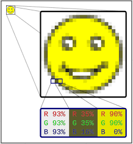
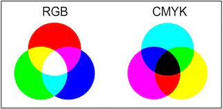

# Computer Images (Part 1)

**Main Source : [Intro to Graphics 03 - Raster Images (Part 1)](https://youtu.be/zllIPDaiOyk)**

In computer, images are usually represented with :

- **Raster Images**, also known as a bitmap image, is a type of digital image that is made up of a grid of pixels, where each pixel stores information about the color and brightness of that point in the image. The number of pixels in the image, both horizontally and vertically is called resolution.
- **Vector Images**, is a type of digital image that is made up of mathematical equations and geometric primitives, such as points, lines, and curves. Unlike raster images, which are based on a grid of pixels, vector images can be scaled up or down without losing quality, because the image is defined by its mathematical equations and can be redrawn at any size.

    
   Source : [https://en.wikipedia.org/wiki/Raster_graphics](https://en.wikipedia.org/wiki/Raster_graphics)

    
   Source : [https://www.vectorizer.io/](https://www.vectorizer.io/)

### Color

Human eyes is able to receive color and the 3 primary color are **Red, Green, Blue (RGB)**. Other color can be represented using additive color mixing from these 3 colors.

Computer represent color using **binary digit (bits)**, the most common method is to represent it in RGB format, these color separated is called **color channel.** The number of bits used for each channel determines the number of possible color values that can be represented.
For example, an 8-bit color channel can represent 256 different shades of that color, ranging from 0 (black) to 255 (white).

There are other color models used in computer graphics and imaging, such as **CMYK (Cyan, Magenta, Yellow, Black)** and **HSL (Hue, Saturation, Lightness)**.

  
Source : [https://expertphotography.com/photoshop-channels/](https://expertphotography.com/photoshop-channels/)

### Computer Display

Computer display produces color by emitting light through tiny pixels on the screen. Each pixel on the screen is made up of three sub-pixels, which emit red, green, and blue light respectively.

There are 2 different type of monitor based on different levels of brightness and color depth :

- **LDR (Low Dynamic Range)**, which typically have a brightness range of 100 to 300 bits and a color depth of 8 bits per channel (24-bit color).
- **HDR (High Dynamic Range)**, HDR monitors typically have a brightness range of 400 to 1000 bits or higher, and a color depth of 10 bits per channel (30-bit color) or higher.
