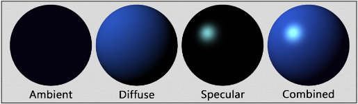
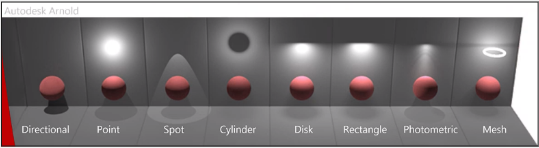
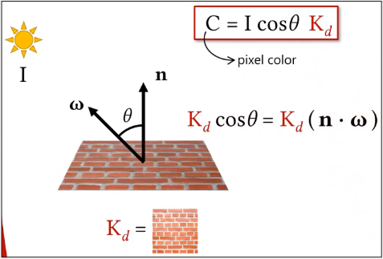
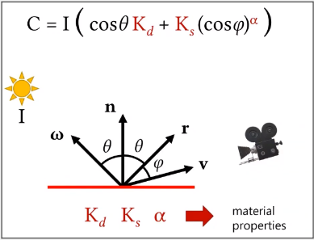
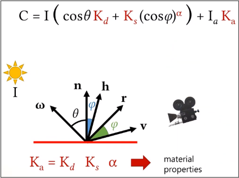
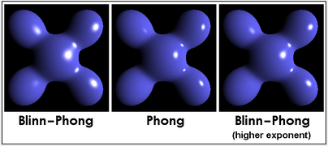
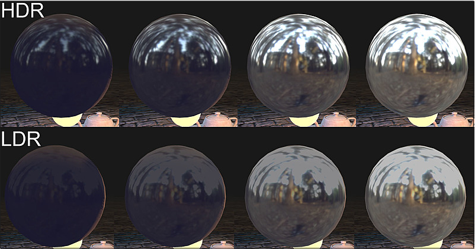

# Shading (Part 1)

**Main Source : [Intro to Graphics 15 - Shading](https://youtu.be/Xg6KEmhqHCY)**

**Shading** is the process of determining the color and brightness of each pixel in a digital image based on the illumination and surface properties of objects in a virtual scene. Shading simulate the behavior of light as it interacts with the surfaces of objects in the scene, taking into account the direction, intensity, and color of light sources as well as the reflectivity, transparency, and other surface properties of objects.

### Light

The basic principle behind light calculations is that light interacts with objects in the scene and is either absorbed, reflected, or refracted by those objects, depending on the 
properties of the object's surface and the characteristics of the light.

There are also some component we use to describe the appearance of objects under different lighting conditions, which is called **Light Reflectance**. 

Three commonly used are :

- **Ambient**, how light is scattered and reflected by surfaces in the scene such as wall.
- **Diffuse**, light scatters and reflects in all directions when it hits the surface of the material, resulting in matte appreance.
- **Specular**, how light reflects in a single direction when it hits the surface of the material. This component is responsible for the glossy highlights and reflections that are seen on many materials, such as metal or glass.

  
Source : [https://clara.io/learn/user-guide/lighting_shading/materials/material_types/webgl_materials](https://clara.io/learn/user-guide/lighting_shading/materials/material_types/webgl_materials)

Light source also have different types such as :

- **Directional**, emits light in a specific direction.
- **Point**, emits light from a single point in all directions.
- **Spot**, emits light in a specific direction and within a cone-shaped area.
- **Cylinder**, emits light from a cylindrical shape.
- **Disk**, emits light from a disk-shaped surface.
- **Rectangle**, emits light from a rectangular-shaped surface.
- **Photometric**, light source that is based on real-world light measurements, such as the luminous intensity of a light bulb or the color temperature of a light source.
- **Mesh**, light source that is attached to a 3D object and emits light from its surface.

  
Source : [https://youtu.be/Xg6KEmhqHCY?t=3267](https://youtu.be/Xg6KEmhqHCY?t=3267)

Representation of the way light interacts with the surface of an object is called **Material Model**.

Some common material models are :

- Lambertian Material
- Phong Model
- Blinn-Phong Model

### Lambertian Material

The Lambertian model assumes that **light is reflected equally in all directions** from a 
surface, regardless of the angle of incidence or the direction of the light source. 

This means that the amount of light reflected from a surface is proportional to the cosine of the angle between the surface normal and the direction of the light source. 

The reflected light is scattered evenly in all directions, resulting in a **diffuse, a matte appearance, with no glossy highlights or reflections**.

  
Source : [https://youtu.be/Xg6KEmhqHCY?t=1065](https://youtu.be/Xg6KEmhqHCY?t=1065)

- $n$ : The normal line.
- $\omega$ : Omega represents the light direction.
- $K_d$ : Diffuse reflectance coefficient, represents the amount of light that is reflected diffusely from a surface. A material with a high Kd value appears brighter and more reflective than a material with alow Kd value.
- $\theta$ : The angle between light source and light reflected.
- $I$ : The light source intensity.
- $C$ : The resulting pixel color.

### Phong Material Model

Phong material model used both the diffuse and specular components of a material's reflectance. This results a **shiny highlight** that is reflected in a single direction from the surface.

  
Source : [https://youtu.be/Xg6KEmhqHCY?t=1948](https://youtu.be/Xg6KEmhqHCY?t=1948)

- $r$ : The direction light is reflected.
- $v$ : The camera direction.
- $\phi$ : Angle between the reflection vector and the direction of the viewer.
- $K_s$ : The specular reflectance coefficient of the surface, and represents the amount of light that is reflected in a single direction from the surface.
- $\alpha$ : The specular exponent, which controls the size and sharpness of the specular highlights. Higher values of alpha result in smaller and sharper highlights.
- $K_d + K_s$ : The combined diffuse and specular components.

### Blinn-Phong Material Model

Modification of the Phong shading model that improves on the specular component of the model. The specular component of the Blinn-Phong model is based on the Phong reflection model that uses a **halfway vector instead of the reflection vector**.

The improvement comes in from halfway vector which can be calculated more efficiently than the reflection vector because it requires only a single vector addition rather than a vector reflection.

  
Source : [https://youtu.be/Xg6KEmhqHCY?t=2949](https://youtu.be/Xg6KEmhqHCY?t=2949)

- h : Halved direction between light source (ω) and camera (v).

  
Source : [https://en.wikipedia.org/wiki/Blinn–Phong_reflection_model](https://en.wikipedia.org/wiki/Blinn%E2%80%93Phong_reflection_model)

Phong model used exact reflection vector to calculate the specular reflection, which can result in sharper and more focused specular highlights that appear brighter.

Blinn-Phong may appear more blurry or softer appearance for the specular highlights.

### Image Based Lightning

Image-based lighting (IBL) is a lighting technique used to simulate the lighting of a virtual scene using a high dynamic range image or a set of images. 

High dynamic range image (HDRI) is used to capture the lighting information from the real world environment, such as a photograph of a physical location or a rendered image of a virtual environment.

Commonly used in applications such as video games, virtual reality, and architectural visualization

  
Source : [https://developer.playcanvas.com/en/user-manual/graphics/physical-rendering/image-based-lighting/](https://developer.playcanvas.com/en/user-manual/graphics/physical-rendering/image-based-lighting/)