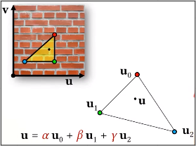
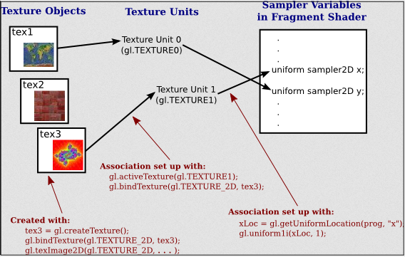
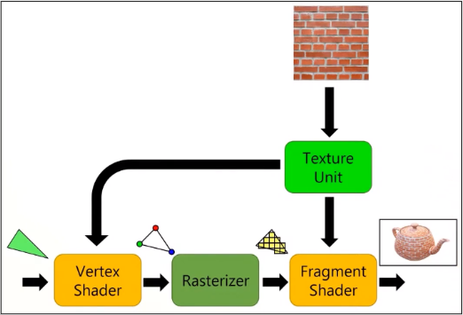

# Textures (Part 2)

**Main Source: [Intro to Graphics 14 — Textures on the GPU](https://youtu.be/WULOKMqEGA0)**

### Texture On GPU

Texture fall into the fragment shader process in the gpu pipeline. In fragment shader, texture are sampled and mapped into the object pixel at particular point. This can be done using barycentric coordinate which interpolate 3 vertices to find the specific point. Fragment shader also calculate other shading information, such as lighting, material properties, and any additional effects or algorithms applied to the scene.

  
Source: [https://youtu.be/Yjv6hc4Zqjk?t=1233](https://youtu.be/Yjv6hc4Zqjk?t=1233)

### Texture Setup

Texture setup is the process by which a texture is loaded into memory on a graphics processing unit (GPU) and prepared for use in rendering. The texture setup process involves several steps, including loading the texture data into memory, setting up the texture parameters, and configuring the texture unit to apply the texture to 3D objects during rendering.

The component responsible for handling texture are called **Texture Unit.** Texture need to be set up and binded into the texture unit. Texture binding process include providing data and parameter to textures.

The data and parameter includes:

- Texture size
- Texture format, such as RGB or RGBA
- Texture filtering mode, what filtering method are used
- Mipmap level
- Texture tiling mode, including repeat, clamp to edge, etc

  
Source: [https://math.hws.edu/graphicsbook/c6/s4.html](https://math.hws.edu/graphicsbook/c6/s4.html)

### Shader Access

After binding the texture, **shaders** which are small programs that run on the GPU and are used to perform various tasks during rendering, such as lighting, shading, and texturing **need to access the texture**.

Texture mapping involves calculating the texture coordinates that are used to look up the corresponding texel in the texture map. This mean texture unit need to access vertex shader which provide information about the coordinates.

  
Source: [https://youtu.be/WULOKMqEGA0?t=2543](https://youtu.be/WULOKMqEGA0?t=2543)
