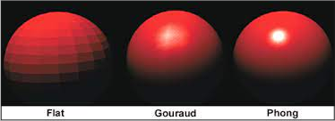
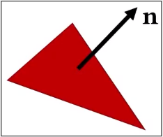
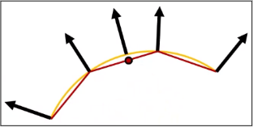
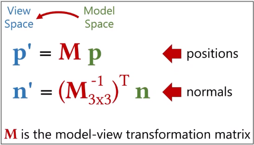

# Shading (Part 2)

**Main Source : [Intro to Graphics 16 - Shading Transformations](https://youtu.be/Q_TYQvZS6WE)**

### Smooth Shading

There are some technique to create a smooth appearance on curved surfaces, by interpolating the surface normals across the surface of the object :

- Flat Shading
- Gouraud Shading
- Phong Shading

  
Source : [https://opengl-notes.readthedocs.io/en/latest/topics/lighting/shading.html](https://opengl-notes.readthedocs.io/en/latest/topics/lighting/shading.html)

Smooth Shading is important for objects with curved surfaces, such as spheres or cylinders, where the faceted appearance of flat shading can be particularly noticeable.

### Flat Shading

**Flat Shading** is a simple and efficient shading technique where each polygon or triangle of the object is assigned a single color, based on the lighting and material properties of the object. After color is calculated, it applies the material properties such as diffuse and specular reflectivity.

Flat shading does not take into account the direction of the surface normals on the object, which can result in a faceted appearance on curved surfaces. This is because **each polygon of the object is treated as a separate flat surface**, and the **shading of each polygon is not blended with the shading of adjacent polygons**.

  
Source : [https://youtu.be/Q_TYQvZS6WE?t=250](https://youtu.be/Q_TYQvZS6WE?t=250)

### Gouraud Shading

In Gouraud Shading, the surface color of **each polygon or triangle of the object is determined at its vertices**, and then interpolated across the surface of the polygon using linear interpolation.

The color at each vertex is calculated based on the lighting and material properties of the object, such as the direction of the light and the surface normal, and can also take into account any textures or material maps that are applied to the surface of the object.

The interpolation of the color across the surface of the polygon creates the illusion of a smooth surface, by **blending the shading of adjacent polygons together**. This technique is more computationally expensive than flat shading, but produces much smoother and more natural results.

  
Source : [https://youtu.be/Q_TYQvZS6WE?t=384](https://youtu.be/Q_TYQvZS6WE?t=384)

### Phong Shading

In Phong shading, the surface color of each pixel of the object is determined using an interpolation of the **vertex normals line**, rather than the surface normals used in Gouraud shading.

The vertex normals are calculated by averaging the surface normals at each vertex of the polygon or triangle, and then interpolated across the surface of the polygon using linear interpolation.

Phong shading may be more computationally expensive than Gouraud shading because it calculates the surface color at each pixel of the object. This results a better lightning than Gouraud shading, especially for objects with high specular highlights or sharp edges.

  
Source : [https://youtu.be/Q_TYQvZS6WE?t=1118](https://youtu.be/Q_TYQvZS6WE?t=1118)

:::tip
In summary, Flat shading assigns a single color to each polygon or triangle of the object while Gouraud calculates the surface color at each vertex of the object using interpolation, this mean Gouraud takes account neighbor polygon.

On the other hand, phong shading uses vertex normals instead of surface normals in Gouraud shading.
:::

### Shading Transformation

**Shading Transformation** is the process of transforming the surface normals of an object from its local coordinate system to a global coordinate system, in order to apply lighting and shading effects correctly.

Some of the coordinate system are :

- **Model Space,** refers to the local coordinate system of the object being rendered. This allows the object to be easily manipulated and transformed, and enables the use of local lighting and shading effects that are based on the object's surface normals.
- **World Space**, refers to a global coordinate system that is fixed in 3D space which also include the other object in the scene. This allows global lighting and shading effects to be applied to the object, such as environmental lighting or reflections.
- **View Space**, camera space or eye space, is a coordinate system that is defined relative to the position and orientation of the camera that is viewing the scene being rendered. View space is used to perform perspective projection, which is the process of projecting a 3D object onto a 2D screen.

  
Source : [https://youtu.be/Q_TYQvZS6WE?t=2011](https://youtu.be/Q_TYQvZS6WE?t=2011)

Shading transformation works by applying a special matrix tranformation which is called **inverse transpose matrix** and is used to account for any non-uniform scaling or shearing transformations that may be present in the model-view matrix.

  
Source : [https://youtu.be/Q_TYQvZS6WE?t=3214](https://youtu.be/Q_TYQvZS6WE?t=3214)
