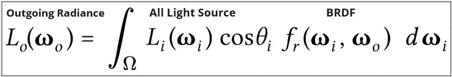
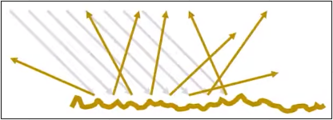
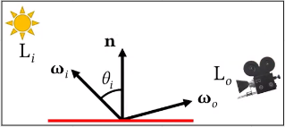
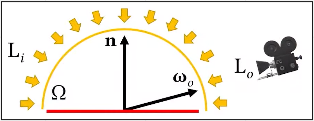
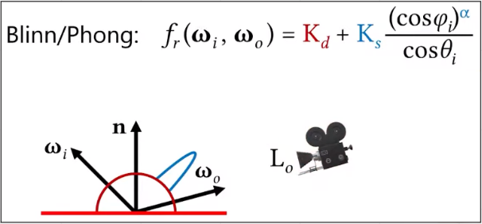

# Rendering (Part 1)

**Main Source : [Intro to Graphics 17 - The Rendering Equation](https://youtu.be/GOfzX7kRwys)**

**Rendering** is the process of generating an image from a 3D scene description, typically through a combination of modeling, texturing, lighting, and shading.

Rendering process at high level include :

1. **Geometry Processing** : The 3D scene is first represented as a collection of geometric primitives, such as triangles or polygons. This step typically involves various preprocessing operations such as mesh smoothing, tessellation, and geometric transformations.
2. **Lighting and Shading** : Once the geometry is processed, the scene is illuminated with virtual light sources and the surfaces of the objects are shaded to produce a realistic
   appearance. This involves calculating the color and intensity of each pixel in the final image based on the position and orientation of the virtual camera, the lighting conditions, and the material properties of the objects.
3. **Rasterization** : The shaded 3D scene is then projected onto a 2D image plane, which involves converting the 3D coordinates of each vertex into 2D screen coordinates. This results in a collection of pixels that represent the final image.
4. **Post-processing** : Finally, the image may undergo post-processing operations such as compositing, filtering, and color correction to further enhance its appearance.

### Rendering Equation

In the step 2, there is an equation that describes how light interacts with surfaces in a 3D scene, it is commonly referred as **The Rendering Equation**.

  
Source : [https://youtu.be/GOfzX7kRwys?t=154](https://youtu.be/GOfzX7kRwys?t=154)

- $L_o(\omega_o)$ : Outgoing radiance at some point in direction \omega_o, which represents the amount of light leaving the surface in that direction.
- $\int_{\Omega} L_i(\omega_i)$ : Incoming radiance at a point on a surface from all light sources in the scene. Also weighted by the cosine of the angle between the surface normal and the incoming light direction.
- $f_r(\omega_i, \omega_o)$ : BRDF function which describes how light is reflected from a surface in direction \omega_i reflected to direction \omega_o.

### BRDF (Bidirectional Reflectance Distribution Function)

An object surface wouldn’t always have the perfect surface. Having a perfect surface meaning light will be reflected in a more predictable way, while a rough surface will scatter the light in many different directions.

  
Source : [https://youtu.be/GOfzX7kRwys?t=595](https://youtu.be/GOfzX7kRwys?t=595)

BRDF describes how light is reflected from a surface in different directions. It takes two vectors as input : the incoming light direction (ωi) and the outgoing light direction (ωo).
The output is a scalar value that represents the **fraction of light** that is reflected in the outgoing direction.

In other words, it describes **how much light is reflected in a particular direction relative to the amount of light that is incident on the surface**.

  
Source : [https://youtu.be/GOfzX7kRwys?t=1587](https://youtu.be/GOfzX7kRwys?t=1587)

Because of the surface structure, light will be reflected in many direction. To take account of all the light reflected, rendering equation uses integral to calculate all the light direction which forming a hemisphere on the surface. The sum of outgoing light should be less than the incoming light.

](./hemipshere-of-light.png)  
Source : [https://youtu.be/GOfzX7kRwys?t=1980](https://youtu.be/GOfzX7kRwys?t=1980)

The rendering equation also takes into account the contribution of all light sources in the scene and this is also calculated using integral.

  
Source : [https://youtu.be/GOfzX7kRwys?t=2656](https://youtu.be/GOfzX7kRwys?t=2656)

### Blinn / Phong Modification

Rendering equation uses BRDF function, there is also the Blinn/Phong material model version for replacing the BRDF function and it uses diffuse specular component.

The Blinn/Phong material model is a simplified version of the BRDF function The that is a good approximation of the BRDF function and it is relatively easy to calculate.

  
Source : [https://youtu.be/GOfzX7kRwys?t=2928](https://youtu.be/GOfzX7kRwys?t=2928)
