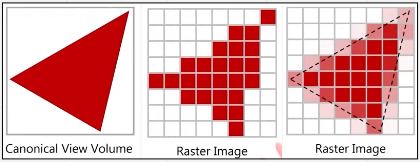
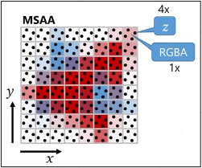
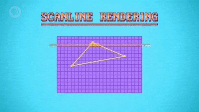
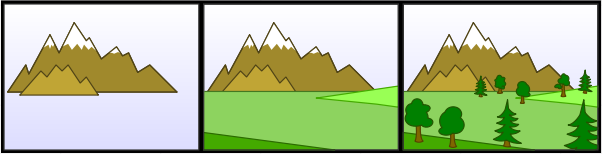
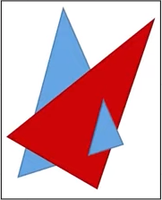
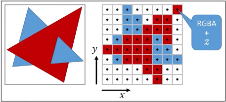
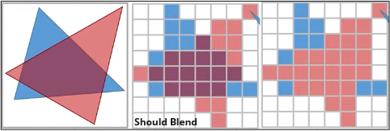
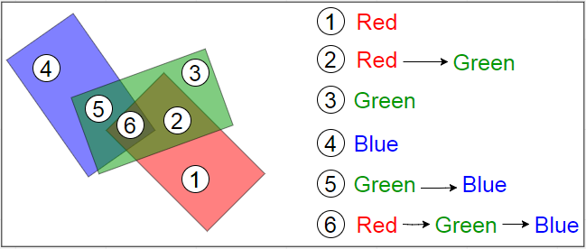
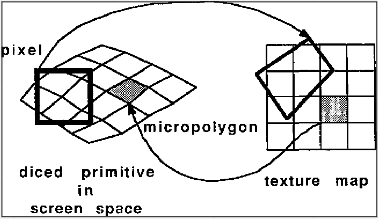

# Rendering (Part 2)

**Main Source : [Intro to Graphics 18 - Rendering Algorithms](https://youtu.be/0WrzyD8nBlk?t=233)**

### Rendering Algorithm

Rendering process which include rasterization, uses several algorithm :

Rasterization :

- Scanline Rendering
- Painter Algorithm
- Z-Buffer Rasterization
- A-Buffer Rasterization
- REYES (Renders Everything You Ever Saw)

### Anti-Aliasing

In rasterization process, 3d object are converted into 2d image with pixel, and then will be colored. In some cases, coloring the pixel directly would make it appear jaggy, this is called **Aliasing**. **Anti-Aliasing** which is the technique to reduce aliasing in digital images, it smoothes out the edges of objects and reducing jaggedness in the image to produce a more visually pleasing result.

  
Source : [https://youtu.be/0WrzyD8nBlk?t=334](https://youtu.be/0WrzyD8nBlk?t=334)

There is also an improvement for Anti-Aliasing (AA) which is **Multi Sample Anti-Aliasing (MSAA)**. MSAA works by sampling multiple points within each pixel, instead of just one, and using the average of the color values at those sample points to generate the final color for the pixel.

  
Source : [https://youtu.be/0WrzyD8nBlk?t=1425](https://youtu.be/0WrzyD8nBlk?t=1425)

### Scanline Rendering

**Scanline Rendering** is a technique used in computer graphics to generate images by processing one horizontal line of pixels, known as a scanline, at a time. It involves determining the intersection points of geometric primitives (such as triangles or polygons) with each scanline and then shading those pixels to produce the final image.

  
Source : https://youtu.be/TEAtmCYYKZA

### Painter Algorithm

The painter's algorithm is a simple algorithm to render object by **drawing the object furthest away to the camera to the closest**.

The algorithm is based on the idea of painting each object in the scene onto an imaginary canvas from back to front, with each object partially or fully obscuring the objects behind it. This mean the object needs to be sorted.

  
Source : [https://en.wikipedia.org/wiki/Painter's_algorithm](https://en.wikipedia.org/wiki/Painter%27s_algorithm)

Painter algorithm draws object one by one from back to front, when objects overlap, the algorithm has to make assumptions about which object is in front of the other based purely on distance. This can lead to incorrect results if the objects are not sorted correctly or if there are ambiguities in the ordering.

  
Source : [https://youtu.be/0WrzyD8nBlk?t=730](https://youtu.be/0WrzyD8nBlk?t=730)

### Z-Buffer Rasterization

Z-buffer algorithm works by **keeping track of the depth value of each pixel** in the image plane during the rasterization process. The depth value represents the distance from the camera to the closest object at that pixel.

The depth value is used to determine which object to draw in front. This algorithm allows for efficient and accurate rendering of 3D scenes, because it allows objects to be rendered in any order and still produce correct results.

  
Source : [https://youtu.be/0WrzyD8nBlk?t=1194](https://youtu.be/0WrzyD8nBlk?t=1194)

There is a problem with Z-buffer algorithm while rendering transparent objects that should blend. If the blue triangle is rendered first and then red after, it will result in the middle image. However, if we do the opposite, rendering red first and blue after, the result wouldn’t blend the color. This is because the depth value of the blue triangle is behind the red hence it’s not drew.

The solution for this is to sort the object from back to front, which require more computation.

  
Source : [https://youtu.be/0WrzyD8nBlk?t=1585](https://youtu.be/0WrzyD8nBlk?t=1585)

### A-Buffer Rasterization

A-buffer rasterization is an extension of the traditional Z-buffer algorithm that uses layers to track each pixel which is stored in linked list. This means A-buffer require more memory than z-buffer and also computationally expensive because the linked lists must be traversed and sorted for each pixel.

  
Source : [https://www.geeksforgeeks.org/a-buffer-method/](https://www.geeksforgeeks.org/a-buffer-method/)

### REYES (Renders Everything You Ever Saw)

REYES is a graphics rendering algorithm that was developed by Pixar in the late 1980s for use in their animated films.

The REYES algorithm works by dividing the scene into small patches, typically 16x16 pixels in size. Each patch is then subdivided into small micropolygons, which are typically 2x2 or 4x4 pixels in size. For each micropolygon, the algorithm computes the shading and other attributes of the object, such as texture mapping and lighting.

  
Source : [https://www.semanticscholar.org/paper/The-Reyes-image-rendering-architecture-Cook-Carpenter/9477daf6e5cfc58d0daa41c893391d1eee8097e8](https://www.semanticscholar.org/paper/The-Reyes-image-rendering-architecture-Cook-Carpenter/9477daf6e5cfc58d0daa41c893391d1eee8097e8)
