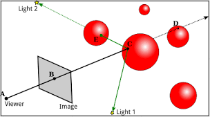
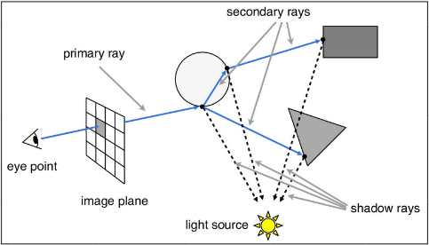
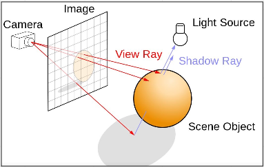
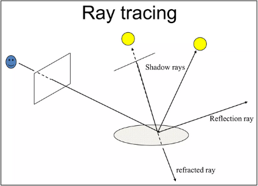
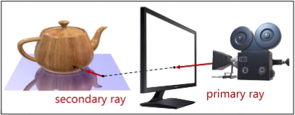
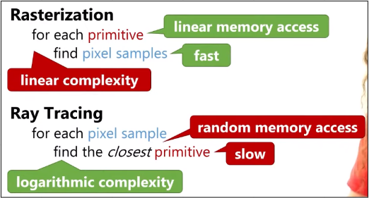
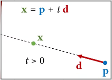
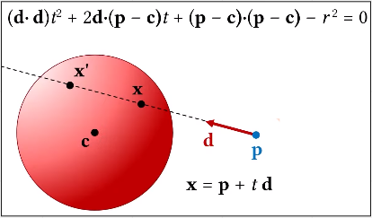
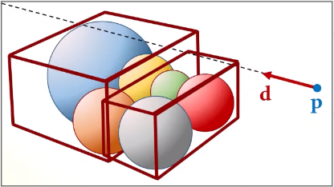
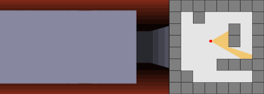

# Ray Tracing

**Main Source :**

- **[Intro to Graphics 18 - Rendering Algorithms](https://youtu.be/0WrzyD8nBlk)**
- **[Intro to Graphics 19 - Ray Tracing](https://youtu.be/gGKup9tUSrU)**

**Ray Tracing** is a technique used in computer graphics to produce highly realistic images by simulating the behavior of light as it interacts with objects in a 3D scene. Ray tracing works by tracing the path of light rays from the camera through each pixel in the image plane and into the scene, where they interact with objects and produce reflections, shadows, and other lighting effects.

  
Source : [https://math.hws.edu/graphicsbook/c8/s1.html](https://math.hws.edu/graphicsbook/c8/s1.html)

Ray tracing **simulates the physical behavior of light**, this means that light is traced everywhere and calculated through each reflection making a very realistic display. Compared to Phong lightning model which is based on simplified mathematical models of how light interacts with surfaces, ray tracing is much more computationally expensive and can require significant processing power to achieve real-time performance.

The reason why light is traced from the camera is to reduce computation. If all light source were to be calculated, then this would be much more computationally expensive than just a light from camera, it could also be overkill because some reflected light may not be seen by the camera.

Ray tracing also consider for **different pixel samples at different positions that will result in different calculations for the rays that are traced**.

Consider a scenario where a reflective surface is struck by a light source. In this case, it is possible for a single light source to give rise to multiple new light sources, and each of these may, in turn, generate further new light sources.

  
Source : [https://cs184.eecs.berkeley.edu/sp19/lecture/9-14/raytracing](https://cs184.eecs.berkeley.edu/sp19/lecture/9-14/raytracing)

In ray tracing, there may be additional rays that are cast from a surface point on an object into the scene to compute the lighting or other effects that result from interactions with other objects or light sources, this is called **Secondary Rays**. It typically include reflection rays, refraction rays, and shadow rays.

- **Reflection Rays** : The rays that are traced from a point on a surface in the scene and directed towards a reflective object.
- **Refraction Rays** : Traced from a point on a surface and directed towards a transparent or translucent object.
- **Shadow Rays** : The rays that will be traced to light source to determine if that particular point should be shadowed or not.

For example, in the image below the red arrow bounced into the light source to check if that point is visible to light. The red arrow at bottom actually doesn’t hit light, so it is shadowed.

  
Source : [https://developer.nvidia.com/discover/ray-tracing](https://developer.nvidia.com/discover/ray-tracing)

  
Source : [https://www.slideshare.net/dieulinh299/ray-tracing](https://www.slideshare.net/dieulinh299/ray-tracing)

  
Source : [https://youtu.be/0WrzyD8nBlk?t=2823](https://youtu.be/0WrzyD8nBlk?t=2823)

Ray tracing can be thought as the opposite of rasterization. In rasterization, we iterate through each object and color the pixel to show it to the camera, this result in linear complexity and will burden if many objects exist in the scene.

While in ray tracing, light comes from the camera and we iterate through the pixel light hit making it a random accessing memory. Ray tracing is a logarithmic algorithm and able to catch up with rasterization at some point.

  
Source : [https://youtu.be/0WrzyD8nBlk?t=3265](https://youtu.be/0WrzyD8nBlk?t=3265)

### Ray

Rays are typically represented as a **line segment** or a vector that originates from a point on the camera or light source and travels through a pixel in the image plane and into the scene.

  
Source : [https://youtu.be/gGKup9tUSrU?t=304](https://youtu.be/gGKup9tUSrU?t=304)

### Ray-Sphere Intersection

This technique is used to model the behavior of light as it interacts with spherical objects in a scene. The sphere formula is used in this model, to solve for the equation we can use quadratic formula.

The possible outcomes of the quadratic roots are :

- If the **discriminant is negative**, there are no real solutions for t, and the **ray does not intersect the sphere**.
- If the **discriminant is zero**, there is one real solution for t, and the ray **intersects the sphere at a single point**.
- If the **discriminant is positive**, there are two real solutions for t, and the r**ay intersects the sphere at two points**. In this case, the intersection point closest to the ray origin is typically chosen as the point of intersection.

  
Source : [https://youtu.be/gGKup9tUSrU?t=969](https://youtu.be/gGKup9tUSrU?t=969)

:::tip
In summary, ray tracing process involves iterating every ray, the ray is tracked until it finds an object, if we found an object, we will check if it intersect and also the closest intersection from the camera. If all of that is true, we start shading the object
:::

### Ray Tracing Accelaration

Ray Tracing Accelaration is a techniques that is used to optimize the ray tracing process and reduce the computational cost of rendering complex scenes with many objects.

One of the common technique is **Axis-aligned bounding boxes (AABB)**, which partition the scene into a hierarchy of bounding volumes. The bounding volume hierarchy (BVH) is constructed by recursively dividing the space containing the scene's objects into two halves, with an AABB enclosing each half.

The improvement come from intersection testing, if the ray does not intersect the box, then it cannot intersect any of the objects inside it, and the ray tracing can be terminated.

  
Source : [https://youtu.be/gGKup9tUSrU?t=2883](https://youtu.be/gGKup9tUSrU?t=2883)

### Ray Casting

There is also a much more lighter version of ray tracing, this is called **Ray Casting**, as it does not account for reflections, shadows, or other complex lighting effects. The only thing ray casting do is just tracing the light from the camera and check if it intersect with an object to determine which objects are visible. Ray casting can also create an illusion of depth or distance, for example a closer wall might be more bright than the further wall.

  
Source : https://id.wikipedia.org/wiki/Raycasting
