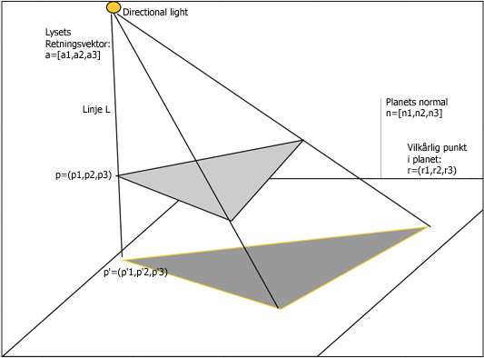
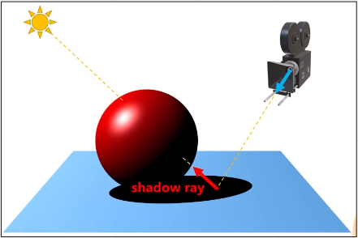
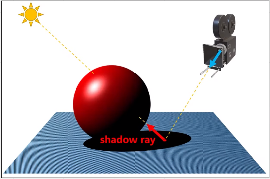
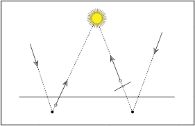
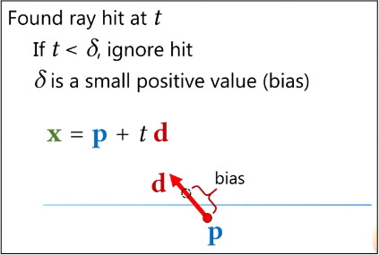
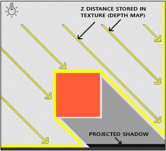

# Shadows

**Main Source: [Intro to Graphics 20 — Shadows & Reflections](https://youtu.be/l_iVdRbA_4s)**

**Shadow** is a dark area where light from a light source is blocked by an object. Shadow exists in a scene when an object blocks or partially blocks the path of a light source, causing an area of darkness to form on a surface behind the object.

When light travels from a source, it travels in straight lines until it encounters an object. If the object is opaque and blocks the path of the light, the area behind the object will be in shadow.

The size, shape, and position of the shadow will depend on the position and shape of the object and the direction and intensity of the light source.

  
Source: [http://www.it.hiof.no/~borres/j3d/explain/shadow/p-shadow.html](http://www.it.hiof.no/~borres/j3d/explain/shadow/p-shadow.html)

### Ray Traced Shadow

**Ray Traced Shadow** is a type of shadow that is created using ray tracing techniques in computer graphics. In the case of ray traced shadows, rays of light are traced from the light source to the observer's eye or camera to the point on the object where the shadow is cast.

  
Source: [https://youtu.be/l_iVdRbA_4s?t=393](https://youtu.be/l_iVdRbA_4s?t=393)

Sometimes shadows may appear incorrect or contain artifacts in some areas of the scene. This is because there is some error in shadow calcuation.

  
Source: [https://youtu.be/l_iVdRbA_4s?t=481](https://youtu.be/l_iVdRbA_4s?t=481)

What happened is when light is traced, the intersection point may not exactly on the surface. It may go inside the surface, this is called **Rounding Errors** which are caused by the limitations of floating-point arithmetic used in computer calculations.

  
Source: [https://www.pbr-book.org/3ed-2018/Shapes/Managing_Rounding_Error](https://www.pbr-book.org/3ed-2018/Shapes/Managing_Rounding_Error)

One of a solution is to use **bias term technique** which involves adding a small offset to the shadow map depth value when determining which areas are in shadow. This offset creates a margin of error that helps to reduce the appearance of shadow artifacts caused by rounding errors.

  
Source: [https://youtu.be/l_iVdRbA_4s?t=1041](https://youtu.be/l_iVdRbA_4s?t=1041)

### Shadow Mapping

Shadow can be generated in rasterization process where colors are determined based on the lighting and shading information in the scene. However, it can be difficult to generate realistic shadows in real-time, particularly in dynamic scenes where the lighting and objects are constantly changing.

**Shadow mapping** is a technique used to handle this, the basic idea behind shadow mapping is to check if the light source can’t hit some point, which mean it is blocked by some object, then shadow will be generated.

To store the information, a depth map which is **two-dimensional image that stores the distance between each pixel in the image and the nearest object in a scene**. This depth map is then used to determine which areas of the scene are in shadow and which are not.

  
Source: [https://learnopengl.com/Advanced-Lighting/Shadows/Shadow-Mapping](https://learnopengl.com/Advanced-Lighting/Shadows/Shadow-Mapping)
