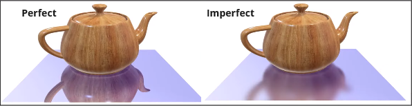
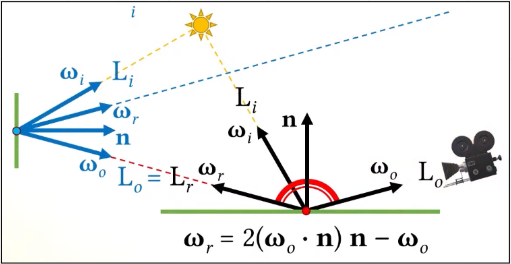
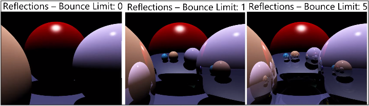
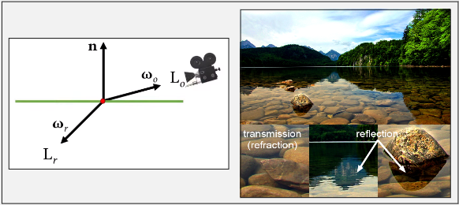

# Reflections

**Main Source : [Intro to Graphics 20 - Shadows & Reflections](https://youtu.be/l_iVdRbA_4s)**

**Reflections** refer to the simulation of the way that light bounces off surfaces and creates a mirrored image of the surrounding environment. Reflections can be seen in everything from mirrors and glass surfaces to water and shiny metal objects.

This mean while rendering, we need to take account not just from light source, but also from light reflected by other objects.

Reflection can occur **perfectly or imperfectly**. Perfect reflections occur when light reflected in smooth and reflective surfaces, such as mirrors or highly polished metal. In reality, material may not always be perfect, so imperfect reflections occur when light reflected in much rougher surface.

  
Source : [https://youtu.be/l_iVdRbA_4s?t=2142](https://youtu.be/l_iVdRbA_4s?t=2142)

Light may be reflected from another perfectly reflective surface. The reflected light may results in a series of reflections that can continue indefinitely, creating a complex web of reflections.

  
Source : [https://youtu.be/l_iVdRbA_4s?t=2933](https://youtu.be/l_iVdRbA_4s?t=2933)

However, we can limit the recursive reflection because each reflection involves a loss of energy, the intensity of the reflected light decreases with each reflection, eventually becoming too dim to be visible.

In the image below, increasing the bounce limit continuously wouldn’t make much difference in the higher limit.

  
Source : https://youtu.be/l_iVdRbA_4s?t=3056

### Refractions

**Refractions** occur when light as it passes through a transparent material, such as glass or water making the light bends or changing direction. Refraction is typically created using a technique called ray tracing or path tracing.

The algorithm computes the angle of incidence of the incoming light ray, and then uses **Snell's law** to calculate the angle of refraction of the outgoing light ray.

  
Source : [https://youtu.be/l_iVdRbA_4s?t=3265](https://youtu.be/l_iVdRbA_4s?t=3265), [https://www.scratchapixel.com/lessons/3d-basic-rendering/introduction-to-shading/reflection-refraction-fresnel.html](https://www.scratchapixel.com/lessons/3d-basic-rendering/introduction-to-shading/reflection-refraction-fresnel.html)
