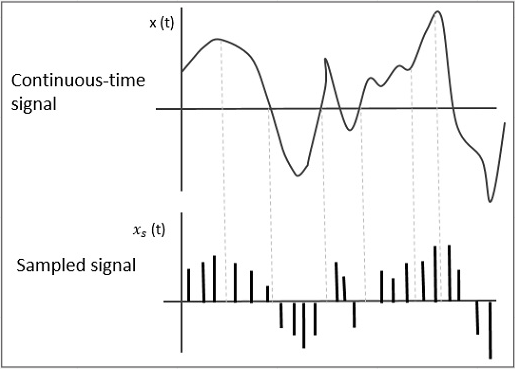
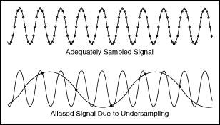
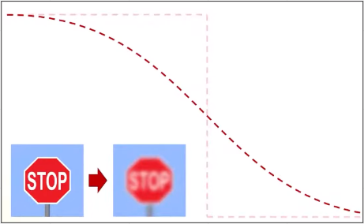
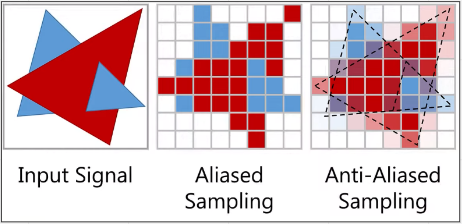
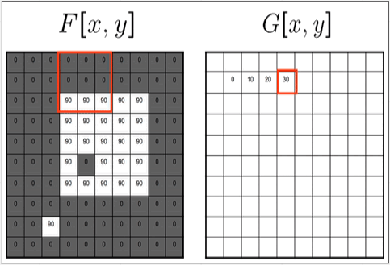
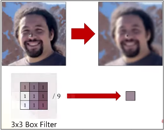
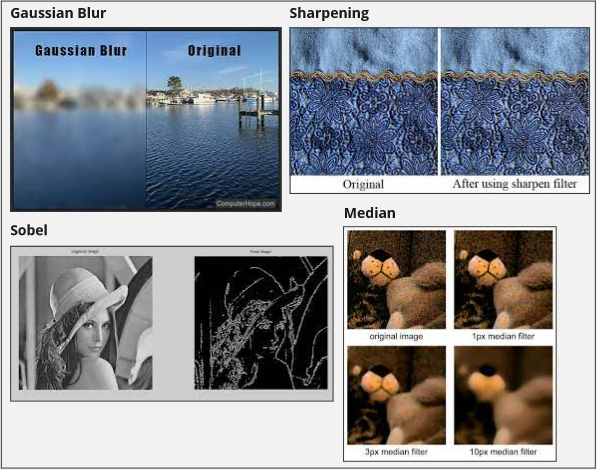

# Signal Processing

**Main Source : [Intro to Graphics 22 - Signal Processing](https://youtu.be/UQl6ttthfXE)**

**Signal Processing** is the process of manipulating and transformation of signals, which are mathematical representations of physical phenomena such as sound, images, and data.

In signal, there are continuous time or infinite amount of information. To be able to process this, signal is **sampled at a specific rate**, the signal can be represented as a discrete sequence of samples, which can be more easily processed and stored.

While sampling, we only take some amount to be the representation of signal, this mean the **sampled signal may be inaccurate** like introducing noise into the signal.

The higher sample results in much better signal but require more bandwidth.

  
Source : [https://www.tutorialspoint.com/digital_communication/digital_communication_sampling.htm](https://www.tutorialspoint.com/digital_communication/digital_communication_sampling.htm)

If the sampling rate is too low, it can result in **aliasing**, which occurs when high-frequency components of the signal are incorrectly represented as lower-frequency components. Aliasing can introduce distortion into the signal and reduce the quality of the sound.

Here, we try to approximate the missing sample but it actually causes undersampling.

  
Source : [https://www.ni.com/docs/en-US/bundle/labview/page/lvanlsconcepts/aliasing.html](https://www.ni.com/docs/en-US/bundle/labview/page/lvanlsconcepts/aliasing.html)

### Smooth Edges

In raster images, the colors between pixels can be thought of as a continuous signal. The color and intensity can change rapidly or has sharp transitions between the pixel often referred as **high-frequency image**. 

To achieve smoother appearance in raster images, we can use signal processing techniques similar to those used for smoothing or filtering signals.

  
Source : [https://youtu.be/UQl6ttthfXE?t=1405](https://youtu.be/UQl6ttthfXE?t=1405)

This is also used in rendering when an object is aliased. The object is treated as a signal and is sampled using an anti-aliasing technique.

  
Source : [https://youtu.be/UQl6ttthfXE?t=1650](https://youtu.be/UQl6ttthfXE?t=1650)

### Image Filters

**Image Filters** are image processing techniques that are used to modify or enhance the appearance of an image. Image filters are typically applied to the pixels of an image in order to achieve a desired effect, such as smoothing, sharpening, or edge detection.

Image filter works by typically taking an nxn sized box of pixel called **filter** and the pixel inside will be transformed depending on the technique used. The transformation used to transform input into output is called **convolution**.

  
Source : [https://ai.stanford.edu/~syyeung/cvweb/tutorial1.html](https://ai.stanford.edu/~syyeung/cvweb/tutorial1.html)

For example, taking a 3x3 box filter of various pixel colors, and then we take the average of those colors resulting in a blurry image.

  
Source : [https://youtu.be/UQl6ttthfXE?t=1779](https://youtu.be/UQl6ttthfXE?t=1779)

There are various image filter technique such as :

- Gaussian Filter, is used for blurring, smoothing, and noise reduction in an image.
- Sobel Filter, used to detect edge.
- Sharpening Filter, enhances contrast between pixels.
- Median Filter, non-linear filter meaning the filter might change depending on the pixel in the image. Used for noise reduction in an image by taking median of neighboring pixels.

  
Source : 
[https://www.computerhope.com/jargon/p/photoshop-gaussian-blur.htm](https://www.computerhope.com/jargon/p/photoshop-gaussian-blur.htm)
[https://medium.datadriveninvestor.com/understanding-edge-detection-sobel-operator-2aada303b900](https://medium.datadriveninvestor.com/understanding-edge-detection-sobel-operator-2aada303b900)
[http://community.photostockplus.com/tag/sharpen-filters/](http://community.photostockplus.com/tag/sharpen-filters/)
[https://en.wikipedia.org/wiki/Median_filter](https://en.wikipedia.org/wiki/Median_filter)