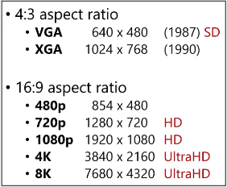

# Computer Animation (Part 1)

**Main Source : [Intro to Graphics 23 - Computer Animation](https://youtu.be/lhK7ZMcW5pU)**

**Animation** refers to the process of creating moving images using a computer. Animation manipulate the digital models and objects to create the illusion of movement. Animators can use a variety of techniques to achieve this, including **keyframing, motion capture, and procedural animation**.

While not all video are computer animations, video also try to create illusion of motion by creating a sequence of still images that are played back in quick succession. It works by capturing a series of individual frames, each representing a small moment in time.

Both animation and video uses image and the more image used will results in smoother, the measurement of how many image is called **frame rate** and typically in **FPS (Frames Per Second)**

  
Source : [https://www.animotica.com/blog/fps-in-video-editing/](https://www.animotica.com/blog/fps-in-video-editing/)

The typical FPS for some display are :

- Television :
    - North America, NTSC (National Television Standards Committee) - 30 FPS
    - Europe, PAL (Phase Alternate Lines) - 25 FPS
- Movies : The standard is 24 FPS, sometimes 48 - 120 FPS
- Computer Monitor : 60 FPS, high-end gaming monitors can support frame rates of 120 FPS or higher.

Computer monitor also have **refresh rate**, which is the measurement of how many times per  second the screen is updated with new image data. It is typically measured in Hertz (Hz), which represents the number of cycles per second.

Common refresh rates for monitors are 60 Hz, 120 Hz, and 144 Hz, although some high-end gaming monitors can support even higher refresh rates, such as 240 Hz or 360 Hz.

  
Source : [https://www.benq.com/en-us/campaign/gaming-projector/resources/gaming-projector-high-refresh-rates.html](https://www.benq.com/en-us/campaign/gaming-projector/resources/gaming-projector-high-refresh-rates.html)

### Video Resolution

This refers to the **number of pixels in an image**, typically measured in terms of width and height. It is often expressed as the total number of pixels in the image, such as 1920x1080 or 4K (3840x2160).

The resolution of a video can have a significant impact on its visual quality, with higher resolutions generally providing sharper and more detailed images. The higher resolution will also require more processing power and storage space, and may not be necessary for all applications.

  
Source : [https://youtu.be/lhK7ZMcW5pU?t=566](https://youtu.be/lhK7ZMcW5pU?t=566)

Low-resolution video can look blurry or pixelated because it does not have enough pixels to represent the details of the image accurately. While high-resolution video has more pixels to represent the details of the image more accurately, which results in a sharper and more detailed image.

  
Source : [https://commons.wikimedia.org/wiki/File:YouTube-resolution-comparison.jpg](https://commons.wikimedia.org/wiki/File:YouTube-resolution-comparison.jpg)

### Video Data

Video contains data related to the digital information that makes up a video file. This can include information about :

- **Resolution :** The number of pixels in image, e.g. 1920x1080 (also known as "1080p").
- **Frame Rate :** Number of individual frames or images that are displayed per second, a video with 60 FPS will be smoother but also stores larger data than a 24 fps video.
- **Color Depth** : Number of colors that can be represented in each pixel of the image. A video with 8-bit color depth can represent up to 256 different colors per pixel, while a video with 10-bit color depth can represent up to 1024 different colors per pixel.
- **Compression** : The process of reducing the amount of data required to store and transmit a video file. Common compression are H.264 and AVC.
- **Actual content such as visual and audio**

### Video Compression

**Video Compression** is essential for efficient storage, transmission, and playback of video content, particularly over networks with limited bandwidth or storage capacity.

Compressing a video may results in losing an information, accuracy, and detail. This is called **lossy compression**, which reduce significant amount of data with some negative drawbacks. 

There is **Lossless Compression** which is a compression technique that reduces the size of a file without losing any information. This make lossless compression reduce the data lesser than the lossy one.

The big idea of how video compression works :

- **Spatial Compression** : Removing unnecessary data which refers to pixels that do not significantly contribute to the visual quality of the image. A pixel that don’t contribute visual quality means that human eye won’t perceive the image accurately. For example, some pixels in an image may be very similar to their neighboring pixels.
- **Temporal Compression** : Removing unnecessary data from frames that do not contain significant changes from previous frames. For example, a video where someone waves their hands but the background doesn’t change at all. Using this compression we can use the previous background frame and only change at frame where the motion occurs.
- **Run-Length Encoding (RLE)** : A lossless compression which involves storing data with the value and the count instead of the full length. For example, consider data with “AAAABBBCCD”, with RLE we can reduce it to "4A3B2C1D” which results in smaller length. However, it’s less effective with data that has less repetition.

  
Source : [https://www.videoconverterfactory.com/tips/h264-to-mp4.html](https://www.videoconverterfactory.com/tips/h264-to-mp4.html)