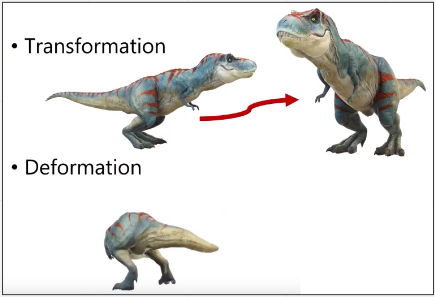
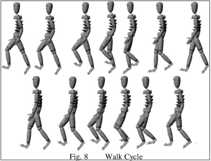
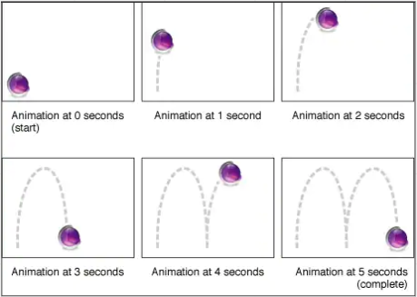
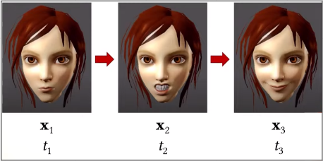
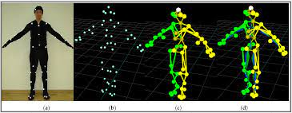

# Computer Animation (Part 2)

**Main Source : [Intro to Graphics 23 - Computer Animation](https://youtu.be/lhK7ZMcW5pU)**

Animation is typically classified into two :

- **Transformation**, process of changing an object or character's position, rotation, scale, or other properties over time.
- **Deformation**, on the other hand, refers to the process of changing the shape or form of an object or character over time.

  
Source : [https://youtu.be/lhK7ZMcW5pU?t=1059](https://youtu.be/lhK7ZMcW5pU?t=1059)

Animation can be represented as :

- Procedural Animation
- Keyframing
- Motion Capture

### Procedural Animation

In Procedural Animation, movements and behaviors of objects or characters are often **determined by algorithms or rules** that are designed to simulate real-world physics or behaviors. In transformating an object, it can use some matrix transformation algorithm.

It could also generate realistic environmental effects like moving water or swaying grass, based on algorithms that simulate the behavior of fluids or plants.

  
Source : [https://www.semanticscholar.org/paper/Procedural-Animation-of-3D-Humanoid-Characters-Bhatti-Ismaili/a00187c3333cfe73ab37b77f81724ae8a3dbe15c/figure/5](https://www.semanticscholar.org/paper/Procedural-Animation-of-3D-Humanoid-Characters-Bhatti-Ismaili/a00187c3333cfe73ab37b77f81724ae8a3dbe15c/figure/5)

### Keyframing

**Keyframing** uses some specific point called **keyframes** that is defined as **starting and ending points of an animation sequence**. Keyframing also involves interpolating to creates smooth animation between the sequence. The smooth transition is often referred as "tweens" or "tweening”.

  
Source : [https://filmora.wondershare.co.id/video-editing-tips/what-is-keyframing.html](https://filmora.wondershare.co.id/video-editing-tips/what-is-keyframing.html)

A keyframing animation that involves transforming one object or shape into another over time is called **Morphing**.

  
Source : [https://youtu.be/lhK7ZMcW5pU?t=1971](https://youtu.be/lhK7ZMcW5pU?t=1971)

### Motion Capture

**Motion Capture** is technique used in animation and film production to generate animation by **capturing the movements of real-life actors or objects** and apply them to digital characters or objects. Motion Capture uses specialized cameras, sensors, or markers to track the movements of a person or object.

  
Source : [https://www.mdpi.com/1424-8220/21/18/6115](https://www.mdpi.com/1424-8220/21/18/6115)
