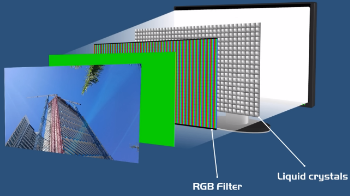
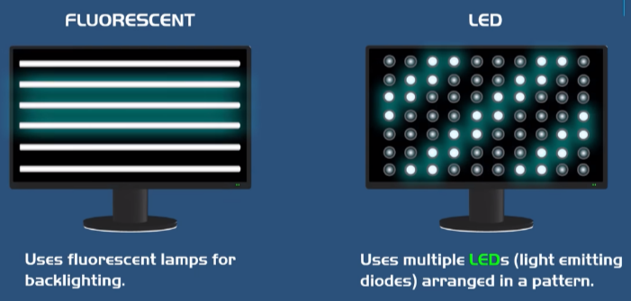
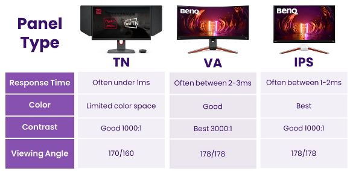
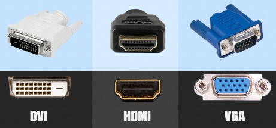
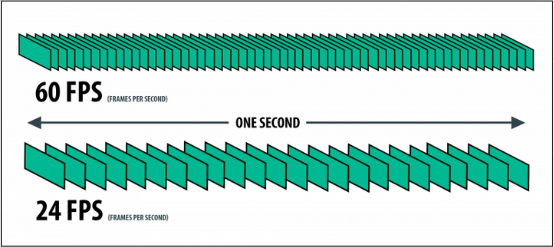
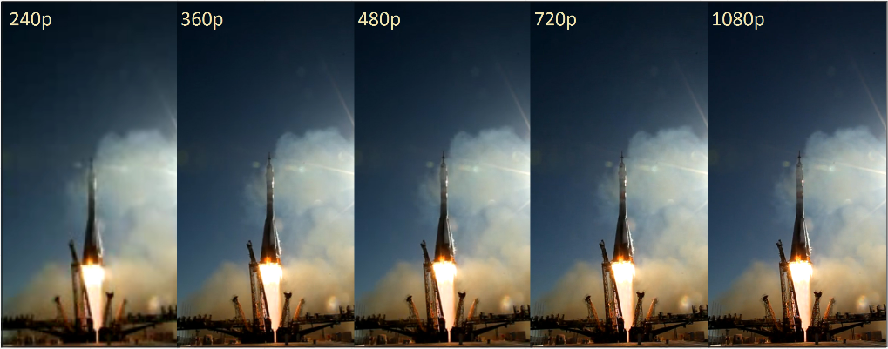

# Computer Display

**Main Source : [Intro to Graphics 23 - Computer Animation](https://youtu.be/lhK7ZMcW5pU)**

Computer generates information, the process of displaying the information is called **Computer Display**, the information generated by computer will be outputted into visual device like monitor or screen.

Computer can generate complex visual like animation and video, computer is able to do this by creating illusion of motion. In fact those motion are created by sequence of image that is displayed and updated bunch of times per seconds.

### Type of Computer Display

**Source : [PowerCert](https://youtu.be/yxygknX1AiE)**

#### Cathode Ray Tube (CRT)

CRT is the oldest monitor display, it uses 3 color electron gun (red, green, blue). The electron gun will rapidly fire to the screen creating a combination of colors. The rate of fire or the re-drawing is called **refresh rate**. For example a refresh rate of 60 Hz means that the display will be re-drawn 60 times per second.

  
Source : https://youtu.be/yxygknX1AiE?t=101

#### Liquid Crystal Display (LCD)

LCD displays is a flat display that consist of a layer of liquid crystal material, in front of that there exists an RGB color filter to produce the different color we need. An LCD monitor needs a light source behind.

  
Source : https://youtu.be/yxygknX1AiE?t=162

#### Light Emitting Diode (LED)

An LED display is a type of LCD display which use light-emitting diodes (LEDs) light as the light source.

  
Source : https://youtu.be/yxygknX1AiE?t=215

#### Flat Panel Types

- **Twisted Nematic (TN)** : TN panels use liquid crystals that twist in response to an applied electric current. TN has a good response time, however, TN panels have limited viewing angles, meaning that color and image quality degrade when viewed from off-center angles.

- **In-Plane Switching (IPS)** : IPS uses liquid crystals that move horizontally between two glass plates. They are arranged in a parallel orientation between the glass plates. IPS offers wider viewing angles compared to TN panels, while also ensuring consistent colors and image quality even when viewed from different angles.

- **Vertical Alignment (VA)** : VA panels use liquid crystals that align vertically between two glass plates. Liquid crystals in VA panels can tilt and align in different angles to control the passage of light.

  
Source : https://www.benq.com/en-us/knowledge-center/knowledge/how-to-choose-between-tn-va-and-ips-panels-for-the-games-you-play.html

### Video Interface

A video interfaaces is used for transferring display signals from a device (such as a CPU or GPU) to a monitor or display. After the CPU and GPU generate graphics, the binary data representing the images or video is sent from the device to the display using one of these interfaces.

**VGA** : VGA is an analog video display interface meaning it can only transfer analog data, it is commonly found on older computers, monitors, and projectors.

**DVI** : DVI is made to succeed the VGA, it has 3 types, DVI-A which only sends analog signal, DVI-D that sends digital signal and DVI-I which is able to send both analog and digital signal.

**HDMI** : HDMI is a popular use nowadays, it transmit high-definition audio, video, and network communication signals in a single cable.

**DisplayPort** : DisplayPort is primarily used for video, however it can also be used for transfering USB data and audio. DisplayPort is able to send display by chaining from monitors to monitors, it is called daisy chaining.

**Thunderbolt** : Thunderbolt is relatively new technology released in 2011. Thunderbolt is used in Apple technologies, it offers high bandwidth and up to 6 daisy chaining.

  
Source : https://www.jagadmedia.id/2020/11/perbedaan-dvi-hdmi-displayport-vga.html

### Display Measurement

Both animation and video uses image and the more image used will results in smoother, the measurement of how many image is called **frame rate** and typically in **FPS (Frames Per Second)**

  
Source : [https://www.animotica.com/blog/fps-in-video-editing/](https://www.animotica.com/blog/fps-in-video-editing/)

The typical FPS for some display are :

- Television :
  - North America, NTSC (National Television Standards Committee) - 30 FPS
  - Europe, PAL (Phase Alternate Lines) - 25 FPS
- Movies : The standard is 24 FPS, sometimes 48 - 120 FPS
- Computer Monitor : 60 FPS, high-end gaming monitors can support frame rates of 120 FPS or higher.

#### Refresh Rate

Computer monitor also have **refresh rate**, which is the measurement of how many times per second the screen is updated with new image data. It is typically measured in Hertz (Hz), which represents the number of cycles per second.

Common refresh rates for monitors are 60 Hz, 120 Hz, and 144 Hz, although some high-end gaming monitors can support even higher refresh rates, such as 240 Hz or 360 Hz.

  
Source : [https://www.benq.com/en-us/campaign/gaming-projector/resources/gaming-projector-high-refresh-rates.html](https://www.benq.com/en-us/campaign/gaming-projector/resources/gaming-projector-high-refresh-rates.html)

### Video Resolution

This refers to the **number of pixels in an image**, typically measured in terms of width and height. It is often expressed as the total number of pixels in the image, such as 1920x1080 or 4K (3840x2160).

The resolution of a video can have a significant impact on its visual quality, with higher resolutions generally providing sharper and more detailed images. The higher resolution will also require more processing power and storage space, and may not be necessary for all applications.

  
Source : [https://youtu.be/lhK7ZMcW5pU?t=566](https://youtu.be/lhK7ZMcW5pU?t=566)

Low-resolution video can look blurry or pixelated because it does not have enough pixels to represent the details of the image accurately. While high-resolution video has more pixels to represent the details of the image more accurately, which results in a sharper and more detailed image.

  
Source : [https://commons.wikimedia.org/wiki/File:YouTube-resolution-comparison.jpg](https://commons.wikimedia.org/wiki/File:YouTube-resolution-comparison.jpg)

### Video Data

Video contains data related to the digital information that makes up a video file. This can include information about :

- **Resolution :** The number of pixels in image, e.g. 1920x1080 (also known as "1080p").
- **Frame Rate :** Number of individual frames or images that are displayed per second, a video with 60 FPS will be smoother but also stores larger data than a 24 fps video.
- **Color Depth** : Number of colors that can be represented in each pixel of the image. A video with 8-bit color depth can represent up to 256 different colors per pixel, while a video with 10-bit color depth can represent up to 1024 different colors per pixel.
- **Compression** : The process of reducing the amount of data required to store and transmit a video file. Common compression are H.264 and AVC.
- **Actual content such as visual and audio**

### Video Compression

**Video Compression** is essential for efficient storage, transmission, and playback of video content, particularly over networks with limited bandwidth or storage capacity.

Compressing a video may results in losing an information, accuracy, and detail. This is called **lossy compression**, which reduce significant amount of data with some negative drawbacks.

There is **Lossless Compression** which is a compression technique that reduces the size of a file without losing any information. This make lossless compression reduce the data lesser than the lossy one.

The big idea of how video compression works :

- **Spatial Compression** : Removing unnecessary data which refers to pixels that do not significantly contribute to the visual quality of the image. A pixel that don’t contribute visual quality means that human eye won’t perceive the image accurately. For example, some pixels in an image may be very similar to their neighboring pixels.
- **Temporal Compression** : Removing unnecessary data from frames that do not contain significant changes from previous frames. For example, a video where someone waves their hands but the background doesn’t change at all. Using this compression we can use the previous background frame and only change at frame where the motion occurs.
- **Run-Length Encoding (RLE)** : A lossless compression which involves storing data with the value and the count instead of the full length. For example, consider data with “AAAABBBCCD”, with RLE we can reduce it to "4A3B2C1D” which results in smaller length. However, it’s less effective with data that has less repetition.

  
Source : [https://www.videoconverterfactory.com/tips/h264-to-mp4.html](https://www.videoconverterfactory.com/tips/h264-to-mp4.html)

:::tip
Find out more about compression in [here](/digital-signal-processing/compression).
:::
