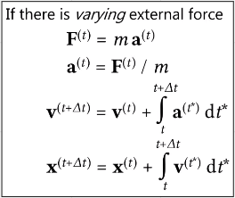
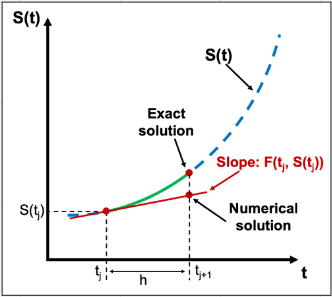
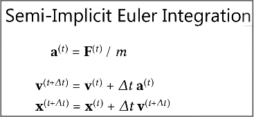
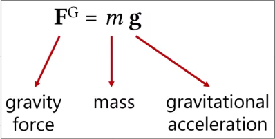
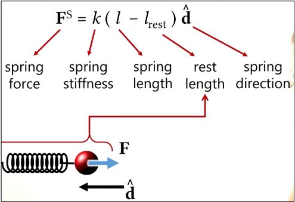
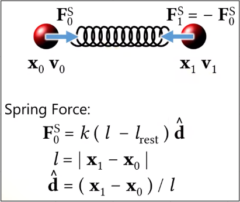
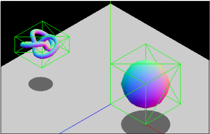
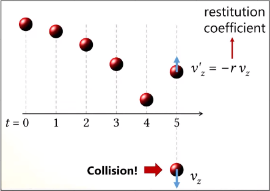

# Physics-Based Animation

**Main Source : [Intro to Graphics 24 - Physics Based Animation](https://youtu.be/F9TP48yXs3s)**

**Physics-Based Animation** in computer graphics involves using the laws of physics to create realistic animations of objects and their movements in a virtual environment. The physics is modeled based on real-world physics models.

Some example of physics animation are :

- **Particle & Fluid Simulation** : Involve simulating the behavior of small particles, such as dust, smoke, or water droplets and liquids and gases, such as water, air, and smoke.
- **Rigid Body** : Behavior of solid objects that maintain their shape, such as cars, buildings, and machinery.
- **Cloth Simulations** : Model the behavior of flexible materials like clothing, curtains, and flags.

An example of physics animation is for moving object which uses Newton law’s. When an external force is applied to an object, it can cause an acceleration in the object's motion. The amount of acceleration that occurs depends on the magnitude and direction of the force, as well as the mass of the object.

This mean we also need to model our object to have their own mass, size, shape and other properties such as friction based on the material.

  
Source : [https://youtu.be/F9TP48yXs3s?t=671](https://youtu.be/F9TP48yXs3s?t=671)

The position of an object at a given time can be represented as a vector, and we can use integrals to calculate the change in position over time. However, solving these integrals analytically can be
difficult or impossible, so numerical integration methods such as **Euler Integration** are often used instead.

### Euler Integration

**Euler Integration** is a numerical method used in physics animation to approximate the motion of objects over time. Euler Integration assumes that the **acceleration of the object remains constant** **over the time step**, and does not take into account any changes in acceleration that may occur. While this sound leading to inaccuracy, it is actually accurate as long as the time step is very small.

  
Source : [https://pythonnumericalmethods.berkeley.edu/notebooks/chapter22.03-The-Euler-Method.html](https://pythonnumericalmethods.berkeley.edu/notebooks/chapter22.03-The-Euler-Method.html)

Euler integration can be divided into three types :

- **Explicit** : It calculates the new position and velocity of an object at each time step based on the
  object's current position, velocity, and acceleration.
- **Implicit** : This is more advanced method that updates the new position and velocity of an object at the end of a time step. To calculate the acceleration, we need to know the force acting on the object. However, to calculate the force, we need to know the velocity or position of the object. This lead to a recursive problem, it will be difficult to calculate, but it will also lead to more accurate results.
- **Semi-Implicit** : In this type, accelaration is calculated explicitly which means it uses the current force and it is available at the current time. By knowing the accelaration, we can calculate the implicit velocity and use it to update the object position.

### Gravity Force

Gravity is also an important force to create a more realistic animation. Gravity force is based on the object affected masses and also the gravitational accelaration. An object affected by gravity force will accelerate towards the gravitational field.

  
Source : [https://youtu.be/F9TP48yXs3s?t=1244](https://youtu.be/F9TP48yXs3s?t=1244)

### Spring Force

**Spring Force** model the behavior of springs for object, it is typically used for bouncing balls, swinging pendulums, and dancing characters.

The spring force is a restoring force, which means that it always acts in the opposite direction of the displacement of the object. This means that if an object is compressed, the spring force will act to expand it, and if an object is stretched, the spring force will act to compress it.

This image below shows the equation for linear spring forces, it’s based on some spring properties.

  
Source : [https://youtu.be/F9TP48yXs3s?t=1340](https://youtu.be/F9TP48yXs3s?t=1340)

There is another type of spring force which is **Spring Damping Force**. This force is used to slow down or stop a motion such as a stopping car. It’s based on the object speed in changing length, meaning a faster object will be affected by more force.

Another type is **mass-spring system**, which is a spring force based on mass of object.

  
Source : [https://youtu.be/F9TP48yXs3s?t=1833](https://youtu.be/F9TP48yXs3s?t=1833)

### Collision

**Collision** is any event in which two or more bodies exert forces on each other in a relatively short time. To know if two object collide with each other, we need to detect it and it’s usually called **collision detection.** Two object is collided if they intersect or overlap.

One of the algorithm to detect is **Bounding Volume Hierarchies (BVH),** This involves making a box around the object and we will know if object collided by checking if the box intersect with each other.

  
Source : [https://developer.mozilla.org/en-US/docs/Games/Techniques/3D_collision_detection](https://developer.mozilla.org/en-US/docs/Games/Techniques/3D_collision_detection)

After object is detected to collide with other object, we can know handle this. For example in a video game, a collision of a falling ball to the ground will bounce it in the opposite direction. In this case, object can have restitution coefficient which measure the bounciness.

  
Source : [https://youtu.be/F9TP48yXs3s?t=2958](https://youtu.be/F9TP48yXs3s?t=2958)
