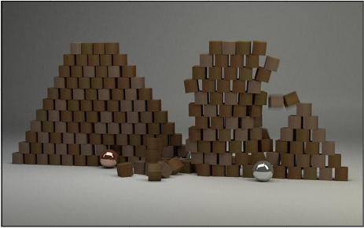
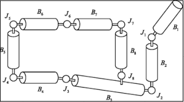
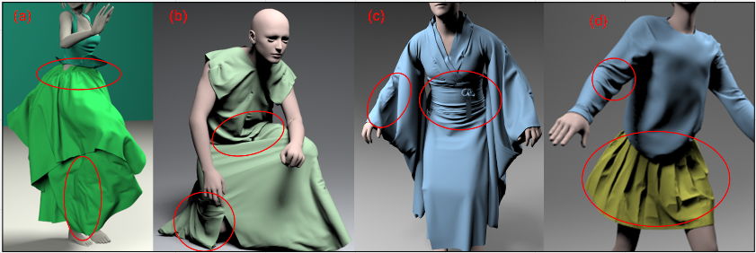
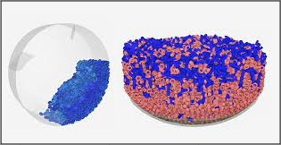
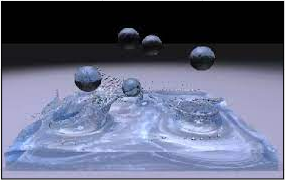
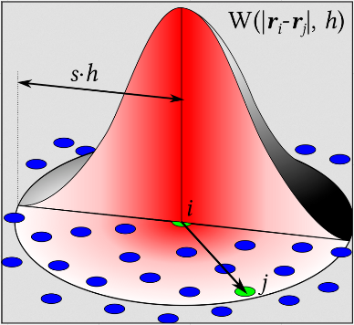
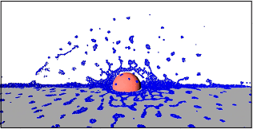

# Simulation

**Main Source: [Intro to Graphics 25 — Simulation in Graphics](https://youtu.be/iZ1e_1tnLgI)**

**Simulation** refers to the use of mathematical models and algorithms to mimic the behavior of physical phenomena or systems, such as the motion of objects, the behavior of fluids, or the interaction of light and materials.

### Rigid Body Simulation

**Rigid Body Simulation** is a type of physics simulation that model the motion and interaction of solid objects that do not deform or change shape during their motion. Examples of rigid bodies include objects such as balls, boxes, or cars.

  
Source: [https://3dtotal.com/tutorials/t/how-to-master-rigid-body-simulation-in-blender-filippo-veniero-object-animation-rigid](https://3dtotal.com/tutorials/t/how-to-master-rigid-body-simulation-in-blender-filippo-veniero-object-animation-rigid)

The motion of a rigid body is governed by Newton's laws of motion, which relate the forces acting on an object to its acceleration. In a rigid body simulation, the forces acting on each rigid body are typically gravity, which pulls the object downwards, and any external forces such as friction or collisions with other objects.

There are also type of rigid body called **Articulated Rigid Body.** In an articulated rigid body simulation, each object is represented as a collection of rigid bodies connected by joints. The joints allow the rigid bodies to move and rotate relative to each other, while maintaining their rigid shape.

Articulated Rigid Body has **degree of freedom** which refers to the number of independent ways in which a joint or rigid body can move.

  
Source: [https://link.springer.com/chapter/10.1007/978-1-4471-4417-5_5](https://link.springer.com/chapter/10.1007/978-1-4471-4417-5_5)

### Cloth Simulation

**Cloth Simulation** is a type of physics simulation that model the behavior of flexible materials, such as cloth, fabric, or soft bodies. Cloth simulation is a complex process which includes:

- **Mesh Modelling**: The cloth is first modeled as a mesh of triangles. Each triangle is made up of three vertices, which are points in space.
- **Properties Modelling**: Physical properties of the cloth are then defined, such as its mass, elasticity, and friction.
- **Calculation**: The cloth is then simulated over time using a physics engine. The
  physics engine calculates the forces acting on each vertex of the mesh, such as gravity, wind, and friction. After that the position and velocity of each vertex of the mesh will be updated.

  
Source: [https://min-tang.github.io/home/PCloth/](https://min-tang.github.io/home/PCloth/)

### Particle-Based Fluid Simulation

**Particle Simulation** involves modeling the motion and interaction of individual particles, such as dust, smoke, or sparks.

The motion of particle is governed Newton's laws of motion and the conservation of momentum. The simulation calculates the new position and velocity of each particle based on the forces acting on it, which include gravity, external forces applied by the user or other objects in the scene, and internal forces such as friction and cohesion.

  
Source: [https://rocky.esss.co/library/presentation-investigate-a-wider-range-of-possibilities-with-particle-dynamics-simulation/](https://rocky.esss.co/library/presentation-investigate-a-wider-range-of-possibilities-with-particle-dynamics-simulation/)

**Fluid simulation**, on the other hand, involves modeling the behavior of fluids such as water, air, or gases.

The motion of the fluid is governed by the Navier-Stokes equations, which describe the conservation of mass, momentum, and energy in a fluid. The simulation calculates the new velocity and pressure of the fluid at each point in space, based on the forces acting on it, which include gravity, external forces applied by the user or other objects in the scene, and internal forces such as viscosity and surface tension.

  
Source: [https://www.semanticscholar.org/paper/Fluid-Simulation-For-Computer-Graphics%3A-A-Tutorial-Braley-Sandu/0b521fdd0b92e00b221012374cbaa70fe163feea](https://www.semanticscholar.org/paper/Fluid-Simulation-For-Computer-Graphics%3A-A-Tutorial-Braley-Sandu/0b521fdd0b92e00b221012374cbaa70fe163feea)

One of the technique used to simulate fluid is **Smoothed particle hydrodynamics (SPH).** This technique uses a grid of particles to represent the fluid. The particles interact with each other and with the boundaries of the fluid domain.

  
Source: [https://en.wikipedia.org/wiki/Smoothed-particle_hydrodynamics](https://en.wikipedia.org/wiki/Smoothed-particle_hydrodynamics)

  
Source: [https://www.kitware.com/sph-fluid-simulation-in-imstk/](https://www.kitware.com/sph-fluid-simulation-in-imstk/)
