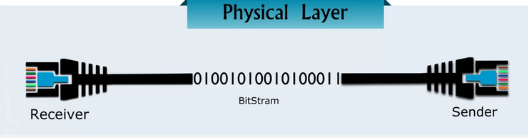
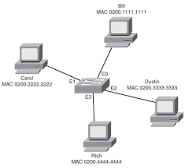
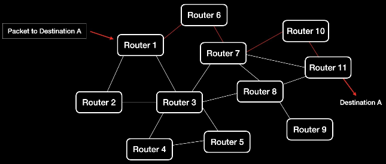
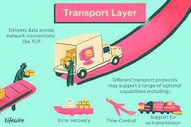
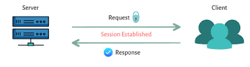
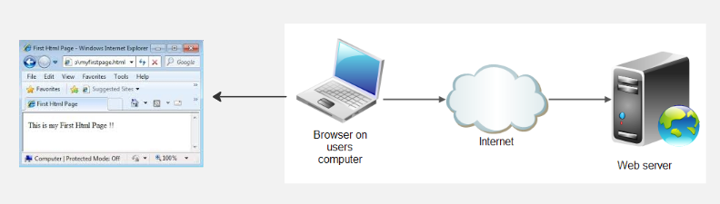

**Main Source:**

- **[OSI model — Wikipedia](https://en.wikipedia.org/wiki/OSI_model)**

**OSI (Open Systems Interconnection) model** is a standard for conceptualizing and understanding communication systems. In order to communicate between system properly, it needs to go through some process.

In OSI model, the process are divided into several abstraction layers. Each of the layer has responsibility to handle communication depending on the layer level. From the lowest physical layer where we send raw bit as electrical signal using physical media such as cables up to the application layer where it interacts directly with the user.

[All OSI layers with example](./osi-layers.png)  
Source: https://community.fs.com/blog/tcpip-vs-osi-whats-the-difference-between-the-two-models.html

### OSI Layers

1. **Physical**: It is the stage where data is transmitted through [physical medium](/digital-signal-processing/signal-transmission-medium) such as coaxial cable, optic fiber, radio signal, etc. The data is first encoded and converted into binary digits. Binary digits are then transformed into electrical signal, a simple example would to map 0s to low voltage signal and 1s to high voltage signal. This layer also involves many other signal transmission technique.

     
   Source: https://digitalmediaglobe.com/understanding-the-layers-of-the-osi-model/

2. **Data Link**: The data link layer is responsible for handling data transfer between the network. Before we establish the connection, data link layer ensure an error-free transfer to the network. Data link is divided into two sublayers:

   - **Logical Link Control (LLC)**: Data to be sent over the network will be encapsulate and will be added headers and trailers, this is called **frames**. They can contain source and destination address, these are useful to distinguish between other data transmission.

    LLC layer establishes, maintains, and terminates logical connections between devices. LLC ensures that the receiving device can handle the incoming data and regulates the rate at which data is transmitted. It also detect tranmission error such as corrupted frames.

   - **Medium Access Control (MAC)**: This sublayer of data link is responsible for managing the physical media data transmission in a computer network. It ensures that multiple devices sharing the same network segment take turns transmitting data to avoid collisions and ensure efficient and fair communication.

      
        Source: https://www.pearsonitcertification.com/articles/article.aspx?p=438038&seqNum=4

3. **Network**: Network layer provide end-to-end packet forwarding and routing within a network. Packet is a unit of data that contains header, payload (actual data), and sometimes a trailer.

   While sending the packets, network layer assign a unique address as identifier to each devices on the network. Sending packets include deciding optimal path for transmission from the source to the destination. If a packets is too large or it doesn't fit within the maximum transmission unit (MTU), network layer may divide it again into small pieces called **fragment** and it will reassembles the fragments again at the receiving end.

     
   Source: https://abitofnoise.com/blog/networking-fundamentals-osi-model-layer-3-network-layer

4. **Transport**: Transport layer ensures again the data is transmitted sent and received correctly and in the proper order by the destination device. The data, again needs to be small enough and doesn't exceed the maximum transmission unit (MTU). The transport layer will divide it into another terms called "segments".

   Transport layer also ensures the same thing as before, it ensures data is correct and error-free, prevent overwhelming between sender and receiver, establish connection-oriented protocols, such as [TCP (Transmission Control Protocol)](/computer-networking/tcp-protocol)

     
   Source: https://www.lifewire.com/layers-of-the-osi-model-illustrated-818017

5. **Session**: A data exchange at a time is called a session. Session layer function is to establish, manage, and terminate communication sessions between two network devices. When communication between devices are completed, the session layer is responsible for terminating the session. In some scenario when a session is interrupted, session layer allows to re-establish the previous session.

     
   Source: https://www.atatus.com/ask/osi-model-layers-and-its-functions

6. **Presentation**: While transmitting data, we encode it and often compress it for more efficient bandwidth. Presentation layer handles data encryption, data decryption, data compression, data decompression. It ensures data will be correctly interpreted by the receiver.

     
   Source: https://realpars.com/osi/

7. **Application**: After data is received, it can be presented into user that is able to interpret data received from transmission such as web browser. This layer is responsible for providing network services directly to the end-user or application. It uses internet protocols including [HTTP (Hypertext Transfer Protocol)](/computer-networking/http-https#http) for web browsing, [SMTP (Simple Mail Transfer Protocol)](/computer-networking/email-protocol#smtp) for email communication, [FTP (File Transfer Protocol)](/computer-networking/ftp) for file transfer, and many more.

     
   Source: https://www.corelangs.com/html/introduction/first-page.html, https://jenkov.com/tutorials/html4/the-web.html
