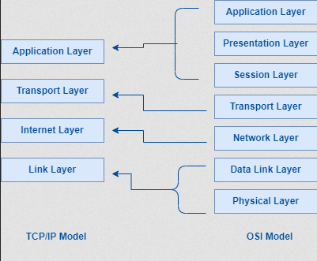
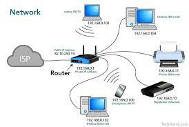
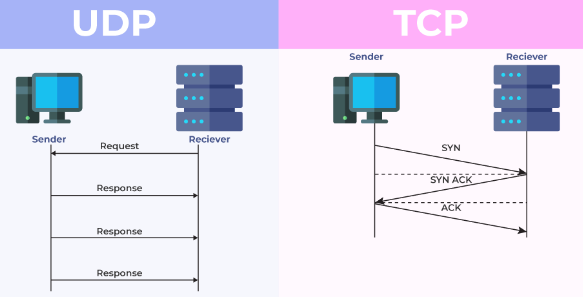
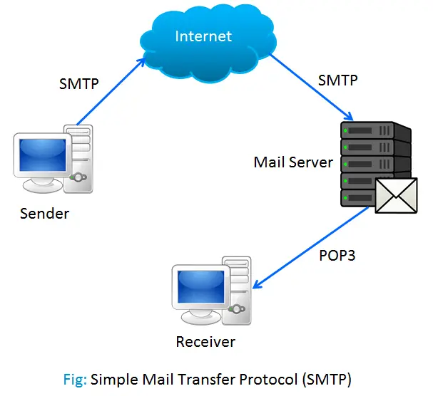

**Main Source : [Wikipedia Internet protocol suite](https://en.wikipedia.org/wiki/Internet_protocol_suite)**

**TCP/IP or Internet protocol suite** describe a set of rules that devices needs to follow in order to communicate properly. It is similar to the [OSI model](/computer-networking/osi-model), but instead it consist of 4 layers, the missing layers is often included in other layers.

  
Source : https://workat.tech/core-cs/tutorial/tcp-ip-reference-model-in-computer-networks-4c9jodl67ax5

### TCP/IP Layers

1. **Link** : Link layer is the lowest layer in TCP/IP. Similar to OSI model, data to be sent is encapsulated into frames and it will be sent through physical media such as coaxial cables, fiber optic, and etc. It also involves assigning physical address to each device in the networks as a unique identifier.

2. **Internet** : Sending data from source to destination is called **routing**. Internet layer assigns logical addresses, known as [IP addresses](/computer-networking/ip-address), to devices connected to a network. IP addresses uniquely identify devices on the network and enable end-to-end communication across different networks.

   Data is then broken down into small pieces called **packets**. Delivering packets to the network may encounter some issues, internet layer is responsible for determining the best path for packet delivery.

     
   Source : https://course-net.com/blog/network-adalah/

3. **Transport** : Transport layer is responsible for the reliable and orderly delivery of data between hosts or endpoints. It ensure no data-error between transmission, data is sent and received accordingly and regularly without overwhelming the receiver or congesting the network.

   Transport layer uses protocol such as [TCP](/computer-networking/tcp-protocol) and [UDP](/computer-networking/udp) as the set of rules or mechanism to transport the data.

     
   Source : https://www.geeksforgeeks.org/differences-between-tcp-and-udp/

4. **Application** : The application layer is the topmost layer and is responsible for providing network services directly to the user or application. The TCP/IP model doesn't consider the specific format, encryption, compression of the data received. These are considered by the defined protocol in the application layer. For example, a browser knows the HTTP protocol for hypertext content such as web pages.

   Example of application layer protocol are :

   - [Hypertext Transfer Protocol (HTTP)](/computer-networking/http-https#http)
   - [File Transfer Protocol (FTP)](/computer-networking/ftp)
   - [Simple Mail Transfer Protocol (SMTP)](/computer-networking/email-protocol#smtp)
   - [Dynamic Host Configuration Protocol (DHCP)](/computer-networking/dhcp)

     
   Source : https://webeduclick.com/difference-between-ftp-and-smtp/
