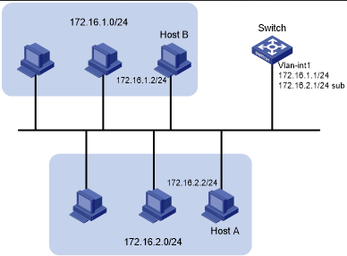
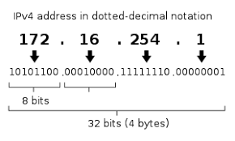
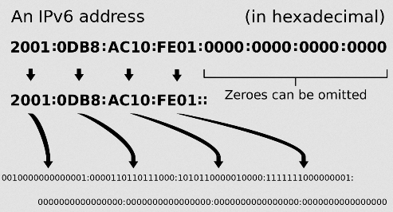
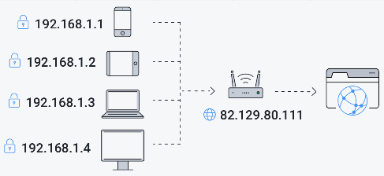

**Main Source :**

- **[IP Address - IPv4 vs IPv6 | PowerCert](https://youtu.be/ThdO9beHhpA)**
- **[Public vs Private IP Address | PowerCert](https://youtu.be/po8ZFG0Xc4Q)**

In a network, there are many computer or device connecting together. There should be a way to distinguish between these device. **Internet Protocol address (IP address)** is an identifier assigned to each device that is connected to a computer network. It serves two main purposes: identifying the host or network interface and providing the location of the device in the network.

IP address is divided by 2 part, the first part identify the network and the second part identify the host. This is useful when there is multiple device on a single network, like the following image.

  
Source : https://techhub.hpe.com/eginfolib/networking/docs/switches/5130ei/5200-3942_l3-ip-svcs_cg/content/483572281.htm

The above network and the below differs in the third segment of the number, the computer inside the network differs in the fourth segment.

### Type of IP Address : IPv4 vs IPv6

There are two types of IP address, IPv4 and IPv6. The difference between them is how many possible IP address can be made.

#### IPv4

In IPv4, an IP address consist of four sets of decimal number ranging from 0 to 255 separated by period. Each set of number represents 8 bits, resulting in total 32 bits for the entire address. For example, `192.168.0.1`, `192.168.123.132`, `102.168.212.226`.

Computer will then convert the IP address to binary format that only uses 0 and 1. Find out more [here](/computer-and-programming-fundamentals/number-system) to know how to convert decimal to binary or the opposite.

An IPv4 IP Address is 32 bits, this mean if we try all possible combination between each set of number, there is $256^4$ or approximately 4.3 billion unique combination possible.

  
Source : https://id.wikipedia.org/wiki/Alamat_IP_versi_4

#### IPv6

Even though IPv4 has so many unique combination, in the modern day of networking, 4.3 billion is not enough to uniquely identify all device.

The difference is, IPv6 consist of eight segment of 16-bit hexadecimal value, allowing for a total of 4 [hexadecimal](/computer-and-programming-fundamentals/number-system#hexadecimal) digits per segment (1 hexadecimal digit = 4 bit), each separated by colon. For example, `2001:0db8:3a4c:0012:0000:8a2e:0370:abcd`, `fe80:0000:0000:0000:1234:5678:abcd:ef01`, `2a02:abcd:1234:5678:9abc:def0:fedc:ba09`.

The full address results in $16\text{-bit} \times 8 = 128\text{-bit}$. With 128 bit, we will be able to generate $2^{128}$ or approximately 340 undecillion of unique IP address.

IPv6 is designed to be compatible with existing IPv4 networks. This mean, it can still communicate with devices and networks running IPv4. The common way to do this is through the technique called dual stack. In dual stack, the device will be able to read both IPv4 and IPv6 address and choose based on the appropriate address.

  
Source : https://en.wikipedia.org/wiki/IPv6_address

### Public & Private IP Address

Public & Private IP address are type of IP address based on where is IP address assigned.

#### Public IP Address

A public IP address is assigned by an Internet Service Provider (ISP) and is globally unique. It is used to identify a device on the internet and allows it to communicate with other devices or services across the internet.

Public IP addresses are routable on the internet and can be accessed from anywhere in the world. Examples of public IP addresses for IPv4 and IPv6 respectively are 203.0.113.1 and 2001:db8:1234:5678::1.

#### Private IP Address

A private IP address is used within a private network such as home network. These IP addresses are not globally unique and are reserved for use within private networks only. It is assigned by the local network and you can't connect to internet with it, it will need to be converted to public IP address first.

The purpose of private IP address is to uniquely identify device while also reducing the exhaustion of IP address. So a particular device on a network may have a same IP address with other device in other network, but this is okay because all the device on that network will have a public IP address to connect to the internet or to connect to the other network.

  
Source : https://www.avg.com/en/signal/public-vs-private-ip-address
