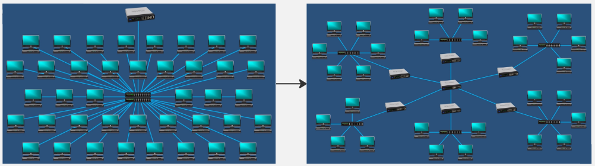
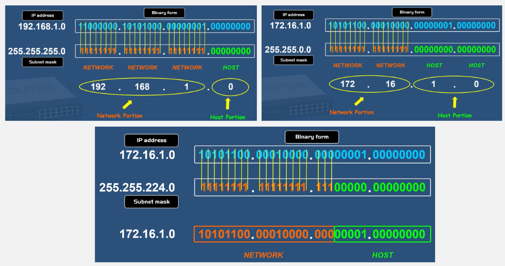
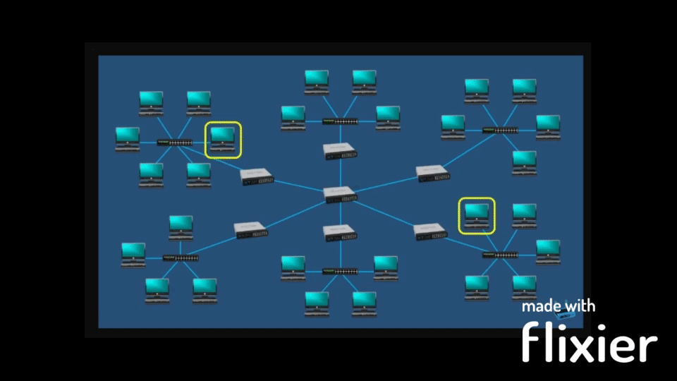

**Main Source : [Subnet Mask - Explained | PowerCert](https://youtu.be/s_Ntt6eTn94)**

[IP address](/computer-networking/ip-address) is divided by 2 part, the first part identify the network and the second part identify the host. **Subnet Mask** is a 32-bit number that is used to divide an IP address into these parts.

A network may contains too many interconnected computers or devices, making it harder to communicate. One way to make it more manageble is to divide them into subnetwork and they will connect to central access point called [router](/computer-networking/router), this practice is called **subnetting**.

  
Source : https://youtu.be/s_Ntt6eTn94?t=496

And now, the purpose of dividing IP address into two part that consist of network and host part is to help determine which part of an IP address belongs to the network and which part belongs to the individual host.

### Subnet Mask Calculation

To determine the network address, subnet mask and IP address needs to be converted into binary format first if they are in decimal number. Subnet mask is applied to an IP address using a "bitwise AND operation", the result is the network address.

The last 1 from the binary number of subnet mask define the last part of network portion.

  
Source : https://youtu.be/s_Ntt6eTn94?t=319

Here is an example of how it is used :

  
Source : https://youtu.be/s_Ntt6eTn94?t=591
