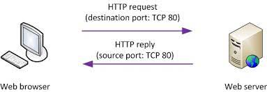
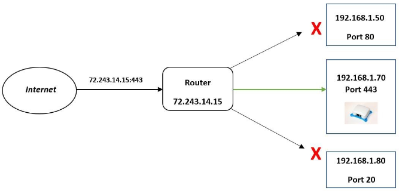
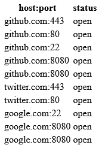
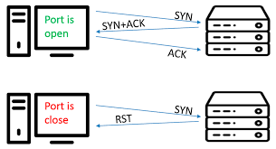

**Main Source:**

- **[Port (computer networking) — Wikipedia](<https://en.wikipedia.org/wiki/Port_(computer_networking)>)**
- **[Network Ports Explained — PowerCert](https://youtu.be/g2fT-g9PX9o)**
- **[Port Forwarding Explained — PowerCert](https://youtu.be/2G1ueMDgwxw)**
- **[Port scanner — Wikipedia](https://en.wikipedia.org/wiki/Port_scanner)**

**Ports** is a number that identify communication endpoint that allows a computer to send and receive data over a network. Ports is used in two common protocols: [TCP](/computer-networking/tcp-protocol) and [UDP](/computer-networking/udp).

The purpose of port number is to determine how to handle network data. When a device receives data, it examines the destination port number to determine which process or service should handle the data. Similarly, when sending data, an application or service chooses a source port number to identify itself to the receiving device.

Port number range from 0 to 65535, ports below 1024 are known as well-known ports and are reserved for specific services, such as port 80 for HTTP. Ports between 1024 and 49151 are registered ports, which are assigned by the Internet Assigned Numbers Authority (IANA) to specific services or applications. Ports above 49151 are dynamic or private ports that can be used by any application or service.

So for example, port 80 which is the HTTP port is a common port used. When you enter a website address (URL) in your browser's address bar and press Enter, the browser establishes a connection to the web server hosting that website using port 80 by default. The web server listens for incoming requests on port 80 and responds by sending back the requested web page or other resources to the browser.

  
Source: https://www.howtonetwork.com/comptia-network-study-guide-free/port-numbers-and-network-protocols/

A list of used port can be found in this [Wikipedia](https://en.wikipedia.org/wiki/List_of_TCP_and_UDP_port_numbers) article.

### Port Forwarding

Port is used together with IP address to communicate. The IP address is used to know the location of the destination, while port is to specify what type of communication we want to do. For example, an HTTP request is made to `http://www.google.com`, the IP address of `google.com` is `215.114.85.17`, with the port 80 it will become `215.114.85.17:80`.

**Port Forwarding** is a technique used to redirect network traffic from one IP address and port combination to another IP address and port combination. It allows incoming connections or data packets destined for a specific port on a [router](/computer-networking/router) or [firewall](//computer-security/network-security#firewall) to be forwarded to a different port or device on the local network.

Our router receives data from external network along with our router's IP address as the destination and also a port. Port forwarding can be thought as the router translating the IP address with the port, so it will be redirected to local device on the network.

The router doesn't know how to process the port received from external network without any port forwarding configuration.

  
Source: https://getquicktech.com.au/blog/benefits-of-port-forwarding/

### Port Scanner

A **port scanner** is a technique used to discover which ports are open on a specific target system or network. Port scanning is often performed by security analysts, network administrators, or attackers to gather information about network services and identify potential vulnerabilities.

#### Port States

Ports can be in different states based on the response received during scanning:

- **Open**: If a port responds to the scan, it is considered open, indicating that a service or application is actively listening on that port.

- **Closed**: If a port responds with a specific message indicating that it is closed, it means that no service or application is listening on that port.

- **Filtered**: If a port does not respond to the scan or the response is blocked by a [firewall](/computer-security/network-security#firewall) or network filtering device, it is considered filtered. The port scanner cannot determine whether the port is open or closed.

This port state is related to port forwarding. If we haven't configured the port forwarding in our router, the default state will be closed.

  
Source: https://codepen.io/umarcbs/pen/NWradwg

#### Scan Types

Port scanners use different scan types or techniques to gather information about the target ports. Some common scan types include:

- **TCP Connect Scan**: This scan attempts to establish a full TCP connection with the target port to determine if it is open, closed, or filtered.

- **SYN/Stealth Scan**: Also known as half-open scanning, this technique sends SYN packets to the target ports and analyzes the responses to determine the port status without completing the full connection.

- **UDP Scan**: UDP ports are connectionless, so UDP scanning involves sending UDP packets to the target ports and analyzing the responses.

  
Source: https://www.mdpi.com/1424-8220/20/16/4423

:::tip
Find out about [TCP](/computer-networking/tcp-protocol) and [UDP](/computer-networking/udp)
:::
