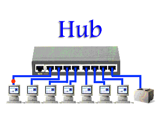

**Main Source : [Hub, Switch, & Router Explained | PowerCert](https://youtu.be/1z0ULvg_pW8?si=6F-oF8maBovN6VnN)**

**Hubs** is a networking device that connects device together, typically in small network such as [local area network (LAN)](/computer-networking/lan). Hubs act as a central point that accepts data from a device and forward it to all other device connected to the hub. The devices are physically connected using cable called [ethernet](/computer-networking/ethernet).

Hub is a "dumb" device, it doesn't store or analyze packets, it simply replicates and forwards them. It does not filter or make any decisions based on the packet's source or destination addresses. As a result, all devices connected to a hub receive all the network traffic, even if the data is not intended for them. This makes hub has certain limitation which is wasting bandwidth and raise some security concerns.

This is why hubs are replaced with more modern networking device such as [switch](/computer-networking/switch) and [router](/computer-networking/router)

  
Source : https://study-ccna.com/network-hubs-explained/

  
Source : https://www.fiber-optic-solutions.com/buy-ethernet-switch-hub.html
