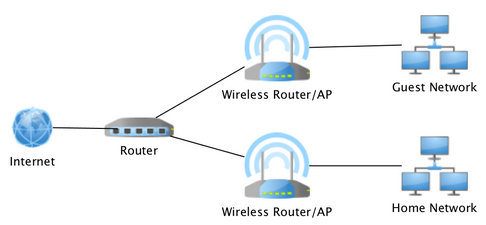

**Main Source : [Wikipedia Router (computing)](<https://en.wikipedia.org/wiki/Router_(computing)>)**

**Router** is a networking device that connects multiple computer networks together, and directs network traffic between them. It uses uses [IP addresses](/computer-networking/ip-address) to make decisions on how to forward data packets across networks.

Router is a type of [gateway](/computer-networking/gateway), which is an entry point or exit point between two different networks. It acts as a bridge, translator, or the central point of connection, it enables and manage the flow of network traffic within a computer network.

As explained in [routing](/computer-networking/routing), routers keep track information about network addresses in database called **routing tables**, it helps to determine where to send packets. They examine the destination IP address of incoming packets and consult their routing tables to determine the appropriate next-hop router or network interface to forward the packets.

Routers are commonly used in homes, offices, and other environments to enable communication between devices on different networks. Routers can be wired or wireless, depending on the type of network they are connecting. Wired routers typically have [Ethernet](/computer-networking/ethernet) ports to connect devices via Ethernet cables, while wireless routers have built-in [Wi-Fi](/computer-networking/wi-fi) capabilities to enable wireless connectivity for devices such as laptops, smartphones, and tablets.

In addition to forwarding data packets, routers can perform other functions such as [network address translation (NAT)](/computer-networking/nat), which allows multiple devices on a local network to share a single [public IP address](/computer-networking/ip-address#public-ip-address) by using [private IP address](/computer-networking/ip-address#private-ip-address), and [firewalling](/computer-networking/firewall), which provides security by filtering and controlling network traffic.

  
Source : https://www.mytechlogy.com/IT-blogs/22654/essential-settings-for-home-network-routers/

:::tip
Find out more about how routers forward or send data to another routers [here](/computer-networking/routing)
:::
