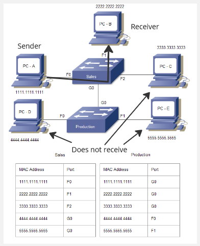
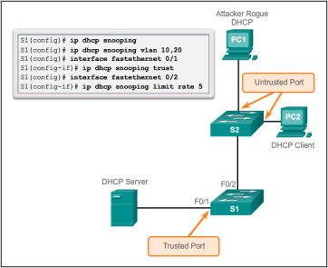

**Main Source :**

- **[Hub, Switch, & Router Explained | PowerCert](https://youtu.be/1z0ULvg_pW8?si=6F-oF8maBovN6VnN)**
- **[Wikipedia Network switch](https://en.wikipedia.org/wiki/Network_switch)**

**Switch** is a networking device that is very similar as [hub](/computer-networking/hubs), but it is more intelligent as it provides more advanced features such as improved performance, better bandwidth utilization, and enhanced security.

#### Switch Table, Selective Forwarding & Collision Isolation

Switch has a memory to store [MAC address](/computer-networking/mac-address) of all devices connected to it. The purpose of storing device addresses is to efficiently forward packets to the correct destination.

For example, computer A wants to send data to computer B. Instead of broadcasting the packet to all connected ports like a hub does, the switch selectively forwards the packet only to the port associated with the destination MAC address.

  
Source : https://www.computernetworkingnotes.com/ccna-study-guide/how-switch-learns-the-mac-addresses-explained.html (with modification)

Not only offers efficient forwarding, it also reduce collision when data is transmitted. In hub, when a device sends data to the hub, there's a chance that other device also sends data before. This makes the incoming data from hub collide with the outgoing data that destinate to hub.

#### Security

Switch allows administrators to control access to the network by limiting the devices that can connect to specific switch ports. Port security enables the configuration of MAC address-based restrictions, allowing only authorized devices with specific MAC addresses to communicate through the switch. This helps prevent unauthorized devices from gaining network access.

#### Network Segmentation

Switch also supports network segmentation through the use of [Virtual Local Area Network (VLAN)](/computer-networking/lan-wan#virtual-local-area-network-vlan). VLAN is a a technology that divide a single physical switch into multiple virtual switches or networks. Each VLAN operates as a separate broadcast domain, allowing devices within the same VLAN to communicate as if they were connected to the same physical network, even if they are physically connected to different switch ports. This also reduce the risk of network attacks.

  
Source : https://www.ciscopress.com/articles/article.asp?p=2181836&seqNum=7
