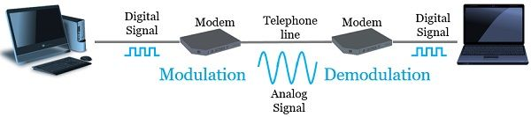
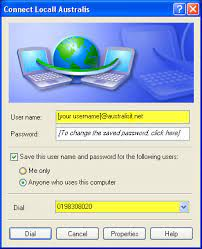
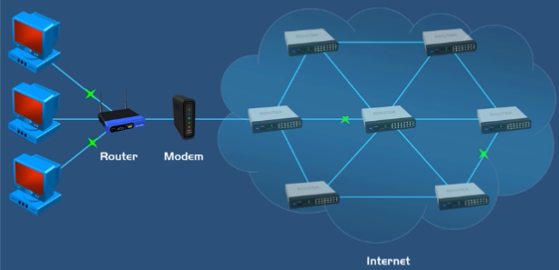
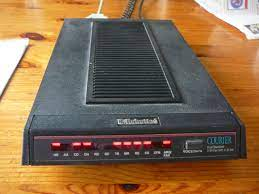
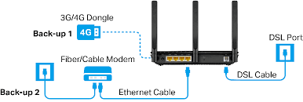
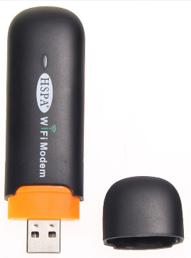

**Main Source :**

- **[Wikipedia Modem](https://en.wikipedia.org/wiki/Modem)**
- **[Modem vs Router | PowerCert](https://youtu.be/Mad4kQ5835Y?si=dpV4LjJiaEMiYMQo)**
- **[Wikipedia Dial-up Internet access](https://en.wikipedia.org/wiki/Dial-up_Internet_access)**

**Modem or modulator-demodulator** is a device that enables communication between a computer or a local network and an internet service provider (ISP) over a telecommunications network. It serves as a bridge between the digital data used by computers and the analog signals transmitted over telephone lines or cable lines.

### Modulation - Demodulation

The primary function of a modem is to convert the digital signals generated by a computer into analog signals that can be transmitted over a standard telephone line or cable line. This process is called modulation. On the receiving end, the modem also performs the reverse process, called demodulation, by converting the analog signals back into digital signals that can be understood by the computer or network.

Modulated analog signals are transmitted over the [communication medium](/digital-signal-processing/signal-transmission-medium), such as copper cables, fiber optics, or wireless channels, depending on the type of modem. The medium carries the signals to the destination.

  
Source : https://techdifferences.com/difference-between-modulation-and-demodulation.html

#### Dial-up Connection

The method of connecting to the internet or a computer network using a traditional telephone line is called **Dial-up connection**. Dial-up connection uses modem and it was a popular method of accessing the internet in the early days of home computing when broadband and high-speed internet connections were not widely available.

  
Source : https://hendri.staff.uns.ac.id/2009/11/koneksi-dial-up/

#### Modem vs Router

A modem connects a user's network to the ISP's network, allowing access to the internet through telephone lines in modulation and demodulation process, while a router manages the traffic between different networks within a local network, directing data packets to their appropriate destinations.

  
Source : https://youtu.be/Mad4kQ5835Y?si=5obRuPN7CxkoxFuO&t=402

### Type of Modem

Here are some common types of modem :

- **Dial-Up Modem** : Dial-up modems were commonly used in the past to establish internet connections over traditional telephone lines. They operated by dialing a phone number to connect to an Internet Service Provider (ISP). Dial-up modems had relatively low data transfer rates, typically ranging from 56 Kbps down to as low as 14.4 Kbps.

    
   Source : https://id.wikipedia.org/wiki/Akses_Internet_putar-nomor

- **DSL Modem** : DSL (Digital Subscriber Line) modems are used to establish high-speed internet connections over existing telephone lines. DSL technology allows simultaneous transmission of voice and data signals by utilizing different frequency bands. DSL modems can achieve significantly higher data transfer rates compared to dial-up modems, ranging from several Mbps (Megabits per second) to tens or hundreds of Mbps.

    
   Source : https://www.tp-link.com/ae/dsl-modem-router/

- **Wireless Modem** : Wireless modems, also known as cellular modems or mobile broadband modems, use wireless communication technologies such as [3G, 4G LTE, or 5G](/computer-networking/cellular-networking) to establish internet connections. They typically come in the form of USB dongles, portable hotspots, or modems built into devices like smartphones or tablets. Wireless modems provide internet access in areas covered by cellular networks but may have varying speeds depending on network coverage and technology.

    
   Source : https://id.aliexpress.com/item/32657887191.html
