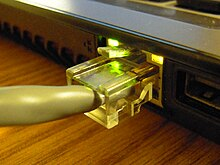
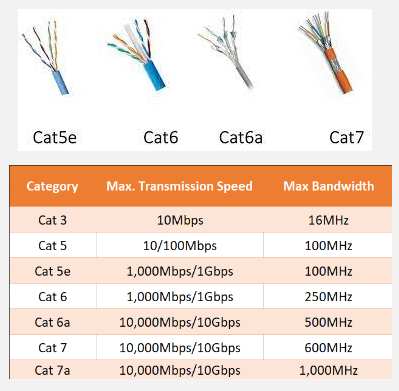
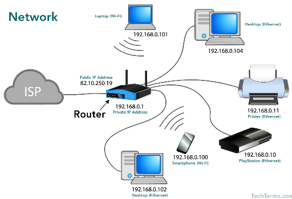

**Main Source:**

- **[Ethernet Cables — PowerCert](https://youtu.be/_NX99ad2FUA?si=gR2OLcnYOxsvjvw6)**
- **[What is Ethernet? — RealPars](https://youtu.be/HLziLmaYsO0?si=FbFOSbRjsW19jtPl)**
- **[Ethernet — Wikipedia](https://en.wikipedia.org/wiki/Ethernet)**

**Ethernet** is networking technology which allows computer or devices to communicate by sending data through [physical cable](/digital-signal-processing/signal-transmission-medium#guided-transmission) such as coaxial, twisted pair, or fiber optic. Computer or laptop commonly connect to router, switch, or hub using ethernet. The Ethernet cable is plugged into the Ethernet port on the computer's network interface card (NIC) and into one of the Ethernet ports on the router.

  
Source: https://en.wikipedia.org/wiki/Ethernet

Ethernet operates between the physical layer and the data link layer of the [OSI model](/computer-networking/osi-model). It means that ethernet handle sending data through physical cable to interconnected device in the network.

Ethernet has been evolving since the first time it's used. The connection speed may vary depending the specific types of cable used. For example in the image below, "CAT" is the type of twisted pair cable used.

  
Source: https://www.fiberopticshare.com/guide-choosing-suitable-ethernet-cables.html, https://helpdeskgeek.com/help-desk/8-troubleshooting-tips-for-a-slow-ethernet-connection/

### Process of transferring data

1. While transferring data, the data is divided into small pieces called **frames**. Frames consist of header, payload (actual data), and trailer. The header includes source and destination [MAC addresses](/computer-networking/mac-address) and frame type information to check if frame is damaged or corrupted.

2. Each device on an Ethernet network has a unique MAC address assigned to its network interface card (NIC). These address are used to uniquely identify each devices within the network. Ethernet will only forward the frames to the desired destination, this will improves network efficiency and reduces collisions.

3. Ethernet uses a protocol called Carrier Sense Multiple Access with Collision Detection (CSMA/CD) to manage access to the network medium (the shared cable). Before transmitting data, a device checks if the network is idle to avoid collisions with other devices. If a collision occurs (multiple devices transmit data at the same time), they detect the collision and stop transmitting. Each device involved in the collision waits for a random period of time before retransmitting its data.

4. After data is received by the target device, the device will check if the data is sent to the correct device. It will then do some error checking to determine if the frames are corrupted during transmission. The payload that contains data will be extracted and will be sent to next protocol process or application for further processing.

  
Source: https://yzrkiller.home.blog/2019/06/22/computer-network/
