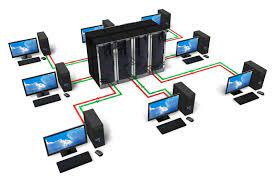
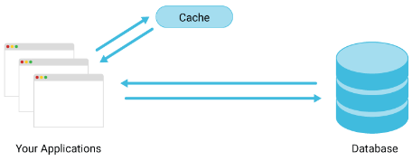
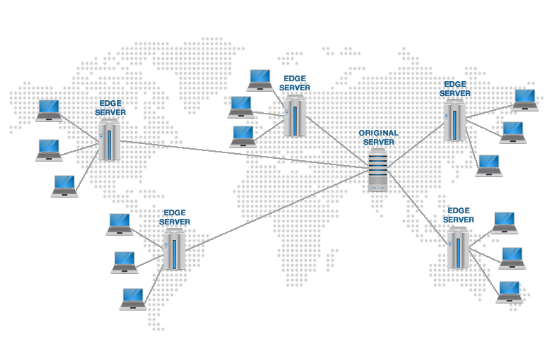
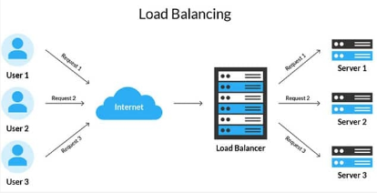
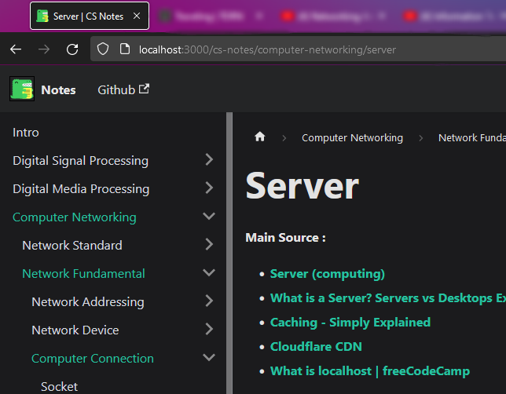

**Main Source :**

- **[Server (computing)](<https://en.wikipedia.org/wiki/Server_(computing)>)**
- **[What is a Server? Servers vs Desktops Explained | PowerCert](https://youtu.be/UjCDWCeHCzY?si=BsG1UnE7fWlNjpZx)**
- **[Caching - Simply Explained](https://youtu.be/6FyXURRVmR0?si=xPJK4Vr46tW55wOa)**
- **[Cloudflare CDN](https://www.cloudflare.com/learning/cdn/what-is-a-cdn/)**
- **[What is localhost | freeCodeCamp](https://www.freecodecamp.org/news/what-is-localhost/)**

A **Server** is a dedicated computer or a system that provides resources, services, or functionality to other computers or devices on a network. It is designed to respond the requests from client devices (device that requests and consumes services or resources from a server) and deliver the requested data or perform the specified tasks.

A server typically operate by the response-request model. This means that a client will send a request to server, the server will process it depending on the request such as doing heavy computation, sending a resource, updating user data, or any other task. The result will be sent back to client after.

  
Source : https://www.racksolutions.com/news/blog/what-is-a-server/

### Server Function

Server hardware are typically more powerful and have more storage capacity than client devices. It is also optimized and configured to perform a lot of tasks simultaneously. A server may also use dedicated operating system that suitable for concurrent computation.

Here are some common use case of a server :

- **File server** : Stores and manages files that can be accessed by client devices over a network.
- **Web server** : Hosts websites and delivers web pages to client web browsers upon request.
- **Database server** : Manages databases and provides access to stored data for client applications.
- **Mail server** : Handles email communication, routing incoming and outgoing messages between clients.
- **Application server** : Runs and manages business applications and software, providing centralized processing and data management.
- **DNS server** : Resolves domain names to their corresponding IP addresses, enabling client devices to locate resources on the internet.

Overall the purpose of server is to act as a central repository for shared data or it may also be a devices runs for most of the times to provide service for client that can be accessed anytime.

  
Source : https://www.networkstraining.com/different-types-of-servers/

### Server Optimization

- **[Caching](/backend-development/caching)** : Caching is a technique used to achieve high-speed and efficient operation while accessing data. The idea is a frequently accessed data can be placed in an easier place to access. Server will first check if the requested data exists in cache, if yes, the server can quickly return the data without accessing a database or generating the data from scratch.

  For example, a web server may cache HTML and CSS files, or other static resources that are frequently requested by clients.

    
   Source : https://www.scylladb.com/glossary/database-caching/

- **Content Delivery Network (CDN)** : CDN is a distributed servers strategically located in multiple data centers around the world. When a user requests content, the CDN automatically routes the request to the nearest edge server, minimizing the distance and network latency between the user and the server.

  For example, a company has main server located in the US. A person connecting from Asia will have a higher latency due to physical distance. The company may choose to build another server in Asia, the new server will connect to the main server. This way we let the server to experience the slower connection while allowing people from Asia can connect with a lower latency or faster connection.

    
  Source : https://www.domainesia.com/tips/apa-itu-cdn-dan-fungsi-cdn/

- **Load Balancing** : Load balancing is a technique used to distribute incoming network traffic across multiple servers. The primary purpose of load balancing is to evenly distribute the workload among multiple servers, preventing any single server from becoming overwhelmed or underwhelmed and improving overall system efficiency.

    
   Source : https://herza.id/blog/load-balancing-pengertian-cara-kerja-jenis-metode-kelebihan-dan-kekurangan/

### Localhost

As said before, we can even use our own computer as server. We can use it as a public server, where people could connect to us. We can also use it for ourselves, meaning our computer will be a server and the one who connect is ourselves. It is referred as loopback network, where we send or request and receive data within the same device, without going through a network.

Localhost need an IP address as well as normal website, the IP is `127.0.0.1`. We can also specify a port, for example, `localhost:4000` or `127.0.0.1:3500` if using the actual IP address. These ports are used to identify specific services or applications running on your device.

