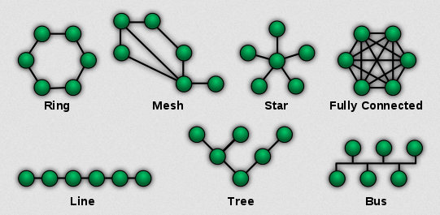
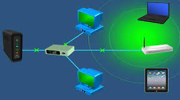
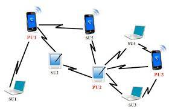
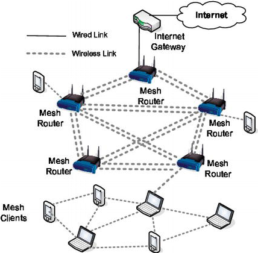

**Main Source:**

- **[Network topology — Wikipedia](https://simple.wikipedia.org/wiki/Network_topology)**
- **[Network Topologies — PowerCert](https://youtu.be/zbqrNg4C98U?si=CgkGx3asVyRrUT20)**

**Network Topology** is a physical or logical arrangement of devices in a computer network. It defines how devices are connected and how they communicate with each other. Network topology determines the overall structure, efficiency, and resilience of a network.

Network topology can be wired or wireless. In a wired topology, devices are connected using physical cables such as [ethernet](/computer-networking/ethernet) and [other cable](/digital-signal-processing/signal-transmission-medium#guided-transmission). In a wireless topology, devices uses wireless electromagnetic signal to communicate, this includes [Wi-Fi](/computer-networking/wi-fi), [bluetooth](/computer-networking/bluetooth), and [cellular networks](/computer-networking/cellular-networking).

### Wired

- **Star Topology**: Device is connected directly to a central device, such as a [switch](/computer-networking/switch) or [hub](/computer-networking/hubs). All data traffic flows through the central device, which manages the communication between devices. If one device fails, it does not affect the rest of the network, but if the central device failes, it affects all devices and it's called single point of failure.

- **Ring Topology**: Devices are connected in a closed loop, where each device is connected to two neighboring devices. Data travels around the ring in one direction, and each device extracts the required data as it passes by. If one device or link fails, the entire network can be affected.

- **Bus Topology**: All devices are connected to a common backbone or a single communication line. Data is transmitted along the backbone, and each device listens to the data and picks up the relevant information. However, if the backbone fails, the entire network may become inoperable.

- **Mesh Topology**: In a mesh topology, every device is connected to every other device in the network. This provides redundant paths and enhances network reliability. Mesh topologies can be classified as full mesh, where every device has a direct connection to every other device, or partial mesh, where only some devices have multiple connections.

- **Tree (Hierarchical) Topology**: A tree topology is a combination of bus and star topologies. Devices are arranged in a hierarchical structure, where multiple star topologies are connected to a main bus backbone. This allows for scalability and easier management of large networks.

- **Hybrid Topology**: Hybrid topologies are a combination of two or more different topologies. For example, a network might combine elements of a star topology and a mesh topology to benefit from the advantages of both.

  
Source: https://simple.wikipedia.org/wiki/Network_topology

### Wireless

- **Infrastructure Topology**: This topology combine wired and wireless. Switch connects to a modem and the wireless devices will connect to the to a central access point (AP) or a wireless router. The access point will then connect to the switch.

    
   Source: https://www.electroniclinic.com/network-topologies-start-ring-mesh-bus-tree-hybrid-ad-hoc-and-wireless-topology/

- **Ad hoc**: Ad hoc is a peer-to-peer network communication, meaning the devices communicate with each other directly without the need for a central access point.

    
   Source: https://www.researchgate.net/figure/Network-topology-ad-hoc-mode_fig1_236013412

- **Wireless Mesh Topology**: This is the wireless version of mesh topology. A device will connect to an access point, the access point will then connect to another access point until it reach the gateway. Because every devices are connected with each other, there will be many routes and the determined route should be the most efficient path.

    
   Source: https://www.intechopen.com/chapters/66938
