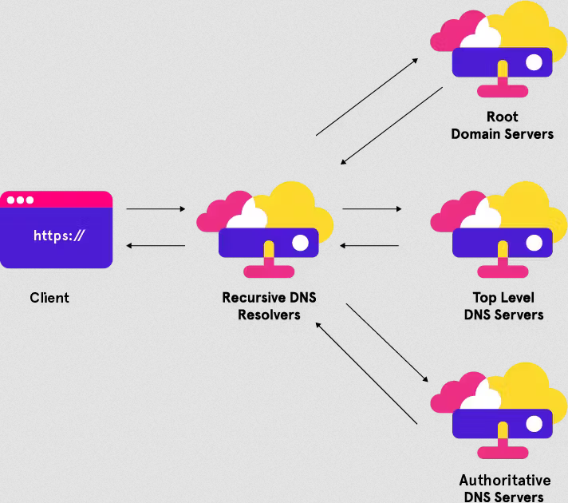

**Main Source :**

- **[How a DNS Server (Domain Name System) works | PowerCert](https://youtu.be/mpQZVYPuDGU?si=HkwtlF9fHOXMEvN7)**
- **[DNS Records Explained](https://youtu.be/HnUDtycXSNE?si=owMYV2iZG8w72g_r)**

**Domain Name System (DNS)** is a server acting as a service that translates human-readable domain name into an [IP address](/computer-networking/ip-address), which used to identify a device connecting to the network.

In computer networking, we uses [IP address](/computer-networking/ip-address) to identify each devices on the network. When accessing a specific website on the internet, we usually enter the domain name or website name in our browser. Browser will need to establish a connection to their server to get the required resource to show the website. Establishing a connection will require IP address as the destination address of where the network is.

However, the browser doesn't understand the domain name entered by user. To resolve this, the browser sends a request to the DNS server, which translates the human-readable name into an IP address. Once the browser obtains the destination address, it can establish a connection and access the desired resource.

  
Source : https://www.geeksforgeeks.org/working-of-domain-name-system-dns-server/

:::tip
Find out in [here](/frontend-web-development/web-url) to know more about domain name or URL
:::

### DNS Record

DNS server has a map of different type of domain name. They are categorized based on the specific purpose. Here are some common record :

- **A (Address)** : An A record maps a domain name to an IPv4 address.

- **AAAA (IPv6 Address)** : Similar to the A record, the AAAA record maps a domain name to an IPv6 address.

- **CNAME (Canonical Name)** : A CNAME record creates an alias for a domain. It allows multiple domain names to be directed to the same IP address. For example, we can create a CNAME record to associate `www.example.com` with `example.com`. This mean everytime user enters `www.example.com`, it will be redirected to `example.com`

- **MX (Mail Exchanger)** : An MX record specifies the mail servers responsible for receiving emails sent to a domain.

- **TXT (Text)** : A TXT record allows domain owners to add arbitrary text to their DNS records. It is commonly used for purposes such as verification, email authentication, and adding human-readable information.

- **NS (Name Server)** : NS records specify the authoritative name servers for a particular domain which is the DNS servers that are responsible for storing and providing DNS information for a domain.

### Type of DNS Server

DNS server is distributed around the world, it also consist of hierarchy which tells the importance of the domain. Here are some types of DNS server :

- **Local DNS** : While trying to convert a domain name into an IP address, our computer will first check if the website has ever been connected to before, check if it's exist in the local computer memory. If yes, the computer doesn't need to connect to the DNS server.

- **Recursive Resolver** : This DNS server act as the bridge between our computer to the higher hierarchy of DNS server. It will recursively ask to the higher server, also will store the responses it receive to speed up future request.

- **Authoritative Name Server** : Authoritative name servers are responsible for storing the DNS records (such as A records, CNAME records, MX records, etc.) for a specific domain. They provides record for specific domain.

- **Top-Level Domain (TLD) Server** : TLD servers are responsible for storing information about the domains within a specific top-level domain. For example, the .com TLD server stores information about all the domains ending with .com.

- **Root Server** : These are the highest-level DNS servers in the hierarchy. They store the IP addresses of the authoritative servers for top-level domains (TLDs) like .com, .net, .org, etc. There are 13 sets of root servers distributed worldwide, managed by different organizations.

  
Source : https://www.menandmice.com/glossary/dns-server-types
