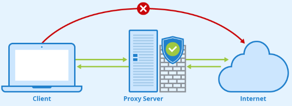
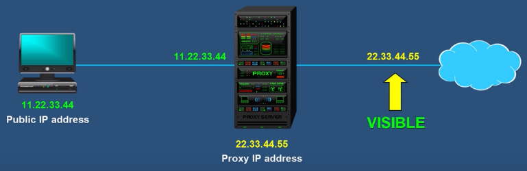
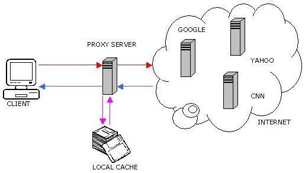
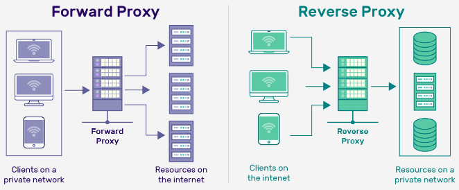

**Main Source :**

- **[What is a proxy? | PowerCert](https://youtu.be/5cPIukqXe5w?si=FLUGu56hLgQGBhQc)**
- **[Proxy vs Reverse Proxy Explained](https://youtu.be/RXXRguaHZs0?si=AGl2qoVdqgriCinj)**

**Proxy** is an intermediary server or application that acts as a gateway between a client and another server. When a client makes a request to access a resource or service, such as a website, the request is first sent to the proxy server, which then forwards the request to the destination server on behalf of the client.

  
Source : https://www.iuwashplus.or.id/fungsi-proxy/

### Purpose of Proxy

Normally when we ask a request to website or server, we will send the request directly. With proxy, it can act as a middleman. This makes proxy have several useful purpose :

- **Privacy** : While connecting to the internet, our IP address are visible. If we use a proxy server, our address will only be visible to the proxy server itself, it will be hidden from the internet.

    
   Source : https://youtu.be/5cPIukqXe5w?si=GaAuvhmmFIJLyK-h&t=83

- **Caching** : After requesting and receiving resource such as web pages, images, or files from the internet, the proxy server can store this on their database. By storing the resource, if a clients request the same resources again, the proxy server will just retrieve them without the needs to communicate with the server again. Caching can improve performance by reducing the response time and bandwidth usage.

    
   Source : http://www.cs.cornell.edu/courses/cs519/2003sp/homework/webproxy/webproxy.html

- **Security & Filter** : Proxies can act as a security barrier between clients and servers by inspecting network traffic for potential threats, such as malware, viruses, or unauthorized access attempts. This can include filtering or blocking certain types of content or websites.

### Reverse Proxy

Unlike a traditional forward proxy, which forwards client requests to a server, a reverse proxy receives requests from clients and forwards them to the appropriate backend servers on behalf of the clients.

The term "reverse" in reverse proxy refers to the direction of the proxying process. Instead of clients accessing servers directly, they interact with the reverse proxy, which then determines the appropriate backend server to handle the request.

By using reverse proxy, we can achieve :

- **[Load Balancing](/computer-networking/server#server-optimization)** : Reverse proxy server act as the interface from the client to server. It can distribute client requests across multiple backend servers to balance the load and prevent any single server from being overwhelmed.

- **Security & Privacy** : It can improves security from malicious request from client and will hides server's IP address from the client, the client will only see the proxy server IP address.

  
Source : https://securityboulevard.com/2023/04/what-is-reverse-proxy-how-does-it-works-and-what-are-its-benefits/
