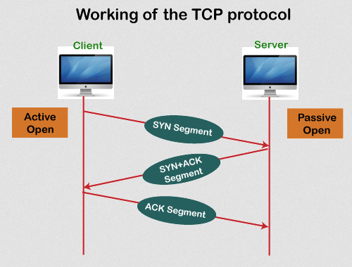
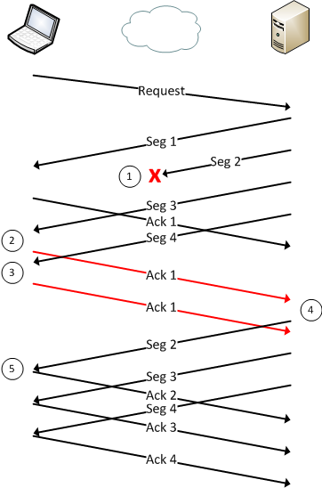
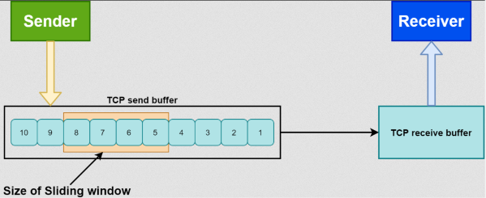
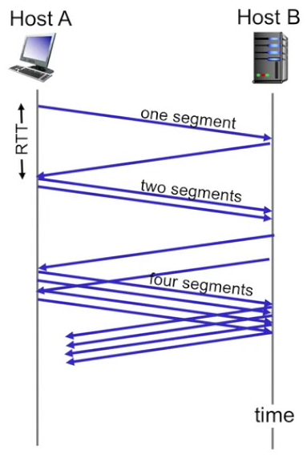
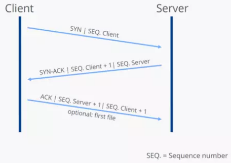

**Main Source :**

- **[Wikipedia Transmission Control Protocol](https://en.wikipedia.org/wiki/Transmission_Control_Protocol)**
- **[TCP vs UDP Comparison | PowerCert](https://youtu.be/uwoD5YsGACg?si=Hy4bdZ6vr2khFBd2)**

**Transmission Control Protocol (TCP)** is a protocol or set of rules used in the [TCP/IP](/computer-networking/tcp-ip) standard for internet communication and forms the basis for many applications, such as web browsing, email, file transfers, and more.

The TCP/IP standard refers to a suite of network protocols, TCP is one of the protocol used there. TCP is a connection-oriented protocol, meaning two devices must establish a reliable connection first before transferring any data. Both client and server need to "approve" or agree while sending the data. The connection is called **TCP connection**, there will be several steps involves to ensure that data connection is reliable and data will be sent and received correctly.

### TCP Process

In TCP, data that wants to be send will be broken down into small unit of data called **segments**. TCP segments contains header that consists of source and destination address; ISN (Initial sequence numbers) which is a uniquely number assigned to each segment to ensure the segment are delivered in order and doesn't conflict with each other, and other header data and the actual data called **payload**.

Here's a simplified explanation of how TCP works :

1. **Connection Establishment** : Before data transmission can begin, TCP establishes a connection between the sender and receiver. This process is known as the **"three-way handshake"**.

   - **SYN** : The sender (client) sends a message called **synchronization (SYN)** to the receiver (server) indicating its intention to establish a connection.

   - **SYN-ACK** : If the server agrees to establish a connection, the receiver will responds back with a SYN-ACK (acknowledgment) indicating they acknowledge the request. It contains the server's own ISN and acknowledges the receipt of the client's ISN. The server also indicates its readiness to establish a connection.

   - **ACK** : The client, upon receiving the SYN-ACK segment, sends back an acknowledgment. It sends a TCP segment confirming the receipt of the server's ISN. The client also acknowledges the server's readiness for the connection. At this point, the connection is established, and both the client and server can begin exchanging data.

   This **ACK** can be thought as the indicator of approvement whether data transmission or TCP connection should continues.

     
    Source : https://www.javatpoint.com/tcp

2. **Data Transfer** : In TCP connection, data is not transmitted continously. After sending a segment, the sender needs to wait for an acknowledgment (ACK) or an approvement from the receiver again. This makes TCP data transfer reliable and certain, if an ACK is not received within a certain time, the sender assumes the segment was lost and retransmits it. The amount of how many segment can be sent without sending another ACK is called **window size**, it is also stored in the header of segment.

     
   Source : https://packetlife.net/blog/2010/jun/17/tcp-selective-acknowledgments-sack/

3. **Flow Control** : TCP employs flow control mechanisms to prevent the receiver from being overwhelmed by data. The receiver specifies a **receive window** indicating the amount of data it can accept. The sender adjusts its data transmission rate based on the receiver's window size, ensuring that data is sent at a pace the receiver can handle.

     
   Source : https://www.baeldung.com/cs/tcp-flow-control-vs-congestion-control

4. **Congestion Control** : TCP also includes congestion control mechanisms to prevent network congestion. It monitors the network for signs of congestion, such as packet loss or increased latency. When congestion is detected, TCP reduces its sending rate to alleviate the congestion and maintain network stability.

     
   Source : https://youtu.be/kRS4J-m5n04?si=3tWpM33jMlx6schI

5. **Connection Termination** : When data transmission is complete, TCP performs a connection termination process to gracefully close the connection. This involves a four-way handshake, where both the sender and receiver exchange FIN (finish) messages to indicate their intention to close the connection.

   - **Sender Sends FIN** : The sender initiates the connection termination by sending a TCP segment with the FIN (Finish) flag set. This segment indicates that the sender has finished sending data and wants to close the connection.

   - **Receiver Sends ACK** : Upon receiving the FIN segment, the receiver sends back an acknowledgment (ACK) segment to confirm the receipt of the FIN. The receiver acknowledges the sender's request to terminate the connection.

   - **Receiver Sends FIN** : If the receiver has also finished sending data and wants to close the connection, it will send a TCP segment with the FIN flag set.

   - **Sender Sends ACK** : Upon receiving the FIN segment from the receiver, the sender responds with an ACK segment to acknowledge the receipt of the receiver's FIN. This acknowledges the receiver's request to terminate the connection.

      
    Source : https://www.ionos.com/digitalguide/server/know-how/introduction-to-tcp/
