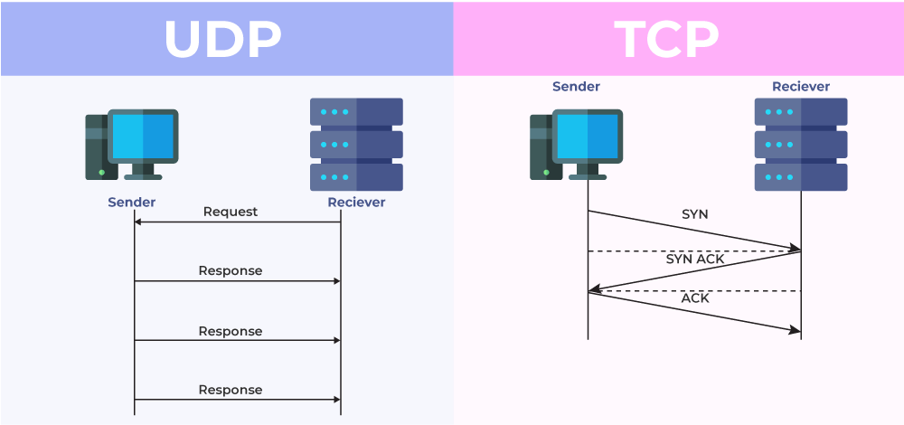
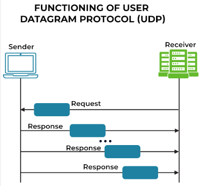

**Main Source:**

- **[TCP vs UDP Comparison — PowerCert](https://youtu.be/uwoD5YsGACg?si=OFe36c6jMAEbVTd2)**
- **[User Datagram Protocol— Wikipedia](https://en.wikipedia.org/wiki/User_Datagram_Protocol)**

**User Datagram Protocol (UDP)** is a protocol for data packets transmission between devices. UDP, same as [TCP](/computer-networking/tcp-protocol), is also a protocol used in the [TCP/IP standard](/computer-networking/tcp-ip-model).

TCP is connection-oriented protocol which means it provides reliable connection and it will guarantee the data will be received. Unlike TCP, UDP is the oppsite, it is connectionless oriented meaning it doesn't guarantee the delivery of data. UDP uses minimum protocol mechanisms, it doesn't provide a reliablity like TCP handshake, this makes UDP is more faster and typically used for real-time data transfer where speed matters.

  
Source: https://www.geeksforgeeks.org/differences-between-tcp-and-udp/

### UDP Process

1. **Data Packaging**: The UDP process starts by dividing data that want to be sent into smaller units called **datagrams**. Each datagram consist of UDP header that contains source and destination address; port number, and checksum value which is a number that is used to detect error. Checksum value from the sender datagram should be the same as the received datagram. The actual user's data in datagrams is called payload.

2. **Addressing**: Sender needs to know the IP address and port number of the destination. It is available in the UDP header, it can also resolved using [DNS server](/computer-networking/dns) if needed.

3. **Datagram Transmission**: The UDP datagram, including the header and payload, will be further encapsulated in Internet Protocol (IP) layer. The IP layer adds its own header containing the ource and destination IP addresses. The resulting IP packet is then sent to the network for transmission.

   UDP does not provide any mechanisms for reliable delivery. The network will send the IP packets, and the receiver's receives them. However, UDP does not have built-in mechanisms for error recovery, retransmission, or acknowledgment of successful delivery. If packets are lost, duplicated, or arrive out of order, it is the responsibility of the receiving application to handle these issues.

4. **Datagram Extraction**: On the receiving end, incoming packets will be identified, it will examine the destination port number to determine what application should process this. The UDP layer removes the UDP header, leaving the payload (user data). The receiving application then retrieves and processes the data from the payload.

  
Source: https://www.spiceworks.com/tech/networking/articles/tcp-vs-udp/
