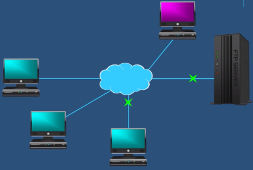
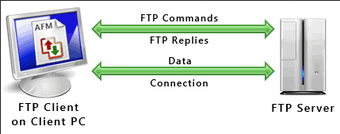
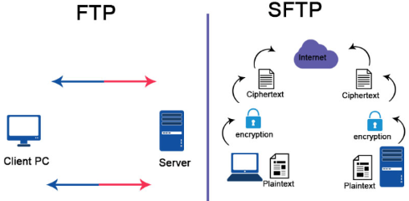

**Main Source :**

- **[FTP (File Transfer Protocol) | PowerCert](https://youtu.be/tOj8MSEIbfA?si=Cr5FHh405wNpaTcq)**

**File Transfer Protocol (FTP)** is a network protocol used for transferring files between a client and a server on a computer network. FTP typically operates on a server, this mean the client will connect to the server and the server will implements the FTP protocol.

  
Source : https://youtu.be/tOj8MSEIbfA?si=YR3ef9cTMsjcD4lp&t=64

### FTP Process

FTP relies on [TCP protocol](/computer-networking/tcp-protocol) for reliable data transfer. Because it's based on TCP, there will be TCP handshakes before connecting to the server. FTP is based on command-response communication, this means client will send command as the request to the server such as RETR to retrieve a file or STOR to store a file.

Here are the high level process of FTP :

1. **TCP Connection** : The client will initiate connection to the server that in default listens to port 21. TCP handshakes that includes sending SYN (synchronize) message and ACK (acknowledgement).

2. **Authenticate** : After establishing a connection to the FTP server, you will need to authenticate, there are two types of authentication. Depending on the server, some FTP require you to register a username and password while some can connect anonymously.

3. **File Operation** : Once client is authenticated, the client can perform various file operations such as uploading (putting) files to the server, downloading (getting) files from the server, renaming files, deleting files, creating directories, and navigating the directory structure, all of these are done by using FTP command. The server will respond with three-digit status code and a corresponding message indicating the success or failure of the command.

4. **Data Connection** : FTP uses separate connections for conencting to the server and for transferring the data. Connecting to server that includes sending command is called **control connection** and the other connection for transferring data is called **data connection**.

   Data connection can be active or passive :

   - **Active Mode** : The server initiates a connection to the client for data transfer. The server sends the client its IP address and a port number on which it listens for the data connection.

   - **Passive Mode** : In passive mode, the client is the one who should initiates a connection to the server. The server will also provide the client its IP address and a port number to establish the data connection.

5. **Connection Close** : When the FTP session is complete, the client sends the QUIT command over the control connection to terminate the session. The server acknowledges the command, and both the control and data connections are closed.

     
   Source : https://www.deskshare.com/resources/articles/ftp-how-to.aspx

### SFTP

FTP is not really secure, it has some security issue such as :

- **Lack of Encryption** : FTP transfers data, including usernames, passwords, and file contents, in plain text. This means that anyone with access to the network traffic can potentially intercept and view sensitive information.

- **Authentication Vulnerabilities** : FTP relies on basic username and password authentication, which can be susceptible to brute-force attacks, eavesdropping, or password sniffing.

Secure File Transfer Protocol (SFTP) is commonly used as a secure alternative to FTP (File Transfer Protocol) because it adds encryption and authentication mechanisms to protect data during transit.

SFTP uses [Secure Shell (SSH)](/computer-networking/network-encryption#ssh) as its underlying protocol, which provides encryption and data integrity. All data, including file content, commands, and authentication credentials, are encrypted to prevent unauthorized access or eavesdropping. SFTP also uses TCP for reliable data transfer and it operates on port 22 instead.

  
Source : https://www.educba.com/ftp-vs-sftp/
