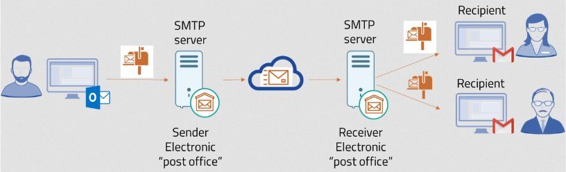
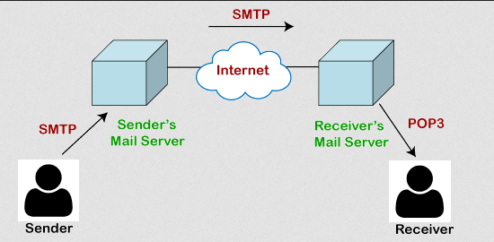
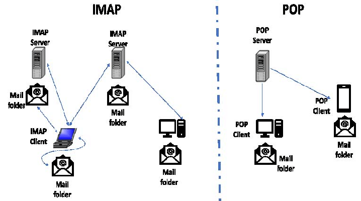

**Main Source:**

- **[Simple Mail Transfer Protocol — Wikipedia](https://en.wikipedia.org/wiki/Simple_Mail_Transfer_Protocol)**
- **[POP3 vs IMAP - What's the difference? — PowerCert](https://youtu.be/SBaARws0hy4?si=ZitizYtQpTXi4xd5)**

**Email Protocol** is a set of rules and standards that define how email communication is conducted between email clients, email servers, and other components involved in the email system. These protocols ensure that email messages are properly formatted, transmitted, delivered, and accessed.

These email protocol are typically based on command-response model, this means the client will send a command as request to do a task and the server will respond with status code and message indicating the result of the request.

### SMTP

**Simple Mail Transfer Protocol (SMTP)** is an email protocol used for sending email messages between servers or from a mail client to a mail server. SMTP is responsible for delivering emails from the sender's side to the recipient's mail server.

SMTP operates on a client-server model, the sender of an email is called client and the recipient act as the server that receive the email. Sender and receiver can be server or an email service software such as Outlook or Gmail. The recipient server is called SMTP server, the server is responsible for handling email delivery, routing, and storing incoming emails.

When a client compose and send an email, the client establishes a connection with the SMTP server and submits the email for delivery.

#### SMTP Process

SMTP is based on TCP/IP suite, it follows the TCP protocol which includes the handshakes

1. **Connection Establishment**: The SMTP client initiates a TCP/IP connection with the SMTP server. By default, SMTP uses port 25, but alternative ports like 587 for secure connections (SMTPS) are also commonly used.

2. **Greeting and Handshaking**: Once the connection is established, the SMTP server sends a greeting message to the client, typically containing the server's name or identification. The client acknowledges the greeting.

3. **Sender and Recipient Information**: The client sends a "MAIL FROM" command to specify the email sender's address. The server responds with a confirmation.

4. **Recipient Verification**: The client sends a series of "RCPT TO" commands to specify one or more recipient addresses. The server verifies the recipients' addresses and responds with confirmation or error codes.

5. **Email Content and Transfer**: The client sends the email content, including the message headers, body, and any file attachments, using the "DATA" command. The content is transmitted as a series of text lines. The client marks the end of the message with a special termination sequence (such as a period on a line by itself).

6. **Message Delivery**: The server receives the email content and performs further processing. It may perform additional checks, such as spam filtering or antivirus scanning. If the recipient's address is valid and the message passes all checks, the server accepts the email for delivery.

7. **Response Codes**: Throughout the process, the server sends response codes to the client indicating the status of each command. These codes include success (e.g., 250 OK), temporary failure (e.g., 421 Service not available), or permanent failure (e.g., 550 Mailbox not found).

8. **Connection Termination**: Once the email transfer is complete, the client can issue a "QUIT" command to terminate the SMTP session. The server acknowledges the QUIT command, and the connection is closed.

  
Source: https://yespo.io/blog/how-choose-right-email-protocol

### POP3

**Post Office Protocol version 3 (POP3)** is an email retrieval protocol used by email clients to retrieve email messages from a mail server. While SMTP is used to send email, POP3 is used to retrieve email messages from a mail server. It is used for downloading email messages from the server to a local device (such as a computer or mobile device) for offline access.

#### POP3 Process

1. **Connection Establishment**: POP3 also uses TCP/IP suite, the client will initiates a TCP/IP connection with the POP3 server. By default, POP3 uses port 110, but alternative ports like 995 for secure connections (POP3S) can be used.

2. **Authentication**: Once the connection is established, the client sends a "USER" command followed by the username and a "PASS" command followed by the password to authenticate itself to the server. The server responds with a positive or negative acknowledgement of the authentication.

3. **Mailbox Access**: After successful authentication, the client sends a series of commands to interact with the mail server and access the user's mailbox. These commands include "LIST" to retrieve a list of available messages, "RETR" followed by the message number to retrieve a specific message, "DELE" followed by the message number to mark a message for deletion, and "QUIT" to terminate the session.

4. **Message Retrieval**: The client uses the "RETR" command to retrieve individual messages from the server. The server responds with the requested message content, including the message headers, body, and any attachments. The client buffers and stores the received messages locally.

5. **Deletion and Cleanup**: If the client sends the "DELE" command for specific messages, the server marks those messages for deletion. The actual deletion of marked messages occurs when the client sends the "QUIT" command to terminate the session.

6. **Connection Termination**: Once the client has finished accessing the mailbox, it sends the "QUIT" command to terminate the POP3 session. The server acknowledges the QUIT command, and the connection is closed.

     
   Source: https://www.javatpoint.com/pop-protocol

### IMAP

**Internet Message Access Protocol (IMAP)** is an email retrieval protocol same as POP3. The difference between POP3 is IMAP provide more advanced functionallity.

POP3 is primarily designed for offline email access. When a POP3 client retrieves email from the server, it typically removes the messages from the server, storing them locally on the client device. It doesn't provide synchronization, for example, if we mark an email as read in our local computer, the server will not update it.

In contrast, IMAP allows for online access to email, clients can create, delete, and manage folders on the server. The messages remain stored on the server, and the client can interacts with the server to view and manage email as the server will synchronized across multiple devices.

1. **Connection Establishment**: The IMAP client initiates a TCP/IP connection with the IMAP server. By default, IMAP uses port 143, but alternative ports like 993 for secure connections (IMAPS) can be used.

2. **Authentication**: Once the connection is established, the client sends an "AUTHENTICATE" or "LOGIN" command followed by the username and password to authenticate itself to the server. The server responds with a positive or negative acknowledgement of the authentication.

3. **Mailbox Selection**: After successful authentication, the client selects a specific mailbox (folder) on the server using the "SELECT" command. This command allows the client to access and manage the messages within the selected mailbox.

4. **Message Synchronization**: The client can request a list of available messages in the selected mailbox using the "FETCH" command. The server responds with information about each message, including headers, flags, and body structure. The client can choose to synchronize the message headers or retrieve the complete message content selectively.

5. **Message Manipulation**: The client can perform various actions on the messages, such as marking them as read/unread, flagging them, moving them to different folders, or deleting them. These actions are typically accomplished through commands like "STORE" and "COPY" issued by the client.

6. **MIME Structure and Attachments**: If a message contains attachments or multi-part content, the client can issue additional commands to retrieve specific parts or attachments of the message using the "BODY" and "PARTIAL" commands.

7. **Connection Management**: The client can keep the connection open for an extended period to maintain an active session with the server. This allows for real-time updates and notifications of new messages or changes to the mailbox. When the client is finished, it can issue the "LOGOUT" command to terminate the IMAP session.

     
   Source: https://www.researchgate.net/figure/MAP-and-POP-protocols_fig1_329881682
