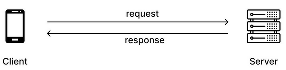
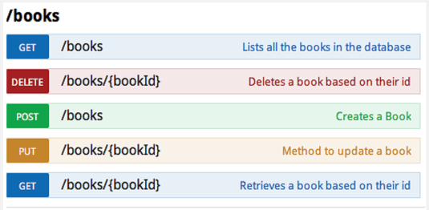
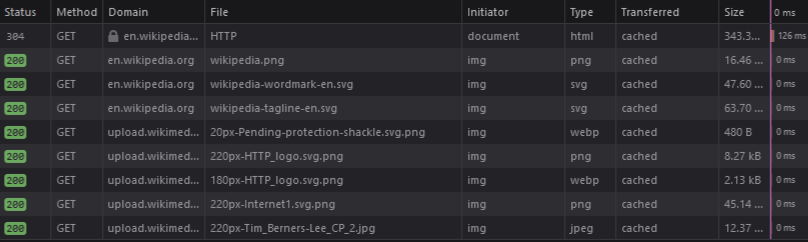
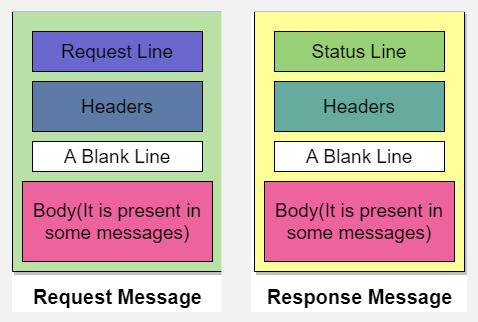
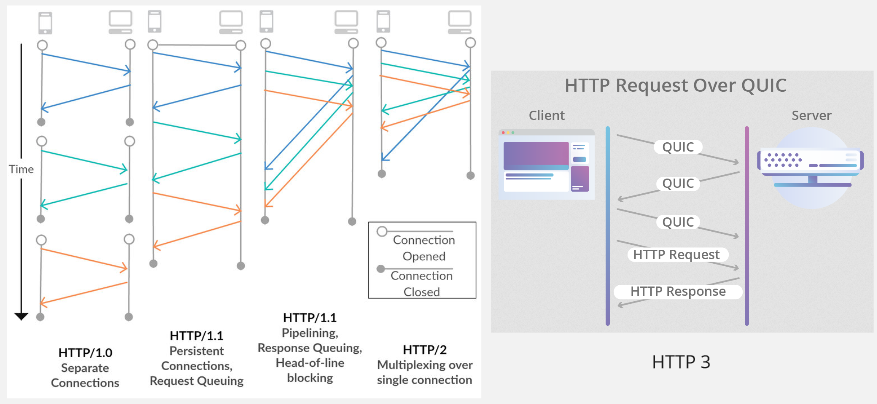
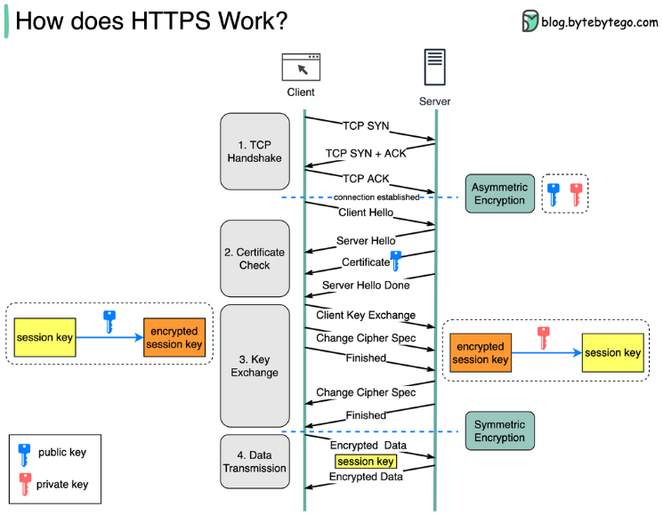

**Main Source :**

- **[Wikipedia HTTP](https://en.wikipedia.org/wiki/HTTP)**
- **[HTTP/1 to HTTP/2 to HTTP/3 - ByteByteGo](https://youtu.be/a-sBfyiXysI?si=n6bBk0HLpwe4AgWU)**
- **[Wikipedia HTTPS](https://en.wikipedia.org/wiki/HTTPS)**
- **[SSL, TLS, HTTP, HTTPS Explained | PowerCert](https://youtu.be/hExRDVZHhig?si=b5j-OTUwBCKu-jsG)**
- **[SSL, TLS, HTTPS Explained - ByteByteGo](https://youtu.be/j9QmMEWmcfo?si=twR9U2aksGKskmmh)**

## HTTP

**Hypertext Transfer Protocol (HTTP)** is protocol used for transmitting hypermedia documents, such as HTML files or webpages, over the internet.

HTTP operates on top of the [TCP/IP protocol suite](/computer-networking/tcp-ip-model), using [Transmission Control Protocol (TCP)](/computer-networking/tcp-protocol) as the underlying transport protocol. It typically uses port 80 for communication, although other ports such as 8080 are also commonly used.

### HTTP Request & Method

HTTP is a stateless protocol, meaning that each request from the client is independent of previous requests. To maintain state and enable more complex interactions, web applications often use cookies or session tokens to track user sessions.

The protocol follows a client-server model, where the client, typically a [web browser](/web-development/web-browser), sends requests to the server, and the server responds with the requested data.

  
Source : https://www.freecodecamp.org/news/what-is-http/

HTTP requests consist of a method that indicates the type of request, a [Uniform Resource Locator (URL)](/web-development/web-url) that specifies the resource being requested, and optional headers that provide additional information about the request.

Some common method are :

- **GET** : The GET method is used to retrieve a resource from the server. It is primarily used to request data and should not have any side effects on the server. For example, retrieving a webpage or fetching data such as image or video from a server.

- **POST** : The POST method is used to submit data to the server to create a new resource. It is commonly used for submitting form data or uploading files. The data sent in the body of the request is typically processed by the server and may result in the creation of a new resource.

- **PUT** : The PUT method is used to update an existing resource on the server. It replaces the resource with the new data provided in the request body. If the resource does not exist, some servers may create it.

- **DELETE** : The DELETE method is used to remove a resource from the server. It requests the server to delete the specified resource.

For example, the image below is called an API endpoint. It is a specific URL that the client can request into and the servers should understand. An API endpoint needs a base URL, it is the starting point of a web address, typically uses the domain name itself.

Suppose we want to "get" all the books available in a server. The web address or the base URL is `www.library.com`. We would use the GET method with the `/books` endpoint. We will append it next to the base URL, so it will be `http://www.library.com/books`. We used `http` in the front to indicate we are going to use the HTTP protocol.

  
Source : https://javarevisited.blogspot.com/2016/04/what-is-purpose-of-http-request-types-in-RESTful-web-service.html

### HTTP Response

Upon requesting using an HTTP method, the server will response a status code that indicates the outcome of the request along with the requested data and optional response headers. The status code consist of 3 digit ranging from 100 to 599 (not all number included).

1. **Informational (1xx)** : This category consists of informational response codes that indicate that the server has received the request and is processing it. These codes are used to provide preliminary information or to request the client to continue with the request.

2. **Success (2xx)** : The success category includes response codes that indicate the successful processing of the request by the server. These codes indicate that the request was understood, accepted, and processed without any errors. The most common success code is 200, which signifies that the request was successful and the server is returning the requested content.

3. **Redirection (3xx)** : Redirection response codes indicate that the requested resource is temporarily or permanently located at a different URL. These codes are used when a resource has been moved or when the server wants the client to access a different URL. The client may need to follow the redirection to obtain the desired resource.

4. **Client Errors (4xx)** : The client error category includes response codes that indicate an error on the client's side. These codes indicate that the server was unable to process the request due to a client error, such as a malformed request, unauthorized access, or a request for a resource that does not exist. The well-known client error code is 404, which indicates that the requested resource was not found on the server.

5. **Server Errors (5xx)** : Server error response codes indicate that the server encountered an error while processing the request. These codes indicate that the server was unable to fulfill the request due to an internal server error or an unexpected condition. Server error codes are returned when something goes wrong on the server side, such as a misconfiguration, a problem with the server application, or server overload.



### HTTP Format & Syntax

HTTP request and response follows a specific format and syntax for communication :

- HTTP Request Format:

  - **Request Line** : Specifies the HTTP method, target URL (including the path and any query parameters), and the HTTP version.
  - **Request Headers** : Optional headers that provide additional information about the request, such as domain name, content type, authentication credentials, and etc.
  - **Blank Line** : A blank line indicating the end of the headers section.
  - **Request Body** : Optional data included with certain HTTP methods like POST or PUT. It contains the payload of the request.

  Example :

  ```
  GET /path/to/resource HTTP/1.1
  Host: www.example.com
  User-Agent: Mozilla/5.0 (Windows NT 10.0; Win64; x64) AppleWebKit/537.36 (KHTML, like Gecko) Chrome/91.0.4472.124 Safari/537.36

  ```

  User-Agent provides information about the client making the request, including the browser and operating system details.

- HTTP Response Format:

  - **Status Line** : Specifies the HTTP version, status code, and a brief status message.
  - **Response Headers** : Provide additional information about the response, such as content type, server information, and etc.
  - **Blank Line** : A blank line indicating the end of the headers section.
  - **Response Body** : Contains the actual content of the response, such as HTML pages, [JSON](/web-development/json), or binary data.

  Example :

  ```
  HTTP/1.1 200 OK
  Content-Type: application/json
  Content-Length: 1234

  {
      "message": "Hello, World!",
      "data": {
          "key": "value"
      }
  }
  ```

  
Source : https://www.studytonight.com/computer-networks/http-protocol

### HTTP Version

HTTP has undergone several version over time, the oldest one is the HTTP/1.0 and the newest is the HTTP/3. Along the version, new response code, feature, performance improvement were introduced.

#### HTTP/1.0

HTTP/1.0 was made in 1996, it is based on TCP and each request required a separate connection, resulting in higher overhead. HTTP/1.0 had a basic set of headers, including Content-Type, Content-Length, Host, User-Agent, and Referer. The supported method are GET, POST, HEAD, and PUT were among the supported methods.

#### HTTP/1.1

This version was made in 1997 and it was a major improvement. It allows multiple requests and responses to be sent over a single connection. Response is allowed to be sent in multiple parts or "chunks". This is particularly useful for transferring large or dynamically generated content.

HTTP/1.1 supports request pipelining, where multiple requests can be sent without waiting for the corresponding responses. This allows for more efficient use of network resources and reduces latency by eliminating the need for round trips between the client and server.

It introduces the host header that specifies the domain name of the server being requested, this header allows a single server to host multiple websites.

#### HTTP/2

HTTP/2 was published in 2015. It introduced multiplexing, with single TCP connection, multiple requests and responses can be sent and received concurrently. Allows a more advanced pipelining compared to HTTP/1.1, it allows multiple independent stream to be sent without order.

HTTP/2 introduces server push functionality, which allows servers to send resources to clients before they are explicitly requested. This can improve page load times by eliminating the need for subsequent round trips for additional resources.

#### HTTP/3

HTTP/3, also known as HTTP over QUIC, was a draft in 2020 and was published in June 2022. It uses new protocol called **Quick UDP Internet Connections (QUIC)** instead of the original TCP. QUIC combines the reliability of TCP with the no handshake mechanism of UDP that provides low-latency and efficiency.

In HTTP/3, if a packet is lost or delayed in one stream, it does not affect the delivery of other streams since they are independent of each other.

QUIC introduces connection ID, it is a unique identifier of a connection. An identifer allows a faster connection establishment or migration compared to traditional protocols like TCP. An example for this would be a phone that originally uses Wi-Fi and changes to a cellular network. The server will recognizes the ID and associates it with the existing connection state, allowing the connection to continue seamlessly without interruption.

  
Source : https://www.researchgate.net/figure/Comparison-of-HTTP-versions_fig1_312560536, https://blog.cloudflare.com/http3-the-past-present-and-future/

## HTTPS

While using HTTP as protocol to retrieve webpage, the information are sent in plain text. This means while information are transmitted, it can be read easily by anyone who has access to the network traffic, this is called eavesdropping. Another bad thing that could happen is someone could manipulate the sensitive information or injecting a malicious code, this is called Man-in-the-Middle Attacks (MITM).

The browsing behavior and activities of users can be easily monitored and tracked by various entities, including internet service providers (ISPs), advertisers, and malicious actors. This compromises user privacy and can lead to targeted advertising, profiling, or misuse of personal information.

**Hypertext Transfer Protocol Secure (HTTPS)** is the secure version of HTTP. It employs encryption mechanisms to ensure secure transmission of data over a computer network. HTTPS uses an encryption protocol called [Transport Secure Layer (TLS)](/computer-networking/network-encryption#ssltls).

### HTTPS Process

TLS protocol involves a handshake process, after connection is established or the three-way TCP handshakes in HTTP is done. TLS handshakes is required to establish a secure connection, in the process there will be some information exchange including TLS protocol version, server's identity or certificate, and exchanging cryptographic keys.

Here is a high-level explanation for HTTPS process :

1. **TCP Handshake** : TCP handshakes which is the same as the beginning of HTTP process, this include sending SYN and ACK message.

2. **Certificate Check** : The client will send a "Client Hello" message to the server, indicating the TLS protocol versions and cryptographic algorithms it supports to encrypt the data. The server will respond with a "Server Hello" message, selecting the highest TLS version and cryptographic algorithms that both the client and server support.

   The server presents its digital certificate, which is a digital document that provide authenticity and trustworthiness of a website or server. The client verifies the certificate's authenticity and checks if it is issued by a trusted Certificate Authority (CA).

   After the certificate exchange, the server sends a "Server Hello Done" message to indicate that it has completed its part of the handshake. This message serves as a signal to the client that it can proceed with the next step.

3. **Key Exchange** : In the next step, there will be an asymmetric key exchange where the client and server exchange keys. This key exchange process includes sending the necessary information required to encrypt the data. This information typically includes the key exchange algorithm, encryption algorithm, and hash function to be used for the TLS protocol.

4. **Data Transmission** : After the key exchange, a session key is generated. The session key is a symmetric encryption key used to encrypt and decrypt the data. The client possesses the public key, while the server has the corresponding private key. In simple terms, the session key can only be used with the public and private keys owned by the client and server. The data is encrypted using the session key, enabling secure transmission between the client and server.

HTTPS is the combination of symmetric and asymmetric encryption algorithm. Asymmetric only happens from certificate check to the key exchange process. During data transmission, symmetric algorithm will be used.

  
Source : https://blog.bytebytego.com/p/how-does-https-work-episode-6
