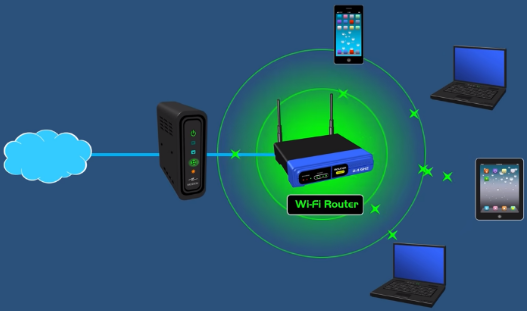
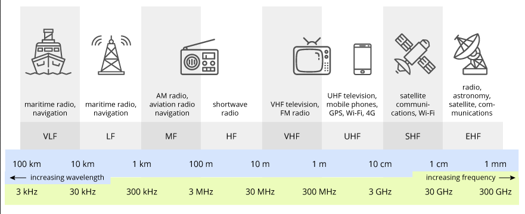
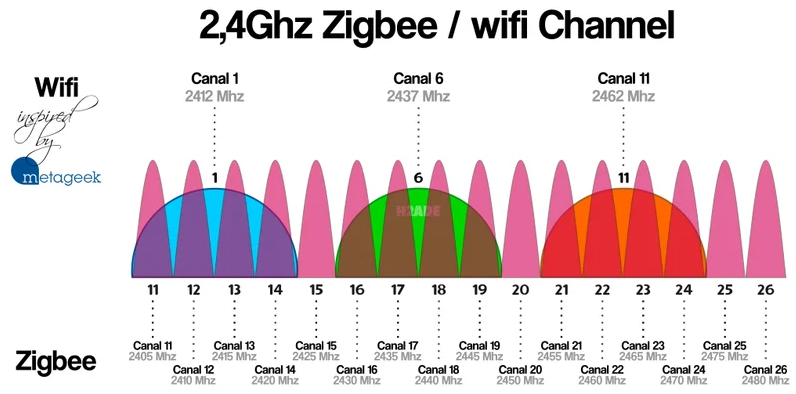
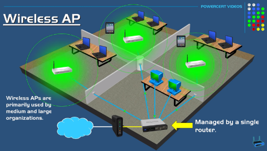
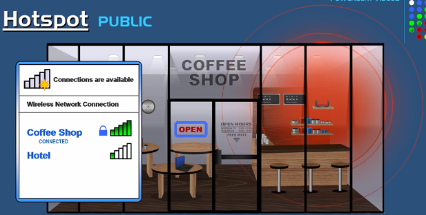

**Main Source :**

- **[Bluetooth vs WiFi - What's the difference? | PowerCert](https://youtu.be/mPMGRILsOVk?si=zD6pY-AbhPWbJFCl)**
- **[2.4 GHz vs 5 GHz WiFi: What is the difference? | PowerCert](https://youtu.be/J_bf_KE5llQ?si=mDP5uaguw2uDLftZ)**
- **[Wireless Access Point vs Wi-Fi Router | PowerCert](https://youtu.be/OxiY4yf6GGg?si=58jsyWGQjuk4K0o6)**

**Wireless Fidelity (Wi-Fi)** is a technology that allows electronic devices to connect to a[ local area network (LAN)](/computer-networking/lan-wan) wirelessly. It enables devices such as computers, smartphones, tablets, and other devices to access the internet and communicate with each other without the need for physical wired connections.

It is one of a wireless network protocol that uses radio waves as the medium to exchange data. Each device will need a central point access such as Wi-Fi [router](/computer-networking/router).

A packet of data in digital form is transformed into an analog signal. Analog signal will be send into the receiver, this is done by the [modulation and demodulation (modem)](/computer-networking/dial-up-modem) process. The Wi-Fi router will connect to the modem and forward the data packet into the destined device in the local network.

  
Source : https://youtu.be/mPMGRILsOVk?si=D7PjKsfm1TouFWk4&t=133

#### Wi-Fi Performance

Some factor that contribute to Wi-Fi performance are :

- **Wi-Fi Range** : Wi-Fi typically have range of 30 - 91 meters. However, the range may be reduced by some factor including the type and design of antennas used in Wi-Fi devices, an obstructions such as thick walls or metal structures are particularly effective at blocking wireless signals.

- **Wave Interference** : Wi-Fi uses radio waves to transfer data, if alot of device uses Wi-Fi at the same time, wave inference could happen. Interference can occur when other devices emit signals that overlap or interfere with Wi-Fi signals.

#### Single & Dual-band Router

These two types of Wi-Fi routers differ in the frequency bands they use to transmit signals. Frequency bands refer to how the router transfers radio waves. For example, a router that operates at a frequency of 2.4 GHz sends radio waves that oscillate at a frequency of 2.4 billion cycles per second, or 2.4 gigahertz (GHz).

Any frequency band can work fine in many cases. However, if many routers are using the same frequency band, it could increase the chances of wave interference from other devices operating in the same frequency band. This can lead to slower connection speeds and even loss of connection.

#### Single-band vs Dual-band router

A single-band router operates on the 2.4 GHz frequency band, while a dual-band router operates on both the 2.4 GHz and 5 GHz bands. The dual-band router is obviously better because not many devices use the 5 GHz band, and higher frequency bands also support faster data transfer rates. This is because higher frequencies allow for a larger bandwidth, enabling more data to be transmitted within a given time frame.

#### Channel Overlapping

Within the frequency bands, the frequencies are further divided into smaller ranges called channels. These channels are where the radio waves are actually transmitted. Sometimes these channels can overlap, leading to slower connection speeds and interference. A 2.4 GHz Wi-Fi has 3 non-overlapping channels, while a 5 GHz Wi-Fi has 25 non-overlapping channels.

  
Source : https://terasense.com/terahertz-technology/radio-frequency-bands/

  
Source : https://haade.fr/en/blog/interference-zigbee-wifi-2-4ghz-to-know

### Wireless Access Point (WAP)

**Wireless Access Point** is a device that enables wireless devices to connect to a wired network. It acts as a bridge between the wired and wireless networks. Wireless access point is the simpler version of Wi-Fi router, the purpose is only to connect from a normal router to each device in the network wirelessly.

A Wi-Fi router is a more advanced device that combines the functions of a wireless access point, a [network switch](/computer-networking/switch), and a [network router](/computer-networking/router) into a single device.

  
Source : https://youtu.be/OxiY4yf6GGg?si=-tqndmm07MA2bh6j&t=178

### Hotspot

**Hotspot** is a location or an area where wireless internet access is provided, typically using Wi-Fi technology.

Hotspot can be public or private, a public hotspots are Wi-Fi networks that are available for use by anyone within range. Examples include Wi-Fi networks in cafes, airports, libraries, and parks. Public hotspots are designed to be easily accessible to the general public and provide internet connectivity for visitors or customers. However, using public hotspot may be dangerous as anyone can access it. A malicious actor could intercepts and captures the network traffic transmitted between a user's device and the hotspot, this is called eavesdropping.

Private hotspots, also known as tethering, are Wi-Fi networks created by individuals using their smartphones, tablets, or dedicated mobile hotspot devices. These hotspots are intended for personal use and are secured with a password. Only those who know the password can connect to the network and access the internet through it. Private hotspots are commonly used when a person wants to share their data connection with other devices.

  
Source : https://youtu.be/ktxC3vDukbc?si=K5IbUJW8XUiRNbuB&t=85
