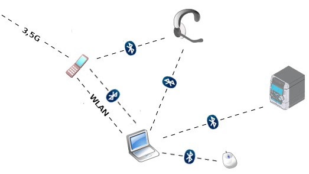
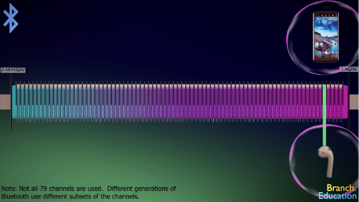

**Main Source :**

- **[Bluetooth vs WiFi - What's the difference? | PowerCert](https://youtu.be/mPMGRILsOVk?si=fg2YELEQwkQGC_Fd)**
- **[How does Bluetooth Work? | Branch Education](https://youtu.be/1I1vxu5qIUM?si=CzlAWwXwDhgZ7cq-)**

**Bluetooth** is a wireless communication technology that allows devices to connect and exchange data over short distances. It is commonly used for connecting devices such as smartphones, tablets, laptops, and peripherals like keyboards, mice, and speakers.

Establishing a connection between two bluetooth device is called **pairing**. Same as [Wi-Fi](/computer-networking/wi-fi), bluetooth operates within the 2.4 GHz frequency range and uses radio waves.

:::tip
The difference between bluetooth and [Wi-Fi](/computer-networking/wi-fi) is bluetooth is typically used for connecting device while Wi-Fi is used to connect to the network such as internet.
:::

  
Source : https://www.littlecamels.com/2012/03/11/how-to-saturate-a-network-of-bluetooth-devices

### Bluetooth Packet

In bluetooth, data is transmitted and received in the form of packets. A packet is a unit of data that contains the information being exchanged between Bluetooth devices. Bluetooth packets consist of several components, including :

- **Access Code** : The access code is a synchronization pattern that helps the receiving device identify the beginning of a packet. It allows devices to synchronize their data transmission.

- **Header** : The header contains control information about the packet, such as the packet type and addressing information.

- **Payload** : The payload is the actual data being transmitted. It can vary in size depending on the packet type and the purpose of the transmission. For example, payload can include an audio data.

- **Cyclic Redundancy Check (CRC)** : The CRC is an error-checking mechanism that uses mathematical calculation on the packet contents. The sender and the receiving device performs the same calculation and the result should be the same.

### Bluetooth Channel

Bluetooth operates within the 2.4 GHz frequency bands. Same as Wi-Fi, within the frequency bands, the frequencies are further divided into smaller ranges called channels. These channels are where the radio waves are actually transmitted.

The Bluetooth standard divides this band into 79 individual channels, each with a bandwidth of 1 MHz. This channels are used to minimize interference from other devices operating in the same frequency range, such as Wi-Fi routers, cordless phones, and microwaves. Bluetooth devices hop between these channels at a rapid rate, typically changing channels 1600 times per second.

  
Source : https://youtu.be/1I1vxu5qIUM?si=43742PCya8lVvX0r&t=526
