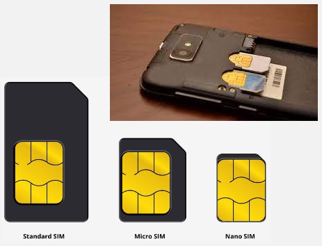
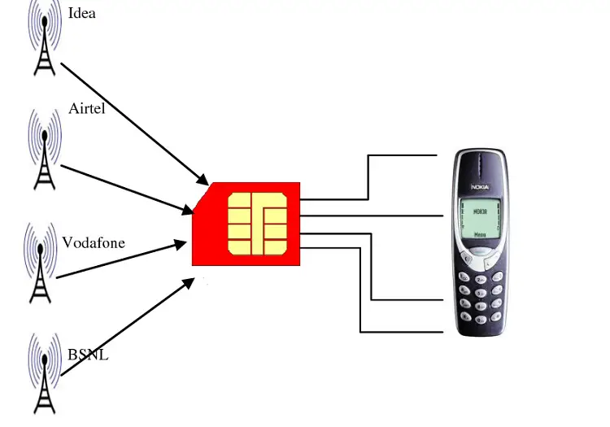

**Main Source : [How do SIM Cards Work? - Techquickie](https://youtu.be/GTCAbmjyEvE?si=_oGqSglZ253CuESu)**

**Subscriber Identity Module (SIM Card)** is a small, portable memory card used in mobile devices such as smartphones, tablets, and certain other devices like smartwatches. It provides necessary information to identify and authenticate the user on a [cellular network](/computer-networking/cellular-networking).

The SIM card contains a unique identification number called the **International Mobile Subscriber Identity (IMSI)**, which is associated with a specific mobile network operator. It is a 64-bit number which means there are $2^{64}$ unique combination. When a device with a SIM card connects to a cellular network, the network uses the IMSI to validate the user's identity and grant access to the network.

A SIM card come in different sizes, the size doesn't matter as the main information is stored in the gold plated area. The gold plated area consist of small metallic contact points, these points will come into direct contact with the device's SIM card reader, allowing for the transfer of data and communication between the device and the SIM card.

  
Source : https://www.lifewire.com/insert-sim-card-into-smartphone-4777486, https://electronics.howstuffworks.com/how-to-tech/how-to-unlock-cell-phone1.htm

Other than identification purposes, SIM card also contains other data including :

- **Phone Number** : SIM cards store the phone number associated with the subscriber's account. This information allows the network to identify and route calls and messages to the correct device.

- **Contacts and SMS** : SIM cards have limited storage space to store contacts and SMS messages. Users can save phone numbers and text messages directly on the SIM card, which can be useful for transferring contacts between devices or as a backup.

### How does it works

SIM cards are used to connect to a cellular network, of course the card needs to be inserted first into the device.

#### IMSI

As said before, SIM card has a unique identifier called IMSI. IMSI is typically 15-digit number, the first three digits represent **Mobile Country Code (MCC)**. The next three digits represent the **Mobile Network Code (MNC)**. The remaining digits represent the **Mobile Subscription Identification Number (MSIN)**, which is unique to each subscriber within the network.

#### The process

While connecting to a cellular network, the cell provider will generate a random number. They will transform the number by encrypting it using some secret key. The provider will send us the random number, our phone should transform it aswell and the result should be the same.

The secret key is actually the IMSI and authentication key (also stored in SIM card) owned by us. So, if we actually has a valid SIM card or are eligible to connect, than we should be able to get the same result. If it succeed, then we are allowed to connect to the network.

This authentication process is called **Challenge-Response Authentication (CRA)**. Different cellular networking technology (such as GSM, UMTS, LTE, or 5G) may have different process and the security protocols implemented by the network operator.

  
Source : https://www.wharftt.com/identifying-and-fixing-a-damaged-sim-card-know-the-signs-and-solutions/
