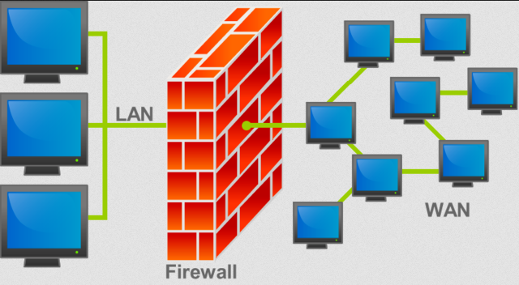
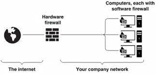

This is the same notes as :

- **[Computer Security > Network Security](/computer-security/network-security)**

**Main Source :**

- **[Wikipedia Denial-of-service attack](https://en.wikipedia.org/wiki/Denial-of-service_attack)**
- **[DDoS Attack Explained](https://youtu.be/ilhGh9CEIwM?si=tVeGgpOmlVOtxNSx)**
- **[What is a Firewall?](https://youtu.be/kDEX1HXybrU?si=gobmfAT1Kcq8dFGO)**

Network Security page

### Eavesdropping

### DDoS Attack

**Distributed Denial of Service (DDoS)** attack is a type of cyberattack in which many computers or devices, often infected with malware, are used to flood a website or network with traffic. This makes the server overwhelmed and cause it to become unavailable to legitimate users. A network of computers that does a DDoS attack is called **botnet**.

An attack where the requests typically originate from a single source is just **Denial of Service (DoS)**. On the other hand, a DoS attack is an attack which run on multiple system connecting to server is called **Distributed Dos (DDoS)**, this causes the server to floods and be overwhelmed.

Another type is **Yo-Yo DDoS** attack which typically targets server that has limited capacity for processing incoming traffic. In a back-and-forth manner, the attacker first attack the server and wait for it to stop the operation. After the server continue the normal operation, the hacker will attack again causing the server to constantly switch between normal operation and overload.

There are several ways to anticipate a DDoS attack :

- **Increase Network Bandwidth** : If possible, increasing the available bandwidth will helps absorb the impact of a DDoS attack by allowing the network to handle a larger volume of traffic.

- **[Load Balancing & Content Delivery Network (CDN)](/computer-networking/server#server-optimization)** : If the DDoS attackers are around the world, using CDN might help. Or we can also distribute the incoming network request using load balancing technique. This technique distribute network request from client evenly across all the server, this will ensure there will be no server that becomes overwhelmed or underwhelmed.

- **Traffic Filtering** : Filtering traffic means we are blocking specific client from making request to the server. There are several technique including blacklisting IP addresses, detect and block suspicious traffic patterns, and by using access control lists (ACLs).

  
Source : https://www.onelogin.com/learn/ddos-attack

### Man in The Middle Attack

### DNS Spoofing

### IP Spoofing

### Firewall

**Firewall** is a network security device that acts as a barrier between a trusted internal network and an untrusted external network, such as the Internet. Its primary purpose is to control incoming and outgoing network traffic.

  
Source : https://en.wikipedia.org/wiki/Firewall_(computing)

Firewall examines the packets of data passing through them and make decisions about whether to allow or block the traffic based on the defined criteria. Common criteria include source and destination IP addresses, ports, protocols, and packet contents. By analyzing this information, firewalls can determine whether a packet should be allowed to pass through or if it poses a potential security risk and should be blocked.

  
Source : https://youtu.be/kDEX1HXybrU?si=iRlxiRyRBPYrG90I&t=137

A firewall can be implemented in both hardware and software forms. A hardware firewall protects the entire network, typically in a standalone form or built-in to the [router](/computer-networking). A software firewall, also known as host-based firewall, is implemented on individual computers or servers. For example, Windows operating system has a built-in firewall called Microsoft Defender Firewall.

  
Source : https://shop3213.sosoutremer.org/category?name=hardware%20vs%20software%20firewall

### Network Encryption

See [network encryption](/computer-networking/network-encryption)
