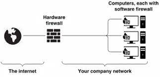

This is the same notes as :

- **[Computer Security > Firewall](/computer-security/firewall)**

**Main Source : [What is a Firewall?](https://youtu.be/kDEX1HXybrU?si=gobmfAT1Kcq8dFGO)**

**Firewall** is a network security device that acts as a barrier between a trusted internal network and an untrusted external network, such as the Internet. Its primary purpose is to control incoming and outgoing network traffic.

  
Source : https://en.wikipedia.org/wiki/Firewall_(computing)

Firewall examine the packets of data passing through them and make decisions about whether to allow or block the traffic based on the defined criteria. Common criteria include source and destination IP addresses, ports, protocols, and packet contents. By analyzing this information, firewalls can determine whether a packet should be allowed to pass through or if it poses a potential security risk and should be blocked.

  
Source : https://youtu.be/kDEX1HXybrU?si=iRlxiRyRBPYrG90I&t=137

A firewall can be implemented in both hardware and software forms. A hardware firewall protects the entire network, typically in a standalone form or built-in to the [router](/computer-networking). A software firewall, also known as host-based firewall, is implemented on individual computers or servers. For example, Windows operating system has a built-in firewall called Microsoft Defender Firewall.

  
Source : https://shop3213.sosoutremer.org/category?name=hardware%20vs%20software%20firewall
