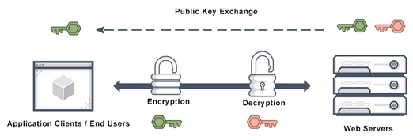
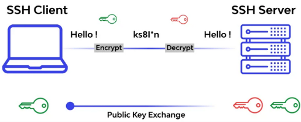

**Main Source :**

- **[SSL, TLS, HTTP, HTTPS Explained | PowerCert](https://youtu.be/hExRDVZHhig?si=6hL-OBvXAyOVHGjz)**
- **[How does SSL work? - Cloudflare](https://www.cloudflare.com/learning/ssl/how-does-ssl-work/)**
- **[Telnet vs SSH Explained | PowerCert](https://youtu.be/tZop-zjYkrU?si=TD9ZjvQxu6mliMo0)**
- **[How Does SSH Work? - PhoenixNAP](https://phoenixnap.com/kb/how-does-ssh-work)**

**Network Encryption** is the process of transforming data transmitted over a computer network to a human-unreadable data to protect it from unauthorized access or interception. It ensures that the information remains secure while it is being transmitted between devices or across the network.

One of the application of network encryption is the [HTTPS](/computer-networking/http-https#https) protocol which is the secure version of [HTTP](/computer-networking/http-https#http).

### SSL/TLS

**Secure Sockets Layer (SSL)** is one of the first cryptographic protocols to provide secure communication over a computer network. It uses public key encryption, also known as [asymmetric encryption](/computer-security/encryption#symmetric--asymmetric-encryption). There will be [public and private key](/computer-security/encryption#public-and-private-key), these key are a piece of information that is used to "lock" or "unlock" data, just like a key in real life.

1. **Handshakes (Client & Server Hello)** : To establish a connection, SSL protocol involves a handshaking process. Handshaking indicates that the client wants to communicate with the server, they will also exchange some required information.

   The client will send a Client Hello message that contains SSL version, a random number, and a list of cipher suites (encryption algorithms) that the client can use. The server will respond with a Server Hello message. This message includes the SSL version selected for the connection, another random number, and the cipher suite chosen from the client's list of supported cipher suites.

2. **Certificate Exchange** : The server will send its digital certificate to the client. The certificate contains the server's public key, which is used for encryption. The client verifies the certificate to know if the server is trustworthy or not by checking its validity, the issuing authority, and the server's domain name. The certificate is necessary as Google may flag a website as not secure if they are not SSL protected and may be penalized in the search ranking.

3. **Key Generation** : The server will generate a key pair consisting of a public key and a private key. The private key is kept securely by the server, while the public key is made available to anyone who wants to establish a secure connection with the server.

4. **Data Transmission** :

   - **Encryption** : The server sends its public key to the client. The client uses this public key to encrypt data that will be sent to the server. The encryption process ensures that only the server possessing the corresponding private key can decrypt and read the data.

     The data can now be transmitted securely over the network.

   - **Decryption** : Upon receiving the encrypted data, the server uses its private key to decrypt the data. The private key is kept secret and known only to the server, ensuring that only the server can decrypt and access the original data.

  
Source : https://avinetworks.com/glossary/ssl-security/

#### TLS

**Transport Layer Security (TLS)** is a newer cryptographic security protocol, it is the successor of SSL. Overall the process is similar, TLS supports a wider range of cryptographic algorithms and is considered more secure.

### SSH

#### Telnet

To communicate with a remote computer such as server, we can use **telnet**. Telnet is client/server protocol that provides access to the remote systems on local area networks or the Internet. Telnet is a command line tool, meaning there is no graphical user interface, you can only type command using keyboard.

Telnet offers the ability to tell server to do task such as running program, delete file, transfer file, start or stop service, and etc.

Telnet is an old technology, it operates over the [TCP/IP network](/computer-networking/tcp-ip-model). Telnet is not very secure, it transmits data, including usernames, passwords, and commands, in clear text, meaning the information is not encrypted. This makes it susceptible to eavesdropping and interception by malicious actors. As a result, Telnet is considered insecure for transmitting sensitive information over public networks, such as the internet.

**Secure Shell (SSH)** is network protocol that provides a secure and encrypted method of communication between two computers. SSH is the secure replacement over the old telnet, it is commonly used for remote login and secure file transfer over an unsecured network, such as the internet.

SSH supports password-based authentication and public key encryption, it encrypts the entire communication session, including the transmitted data, commands, and responses.

#### SSH Process

1. **Connection Initialization** : The client initiates a connection request to the SSH server. The server listens on a designated port (typically port 22) for incoming SSH connections.

2. **[Key Exchange](/computer-security/encryption#key-exchange)** : The client and server perform a key exchange process to establish a session key which is a [symmetric encryption](/computer-security/encryption#symmetric--asymmetric-encryption) used for encrypting and decrypting of the data (typically uses the [asymmetric encryption](/computer-security/encryption#symmetric--asymmetric-encryption)).

3. **Encryption** : Once the session key is established, the client and server use symmetric encryption algorithms to encrypt the data transmitted between them. This ensures the confidentiality of the information. Additionally, SSH provides integrity checks using cryptographic hash functions to detect any tampering or modification of the data during transmission.

4. **User Authentication** : The client authenticates itself to the server, by providing a username and password or by using public-key cryptography for authentication, where the client presents a public key to the server for verification.

5. **Shell or Command Execution** : After successful authentication, the SSH server provides the client with a secure shell or executes a specific command requested by the client. This allows the client to interact with the remote system as if they were directly accessing it.

6. **Secure Data Transfer** : SSH can also provide secure file transfer capabilities through the SFTP (SSH File Transfer Protocol) subsystem. SFTP allows users to transfer files securely between the client and server, similar to [FTP](/computer-networking/ftp) but with the added security of SSH.

  
Source : https://course-net.com/blog/ssh-adalah/
