**Main Source :**

- **[Computer architecture - Wikipedia](https://en.wikipedia.org/wiki/Computer_architecture)**
- **[Central processing unit - Wikipedia](https://en.wikipedia.org/wiki/Central_processing_unit)**
- **Various Google searches**

**Computer Organization and Architecture (COA)** is the study of the design and implementation of computer systems at the hardware level. It focuses on the organization and interactions of the components between a computer systems, including CPU, memory, and I/O devices.

### Computer Components

#### CPU

**Central Processing Unit (CPU)** is the most crucial component in a computer system, it is the "brain" of the computer that is responsible for executing program instructions. A CPU consists of other smaller components :

- **Control Unit (CU)** : The control unit is responsible for managing and coordinating operations in CPU. It fetches instructions from memory, decodes them to determine their meaning, and controls the flow of data between different components of the CPU. Last but not least, it ensures instructions are executed in the correct sequence according to the program's instruction.
- **Memory** : Memory is the storage space where data and instructions are stored for the CPU to access. It holds program instructions, data, and variables during program execution. Memory can be organized into different levels :
  - **Main Memory** : Main memory (RAM) is the primary storage used by computer to temporarily hold data and instructions that the CPU needs to access quickly during program execution. The characteristic of RAM is that it is **volatile** and requires power to operate. This means that any data present in RAM will be lost after the computer is turned off.
  - **Cache** : Cache is a small, high-speed memory that are typically located closer to the CPU than main memory. Cache reduce the time required to fetch instructions and data from the main memory. Caches exist in multiple levels, such as L1, L2, and L3, with each level providing progressively larger storage capacity but at slightly slower access speeds.
  - **Secondary Memory** : Secondary memory is the opposite of main memory, it is non-volatile (requires no power) and it provides long-term storage for programs, data, and files. They are devices like hard disk drives (HDDs) or solid-state drives (SSDs).
- **Registers** : Registers are small, high-speed memory units located within the CPU. They are used to store data that the CPU is currently using for its operations. Registers can store intermediate results, memory addresses, and control information. For example, a register can be used for **program counter**, which is a component to holds the memory address of the next instruction to be fetched and executed.
- **Arithmetic Logic Unit (ALU)** : ALU is the component that is responsible for performing arithmetic operations (addition, subtraction, multiplication, and division) and logical operations (such as comparisons, [bitwise operations](/computer-and-programming-fundamentals/bitwise-operations), and [boolean operations](/computer-organization-and-architecture/boolean-logic)). The ALU operates on data retrieved from registers and produces results that are stored back in registers.

Regarding instructions, they are made through the source code from the high-level programming language. These source code are translated to machine language which is recognized by the CPU as instruction. Those instructions will be stored in memory sequentially, along with the variables or any other data used in the program.

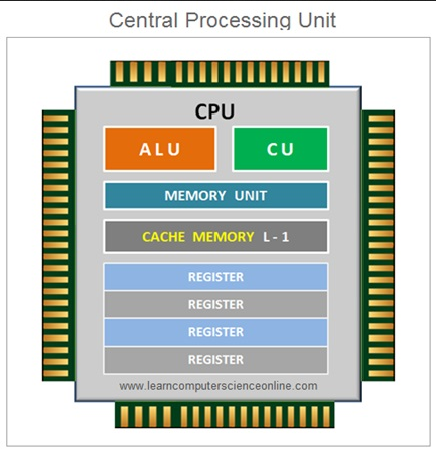  
Source : https://www.learncomputerscienceonline.com/what-is-computer-memory/

- **Clock** : Clock is a timing mechanism that synchronizes the operations of the CPU. It generates regular electrical pulses called **clock cycles**. Each clock cycle represents a fixed unit of time, and the CPU's operations are synchronized to the clock. The clock speed determines the number of clock cycles per second and is measured in hertz (Hz). A higher clock speed generally allows the CPU to execute instructions more quickly. For example, if the clock speed is 1 GHz, it will be able to execute 1 billion instructions per second. By instructions, it doesn't mean any specific calculation, it is the action the CPU can do, it can include fetching instructions, decoding instructions, executing arithmetic or logical operations, or accessing and updating data in registers or memory.
- **Buses** : Buses are the components that serves as the communication pathways that transfers data between different components of the computer system. They provide a means for the CPU, memory, and peripheral devices to exchange information. There are different types of buses, including the address bus (for specifying memory locations), the data bus (for transferring data), etc.
- **Input/Output (I/O) Unit** : The I/O unit handles communication between the CPU and external devices, such as keyboards, mice, displays, storage devices, and network interfaces. They convert signal from various device to the CPU and convert it back for output. For example, sound wave recorded by microphone will be converted to electrical signal, which will be converted to digital signal for CPU to understand, and then converted back to sound wave to the speaker.

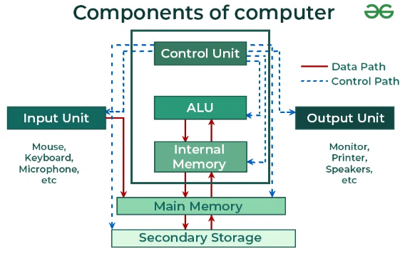  
Source : https://www.geeksforgeeks.org/computer-and-its-components/

#### RAM

**Random Access Memory (RAM)** is a type of memory used for temporary data storage while a computer is running. The CPU can access data in RAM much faster than it can access data from other types of storage, such as hard drives or solid-state drives (SSDs).

RAM is organized into a large number of memory cells, each of which can store a fixed amount of binary data (bits). These cells are arranged in a grid-like structure, with each cell having a unique address. This allows the CPU to directly access and retrieve data from any specific memory location in RAM, hence the term "random access."

A single memory cell in RAM stores a single bit of data, together will be combined to construct larger data size (8 bit = 1 byte).

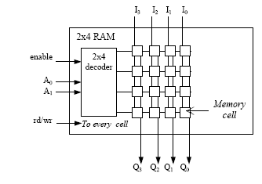  
Source : https://www.researchgate.net/figure/Fig3-internal-structure-of-RAM_fig2_328842382

#### ROM

**Read-Only Memory (ROM)** is the type of memory which is used for storing data that can only be read, it is considered as non-volatile memory. ROM is used to store permanent instructions or data that do not change over time or during the course of normal system operation.

ROM can be used for :

- **Bootstrap Loader** : It is the initial instruction for computer to boot or start up.
- **Firmware** : Firmware is software code embedded in hardware devices. It consists of basic machine instructions for hardware to do common task with other software in the device.
- **Embedded Systems** : Embedded systems are devices included with a dedicated computer systems to perform specific tasks or functions. They often rely on pre-programmed instructions stored in ROM to perform their intended functions.

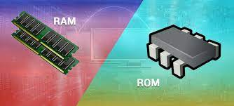  
Source : https://www.wawasanku.com/2023/01/RAM.html

#### Optical Drive

**Optical drive** is a hardware device used to store data (non-volatile) that utilizes laser technology (e.g., CD, DVD, Blu-ray). The surface of the disk is flat, a laser beam will be emitted from the optical drive onto the surface of an optical disc. The laser beam will be used to create the pits and bumps on the disc's surface. The drive's optical sensor detects the variations in the reflected light, interpreting them as binary data (0s and 1s) to read the stored information.

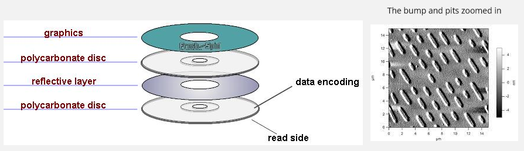  
Source : https://itec226pro.wordpress.com/component/cddvd/, https://commons.wikimedia.org/wiki/File:Afm_cd-rom.jpg

#### Flash Memory

**Flash memory** is another non-volatile storage device that uses electrical circuits to store and retrieve data (e.g., USB, phone memory cards). Flash memory are built of many transistors called **floating-gate transistors**, the presence or absence of electrical charges on the floating gate represents binary data. Typically, a charged floating gate represents a "0" bit, while an uncharged floating gate represents a "1" bit.

We can write to the memory by applying voltage to charge the floating gate, or erase by applying higher voltage to the control gate, which causes the trapped charges to return to the source or drain region of the transistor.

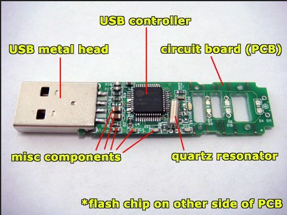  
Source : https://www.pinterest.com/pin/pen-drive-usb-component-diagram--366269382169975659/

#### HDD

**Hard Disk Drive (HDD)** is a type of non-volatile storage device that uses magnetic storage to store and retrieve digital data. It consists of a stack of spinning disks called **platters**, and each platter has a read/write head that moves across its surface to read and write data.

Data is stored on the disks in the form of tiny magnetic areas. When data needs to be saved, the write head magnetically changes the magnetic orientation of the corresponding areas on the disk to represent the data. When data is read, the read head detects the magnetic patterns on the disk and converts them into digital information.

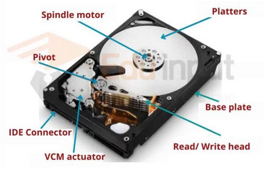  
Source : https://eduinput.com/hard-disk-drive-hdd/

#### SSD

**Solid-State Drive** (SSD) is the non-volatile storage device that uses flash memory instead of magnet to store digital data persistently. An SSD consists of multiple memory chips that store data electronically. These memory chips are made of **flash memory cells**, which can hold electrical charges to represent 0s and 1s, the basic building blocks of digital data.

The SSD controller act as the bridge between the memory chips and computer, it is the one that manages the storage and retrieval of data.

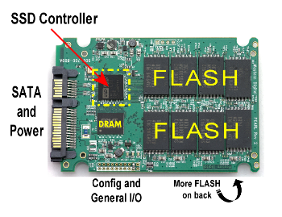  
Source : https://www.storagereview.com/ssd-controller

#### Power Supply

**Power supply** or **Power Supply Unit (PSU)**, is a device that provides electrical power to a computer or electronic system. It converts the available input voltage from a power source (such as a wall outlet) into the appropriate voltage and current levels required by the components within the system.

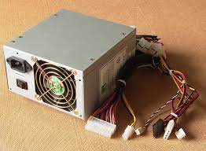  
Source : https://turbofuture.com/industrial/Basic-Elements-of-a-Power-Supply

#### RTC

**Real-Time Clock (RTC)** is the component on computers or other electronic devices that keeps track of time, even when the device is powered off or restarted. Under the hood, RTC uses a **quartz crystal oscillator**, it is a material that have the property of vibrating at a very precise and consistent frequency when an electric current is applied. The stable vibration is used as a reference for counting time. It may also consist a battery backup to ensure continuous timekeeping operation.

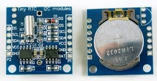  
Source : https://www.14core.com/starters-20-wiring-the-i2c-ds1307-real-time-clock-on-arduino/

#### Graphics Card

**Graphics card** is the hardware component in a computer that is responsible for rendering and displaying visual information on a monitor or other display devices.

GPU is the specialized CPU designed to handle complex calculations related to rendering graphics and images. It performs tasks such as geometry processing, texture mapping, lighting effects, shading, and rasterization.

GPU is specifically designed for parallel processing, it is able to perform complex calculation simultaneously, but it is worse than CPU for procedural processing. It has a dedicated high-speed memory which is the **video RAM (VRAM)** closer to the GPU cores. GPU utilizes small yet many cores, in contrast, CPU has less core but each core is more powerful.

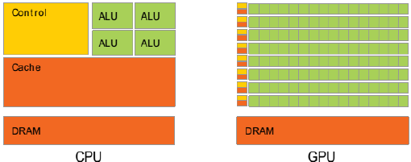  
Source : https://www.researchgate.net/figure/CPU-vs-GPU-Architecture_fig1_270222593

#### Sound Card

The **sound card** is a hardware component in computer that manages audio input and output. It is responsible for processing and producing sound, converting digital audio signals to analog signals for playback through speakers or headphones, and converting analog audio signals to digital format for recording or processing.

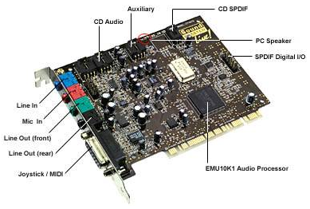  
Source : https://www.escotal.com/soundcard.html

#### Network Interface Card

**Network Interface Card (NIC)** or **network adapter**, is a hardware component that enables a computer to connect to a network. It provides the necessary physical interface and communication protocols for a computer to transmit and receive data over a network.

The NIC is physically connected with the computer through network port like [Ethernet](/computer-networking/ethernet). When the computer needs to send data over the network, it passes the data to the NIC. The NIC converts the digital data into appropriate electrical signals or radio waves, depending on the type of network medium being used (wired or wireless). Before the transmission, NIC also handles the protocols or the rules for transmitting data. It then transmits these signals over the network medium.

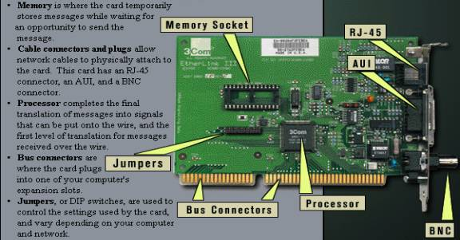  
Source : http://www.cs.uni.edu/~jacobson/secure/NICnacMAC.htm

#### Motherboard

**Motherboard** is the circuit board that connects various hardware components, allowing them to communicate and work together to form a functional computer system. It has the RAM slots for installing RAM, ports for I/O devices, connectors to storage, etc.

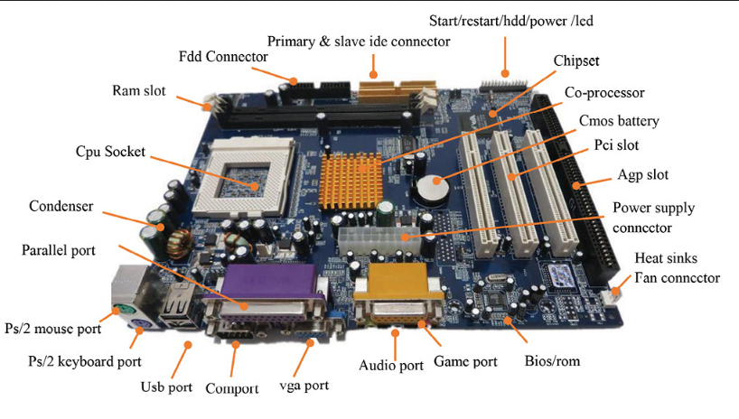  
Source : https://medium.com/@mitteam2021/computer-motherboard-and-its-components-8606f10dc08f

#### PCI

**Peripheral Component Interconnect (PCI)** is a standard connection interface on a computer motherboard that allows for extra hardware components or expansion cards to computer system. These expansion cards can include devices like graphics cards, sound cards, network adapters, and other peripherals.

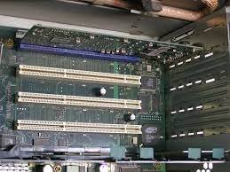  
Source : https://en.wikipedia.org/wiki/PCI-X

### Data Representation

Computer represent data in various way, to know more about it, see below notes :

- [Binary number system](/computer-and-programming-fundamentals/number-system#binary), includes how can we store and represent number with binary.
- [Binary representation](/computer-and-programming-fundamentals/binary-representation), includes binary operation.
- [Floating-number representation](/computer-and-programming-fundamentals/floating-number), includes how can computer represent real number.
- [Data representation](/computer-and-programming-fundamentals/data-representation), includes how computers represent data like character (e.g., ASCII, UTF), color, database.

### Terminology

#### Opcode & Operand

These two are related to the execution of program in CPU.

- **Opcode** : Opcode or operation code, is a specific operation or instruction in machine language that the CPU needs to execute. Examples of opcode include instruction like "add," which perform addition by taking value in a memory address or register.
- **Operand** : An operand is a value or a memory location that is operated upon by an instruction. It provides the data or the address on which the operation specified by the opcode will be performed. For example, in the instruction "add R1, R2, R3," R1, R2, and R3 are the operands, representing registers that hold the values to be added together.

#### Word Size

The CPU will execute instruction from memory, it will take some amount of data from the memory. The fixed amount of data that can be processed by CPU in one go is called **word**. The size of a word can vary, for example, word sizes can be 8 bits (1 byte), 16 bits (2 bytes), 32 bits (4 bytes), or 64 bits (8 bytes).

#### Endianness

**Endianness** refers to the ordering of bytes in a multibyte data type, such as integers or floating-point numbers, in computer memory. It determines how the bytes of a larger data value are stored and retrieved.

- **Big endian** : The most significant byte (the byte with the highest memory address) is stored first.
- **Little endian** : The least significant byte (the byte with the lowest memory address) is stored first.

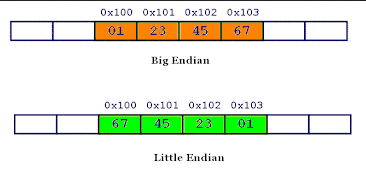  
Source : https://www.geeksforgeeks.org/little-and-big-endian-mystery/ (read from right to left)

#### Chipset

**Chipset** refers to a set of integrated circuits that are designed to control and manage the flow of data and signals between various components of a computer. The chipset acts as a bridge or interface between the CPU, memory, and other devices.

The high-speed communication for CPU, memory, graphics card is handled by **northbridge**, while the lower-speed for I/O devices is handled by **southbridge**.

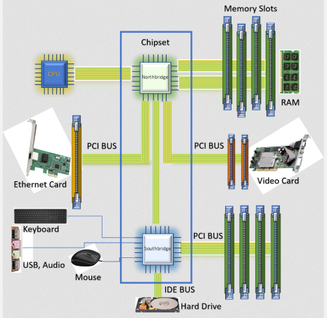  
Source : https://www.baeldung.com/cs/chipset

#### Architecture

Architecture is the overall design and organization of the hardware and software components that make up a computer system.

- **Processor Design** : It involves the design of how CPU is structured, how one component communicate with each other.
- **Memory Organization** : The organization of various memory components (main memory RAM, hard drives, etc.) in computer systems.
- **I/O System** : Determines how input and output devices are connected to the computer system and how data is exchanged between them. It includes interfaces, drivers, and protocols for interacting with peripherals such as keyboards, mice, displays, printers, and network devices.

#### BIOS / UEFI

**Basic Input/Output System (BIOS)** is a firmware stored in the [ROM](#rom) used to initialize hardware components during the boot process. Not only initializing, it also provides a text-based interface to interact with and configure basic settings of the computer's hardware components.

On the other hand, UEFI is a newer firmware interface that was introduced as a successor to BIOS. UEFI has more modern firmware architecture, it offers more advanced configuration, and uses a GUI for easier configuration.

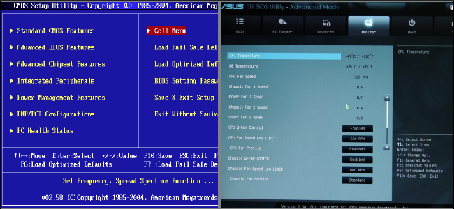  
Source : https://www.onlogic.com/company/io-hub/uefi-vs-bios-building-a-better-firmware/ (BIOS on the left)
