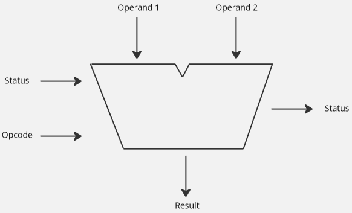
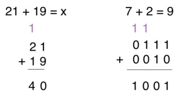
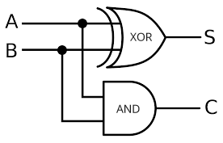
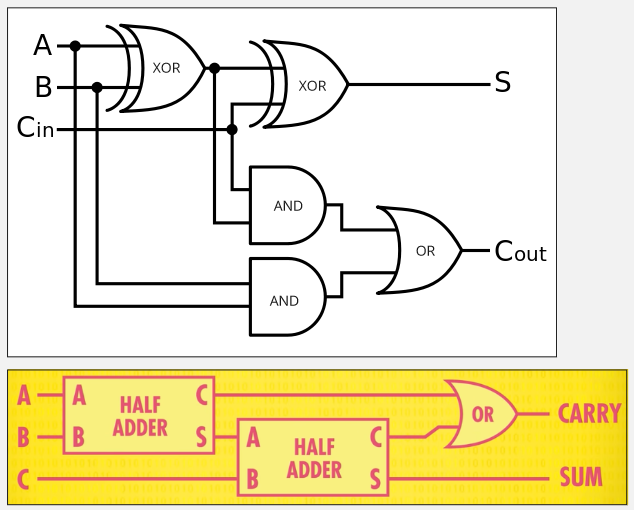
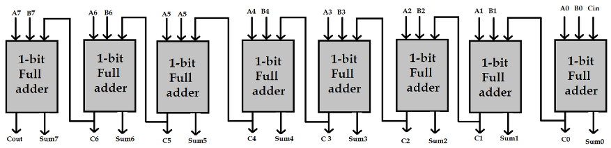

**Main Source :**

- **[How Computers Calculate - the ALU: - Crash Course Computer Science #5](https://youtu.be/1I5ZMmrOfnA?si=jFZSZjsoJQI8VMHc)**

**Arithmetic Logic Unit (ALU)** is the component of CPU that handles basic arithmetic operations such as addition, subtraction, multiplication, and division.

Computers, as we know, only understand binary data, represented by electrical signals in the form of 1s and 0s. When performing calculations, computers rely on [binary operations](/computer-and-programming-fundamentals/binary-representation#binary-operation) to manipulate this binary data. Computer will leverage [various logic gates](/computer-organization-and-architecture/logic-gates), which is based on [boolean logic](/computer-organization-and-architecture/boolean-logic) in order to carry out binary operations.

For example, consider an input electrical signal 1 followed by 0, and another input is 0 followed by 1. The first input, namely 1 and 0, will go through an [OR logic gate](/computer-organization-and-architecture/logic-gates), producing 1. The second input, 0 and 1, will go through another OR logic gate, producing 1 as well. The two result, which is 1 followed another 1, or "11", will represent 3 in binary number system.

What we have just done is doing an [addition operation on binary](/computer-and-programming-fundamentals/binary-representation#addition). The first input "10", which represent the number 2 in decimal, and the second input "01", which represent number 1, is added together by using the OR logic gate, producing 3.

:::note
This process essentially illustrate the [bitwise OR operation](/computer-and-programming-fundamentals/bitwise-operation#or)
:::

All of this process takes place in the ALU. The ALU takes input from the registers, which hold data temporarily, and performs operation based on the instruction from the [control unit](/computer-organization-and-architecture/control-unit). The ALU operates on binary data in the form of bits or bytes, it produces output based on the operation performed.

### ALU

#### Overview



:::note
The V-shape of ALU is just for illustration purposes.
:::

Input of ALU :

- **Operand** : ALU takes two input called [operand](/computer-organization-and-architecture/coa-fundamentals#opcode--operand), which represent the input binaries for operation to be performed.
- **[Opcode](/computer-organization-and-architecture/coa-fundamentals#opcode--operand)** : It is the instruction on what should ALU do based on the two operand.
- **Status** : Status provide information about the current status of ALU or the contextual information from the previous operations. The status is called a **flag**, it is obtained from a special registers called [status registers](/computer-organization-and-architecture/registers-and-ram#status-registers).

  Some common flags are :

  - **Zero Flag (Z)** : This flag is set when the result of an operation is zero. It is cleared when the result is nonzero.
  - **Carry Flag (C)** : This flag is set when there is a carry or borrow in arithmetic operations such as addition or subtraction.

      
    Source : https://knowthecode.io/labs/basics-of-digitizing-data/episode-8

  - **Overflow Flag (V)** : This flag is set when there is a signed overflow in arithmetic operations, meaning the result is too large or too small to be accurately represented with the available number of bits.
  - **Sign Flag (S)** : This flag reflects the sign of the result. It is set when the result is negative and cleared when the result is positive or zero.

Output of ALU :

- **Result** : Represents the result of the arithmetic or logical operation performed based on the input.
- **Status** : The status flag that may be generated from the current operation.

#### Arithmetic

##### Half Adder

The example we have done earlier, which is adding two binary using an OR logic gates will not work for all binary inputs. For example, when we have input of "01" (1 in decimal) and "11" (3 in decimal), if we use OR gates, we will produce "11", which still correspond to 3 in decimal. Notice that we didn't consider the carry that might have produced during the addition.

We will need to modify the behavior of the addition system. We will also consider the carry by using the carry status flag. So, performing addition on "1" with "1" should produce "0". The logic gate that will produce result of "0" when given input "1" and "1", is the [XOR gate](/computer-organization-and-architecture/boolean-logic#logic-gates).

Here is the table of XOR gate possible input and output :

```
A   B   S   C-out
-----------------
0   0   0     0
0   1   1     0
1   0   1     0
1   1   0     1
```

Where A and B is the input, S is the result, C-out is the carry output. Now, how can we implement this? To produce S, we can easily use XOR gate, but how would we produce the C-out? One way is to perform AND operation using AND gate on input A and B, it will produce 1 for carry only if both input are 1.

So, we will combine the XOR gate with AND gate, this is called **half adder**.

  
Source : https://id.m.wikipedia.org/wiki/Berkas:Half-adder.svg (with modification)

##### Full Adder

Notice that half adder doesn't consider the carry from the previous operation. To account for input carry, another circuit called **full adder** will be used. The full adder will be constructed by combining multiple half adder with additional OR gate.

The first half adder produces the sum S and carry C. The sum S will be inputted again to the next half adder, which takes a carry input C-in. It will produce another sum S, which is the actual sum produced. The C from first half adder will be combined with the C from the second half adder with an OR gate, producing the actual carry C-out.

  
Source : [top](https://id.m.wikipedia.org/wiki/Berkas:Full-adder.svg), [bottom](https://youtu.be/1I5ZMmrOfnA?si=1Y2BGY9L7TvSwRFL&t=265)

Summarizing the full adder, it will take 3 input, which is A, B, C-in, and produces output S and C-out :

```
A   B   C-in    S   C-out
---------------------------
0   0    0      0     0
0   0    1      1     0
0   1    0      1     0
0   1    1      0     1
1   0    0      1     0
1   0    1      0     1
1   1    0      0     1
1   1    1      1     1
```

##### Ripple Carry Adder

That full adder operates on a single bit binary numbers. To extend the concept to process a larger number of bits, we can combine multiple full adder.

For example, to create an 8-bit adder, we would need to combine eight full adders together.

  
Source : https://www.engineersgarage.com/vhdl-tutorial-21-designing-an-8-bit-full-adder-circuit-using-vhdl/

Each full adder still takes three input, which are A, B, and C-in, which can be the carry from the previous adder. The sum S from sum0 up to sum7 will be concatenated together at the end, producing the 8-bit binary number. The sum0 output represents the [least significant bit (LSB)](/computer-and-programming-fundamentals/binary-representation#least--most-significant-bit) of the sum, while the sum7 output represents the [most significant bit (MSB)](/computer-and-programming-fundamentals/binary-representation#least--most-significant-bit) of the sum.

This 8-bit adder is called **ripple carry adder**. The problem for this adder is, it is possible that the last adder produces a carry, which mean we will need to add that carry to the next column. However, we are using a limited 8-bit adder, we don't have that 9-bit column place. This problem is called **overflow**, which occur when we add or subtract number that are too large within our binary representation.

##### Other Operation

In fact, other operation such as subtraction, multiplication, and division can be performed with only addition operation.

- **Subtraction** : Subtraction, for example, (2 - 5), can be rewritten as (2 + (-5)), which is an addition operation. To represent the number (-5) in binary, we can use the [two complement representation](/computer-and-programming-fundamentals/binary-representation#two-complement).
- **Multiplication** : Multiplication can be performed using iterative addition, 2 × 3 is essentially just 2 + 2 + 2.
- **Division** : Division can also be implemented using iterative subtraction, 4 / 2 is 4 - 2. We will repeatedly subtract the divisor from the dividend until the remainder is less than the divisor.

#### Logic Unit

The logic unit in ALU performs various logical operations such as AND, OR, XOR, NOT on binary data.

For example, the logic unit is responsible for making logical decisions based on the results of the logical operations. We may use conditional statement (e.g., if input number is negative, then do A, else do B). We can use the logic unit to determine if input number is negative or not. To determine the sign of a number, we can check the [sign bit](/computer-and-programming-fundamentals/binary-representation#signed-magnitude) if it represents 1 or 0, using the AND gate.

We will assume that we are using the [two complement representation](/computer-and-programming-fundamentals/binary-representation#two-complement). The leftmost bit will be the sign bit, we will check the sign by doing the logical AND operation with some arbitrary binary number that has "1" as its leftmost bit, and "0" for the remaining bit. When the input is negative number "1\_\_\_" (the latter bit can be anything), doing the logical AND with binary "1000" will result in "1000", because the result is not 0, we can conclude that the sign bit is 1, indicating a negative number.

On the other hand, when the input is positive number "0\_\_\_", doing logical AND with binary "1000" will result in 0, which indicates a positive number.
