**Main Source:**

- **[Registers and RAM - Crash Course Computer Science #6 — CrashCourse](https://youtu.be/fpnE6UAfbtU?si=XGkAf7mO--sxmc3t)**
- **[What is a Register in a CPU and How Does it Work? — TOTALPHASE](https://www.totalphase.com/blog/2023/05/what-is-register-in-cpu-how-does-it-work/)**
- **Some Google searches**

**Registers & RAM** are important components in CPU, they serve as storage or memory for the CPU. Register is a smaller storage with higher speed that is suitable to hold intermediate result. While RAM is the larger storage with lower speed that is suitable to hold the program's data and instructions actively used by CPU during program's execution. Both memory is a type of volatile memory, it can only store data while the device is running.

Registers are the fastest form of computer memory, and they are directly accessible by the CPU. When doing arithmetic operation using [ALU](/computer-organization-and-architecture/alu), we will need place to store the intermediate result or to store other information such as carry temporarily. Registers is typically the place to store this. The ALU will receive important information such as status and operand from the registers.

### Latch

Latch is the simplest form of memory in digital electronics that capable of storing a single bit of information. A latch uses a combination of [logic gates](/computer-organization-and-architecture/boolean-logic#logic-gates) that works by having a **feedback loop**, that is when the output of a gate is connected back to one of its own inputs.

We can construct a latch using self-looping OR and AND gates. We will have two input, A and B, the A is our input, while B is the input from the output.

- **OR**:
  - When input A is 0, the output will be 0.
  - When input A is 1, the output will be 1. This output value will be fed back to input B, resulting in both inputs A and B being 1, and the overall output remaining 1.
  - If input A is changed to 0, the output will still be 1 because the feedback from input B keeps it at 1.
  - When we change input A to be 1, the output will still be 1, because we can't change the B. Therefore, the self-looping OR doesn't work, it stores the value 1 permanently, we can't use this as memory.
- **AND**: Similar to AND gate, when we start from input A and B as 1, the AND gate will produce 1. When we change the input A to 0, the logical AND between 0 and 1 will be 0, this will also change the input B. Now, whatever value we use as input for input A, it won't change anything, because the input B is permanently set to 0.

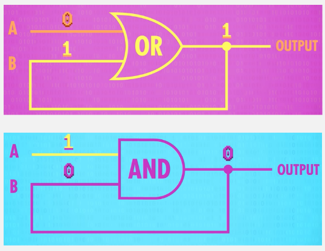  
Source: https://youtu.be/fpnE6UAfbtU?si=jzfY47w-VWxCkJXr&t=120

#### AND-OR Latch

We can use the combination of OR and AND gate with a NOT gate to create a fully functional memory called the **AND-OR latch**. We will have two input, one is "SET (S)" and the other is "RESET (R)".

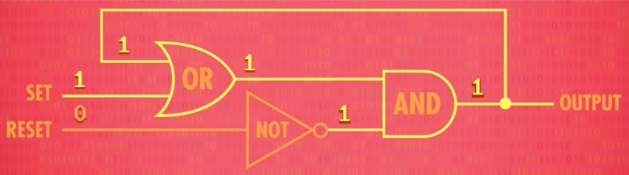  
Source: https://youtu.be/fpnE6UAfbtU?si=w3z481li5AWxMMpF&t=163

When we have input 1 for SET, it will produce 1 from the OR gate. The OR gate will send the output to the AND gate. The AND get will take another bit from the inverse of RESET input. Because 0 negates to 1, the AND gate will produce 1 as output, the output will be fed back to the input of OR gate. In conclusion, setting the SET to 1 effectively make the output as 1.

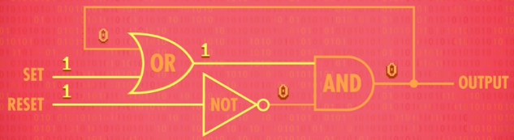  
Source: https://youtu.be/fpnE6UAfbtU?si=w3z481li5AWxMMpF&t=163

When the RESET is 1, it will be negated to 0 by the NOT gate, making the AND gate produces 0. In conclusion, setting the RESET to 1 effectively resets the output to 0. Doesn't matter if we have 0 as the SET.

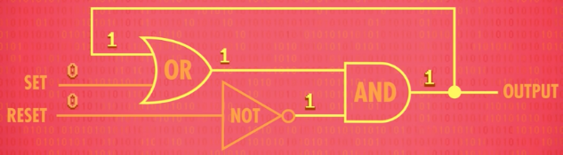  
Source: https://youtu.be/fpnE6UAfbtU?si=oo9ZqdgbPOLxIYWp&t=174

When the SET and RESET is 0, the output will be 0 or 1 depending on the last output. This is because the 0 in RESET will produce 1 from the NOT gate, therefore it all depends on the output of OR gate. If the last output is 1, the OR gate produces 1, and otherwise if the last output is 0.

The behavior of the output being the last output is what makes it possible to be used as memory. If we have 1 as the input for SET, this will effectively store value 1. As long as we don't set the RESET to 1, the output 1 remains in the latch. Only if we set the RESET to 1, the output will be reset.

#### Gated Latch

This AND-OR latch can be simplified so that it requires only a single input bit, either 1 or 0, which will be stored immediately. We will also have another input which determine if we are allowed to write to the memory.

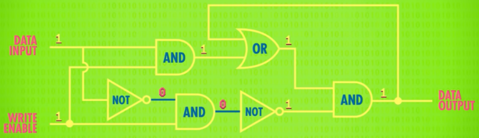  
Source: https://youtu.be/fpnE6UAfbtU?si=WfSlrlDVk_xY01hB&t=215

We will use two additional AND gates and another NOT gate. When we set the write to 0, this will effectively disable any write, because it will make the AND gate that takes input from DATA INPUT and WRITE ENABLE always produces 0.

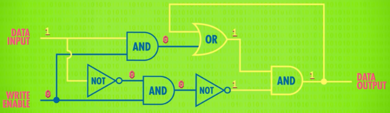  
Source: https://youtu.be/fpnE6UAfbtU?si=WfSlrlDVk_xY01hB&t=215

Simplifying the gated latch:

  
Source: https://youtu.be/fpnE6UAfbtU?si=RUoSfgxY7fr0jQ_U&t=255

The latch will store whatever the input is, only when the write is enabled. When the write is disabled, anything we do on the input data won't change the latch memory.

### Registers

A single latch can only store a single bit of information. A register is created by combining multiple latch. Registers have fixed size, it can range from 8 bits (1 byte) to 64 bits (8 bytes) or more, where each bit is stored by a single latch.

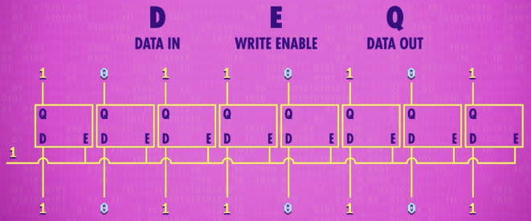  
Source: https://youtu.be/fpnE6UAfbtU?si=H-WxLU6burkepXJv&t=308

This is an example of 8-bit registers. The latches will be connected together within a single wire that will control whether the write is enabled or not. Each latch will take an input data and produce the output data, the concept is similar as gated latch. After inputting data to each latch, we successfully stored an 8-bit number.

#### Matrix Latch

In the 8-bit register above, we need 8 wire for each latch to take the input data and another 8 wire to produce the output data. We also need a single additional wire for the enabling or disabling the write.

In certain digital circuit designs, the latches are arranged in a grid-like structure to reduce the wire required to construct a single registers. The wire that will enable/disable write will be within every intersection in the grid. To enable a certain latch in the grid, the corresponding wire on the specific row and column must be 1. The circuit also uses additional AND gate to connect the wire with the internal latch.

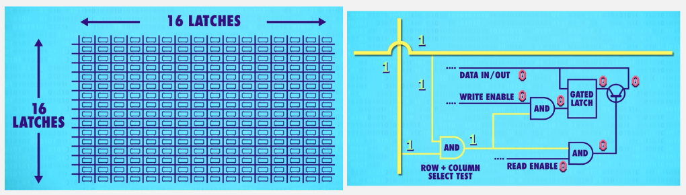  
Source: https://youtu.be/fpnE6UAfbtU?si=eoDWiptQiBjjYiqQ&t=349

In this structure, although we used additional wires just for enabling/disabling the write operation, we unified the wires for inputting data. The impact of enabling the write operation is limited to a specific row and column, leaving the other latches in the grid unaffected. So, instead of employing a single wire for enable/disable functionality, we opt for a single wire dedicated to data input.

#### Memory Address

In the grid structure, we can select certain latch by its corresponding row and column. If each latch were to have an address, just like memory, their address would be their corresponding row and column.

But remember, the number of row and column will also be encoded in binary format. For example, a latch in 4th column and 7th row would have address of "01000111", where 4 in binary is "0100" and 7 in binary is "0111". The address length of the grid should match the number of latches in the grid. In a 16×16 grid (256-bit memory) with 16 latches per row and column, an 8-bit address is needed. This consists of 4 bits for the row address and 4 bits for the column address.

When we have certain address and we want to get the latch, we will need something that handles the conversion. A **multiplexer** is a component we can use, it is a component that is commonly used to select and route different data inputs to the desired output. So, whenever we want to enable write and write data for a specific latch, we just input the memory address in form of binary to the multiplexer.

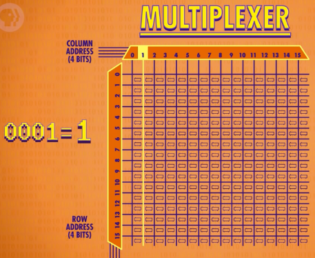  
Source: https://youtu.be/fpnE6UAfbtU?si=3eEYivxZm6Nfx-_C&t=487

#### RAM

The 16×16 grid memory can be simplified like below

  
Source: https://youtu.be/fpnE6UAfbtU?si=XDLNhZa1uqvkB82k&t=519

It will have address lines that should accommodate the 256 possible memory locations, the data lines for writing to the memory, and the read/write enable/disable functionality.

We can combine multiple instance of this 256-bit memory to construct a storage with larger capacity. We can arrange them the similar way of arranging latches to create a register.

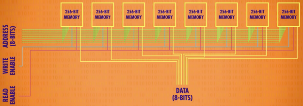  
Source: https://youtu.be/fpnE6UAfbtU?si=THw2caJKKBD2tiSt&t=550

Each of the eight individual 256-bit memories operates independently, with its own set of address lines, data lines, and read/write signals.

When accessing data from this 8 x 256-bit memory, the desired memory unit is selected, and the specific memory location within that unit is addressed using the address lines. Data can then be read from or written to the selected location through the corresponding data lines.

And then, together creating a unified memory system called **Random Access Memory (RAM)**.

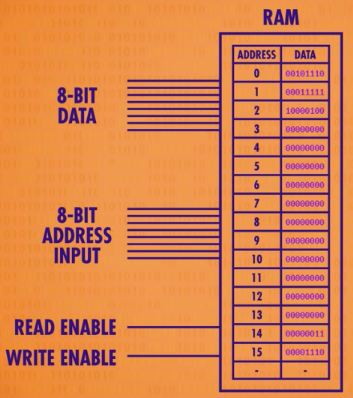  
https://youtu.be/fpnE6UAfbtU?si=WUJg36L_x4mABGrz&t=564

RAM can be constructed by combining each small registers, it can be thought as an array of registers. So, similar to registers, RAM will have sort of addressing, data lines, and read/write signals. They are constructed the same way, but they serve different purposes. RAM is a larger memory and typically used for more than just holding data temporarily during CPU operations.

For modern computers with larger memory, the number of addresses will increase as well. The number of available addresses determines the memory capacity of the RAM. For example, the A 32-bit RAM can address up to $2^{32}$ (4,294,967,296) unique memory locations, which translates to a maximum RAM capacity of 4 gigabytes (GB). In contrast, a 64-bit RAM can address up to $2^{64}$ (18,446,744,073,709,551,616) memory locations, allowing for a 16 exabytes (EB) storage or more.

When we say "32-bit computer", we are referring to the architecture of the system, which is the size of the memory addresses used by the computer's processor. So, a 32-bit computer would have maximum of 4 GB RAM, the processor will be able to address up to $2^{32}$ distinct memory locations.

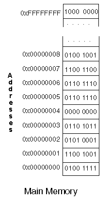  
Source: https://www.eecis.udel.edu/~davis/cpeg222/AssemblyTutorial/Chapter-10/ass10_2.html

:::note
Sometimes memory address is denoted by [hexadecimal number system](/computer-and-programming-fundamentals/number-system#hexadecimal). The prefix "0x" typically correspond to hexadecimal, while the prefix "0b" correspond to binary.
:::

##### Type of RAM

There are several types of RAM used in computer systems:

- **DRAM (Dynamic Random Access Memory)**: DRAM is the most common type of RAM used in modern computer systems. It is a volatile memory technology that stores each bit of data in a separate capacitor within an integrated circuit. The data stored in DRAM needs to be refreshed periodically to retain its information, by refreshing, it means restoring the charge in the capacitor. DRAM is relatively slower compared to other types but offers higher storage density and lower cost.

- **SRAM (Static Random Access Memory)**: SRAM is another type of volatile RAM that stores data using latch circuits. Unlike DRAM, SRAM does not require periodic refreshing, which makes it faster and more reliable. However, SRAM is more expensive and has lower storage density compared to DRAM. SRAM is commonly used in cache memory and as registers in CPUs.

- **SDRAM (Synchronous Dynamic Random Access Memory)**: Typically traditional RAM can't keep up with the CPU's processing speed, this results in a performance bottleneck. SDRAM is a type of DRAM that synchronizes its operations with the CPU's clock, offering the potential for improved performance. SDRAM is used as the main memory in most computer systems. Different variations of SDRAM include DDR (Double Data Rate) SDRAM, DDR2, DDR3, DDR4, and DDR5, with each generation providing increased data transfer rates and improved performance.

- **VRAM (Video Random Access Memory)**: (not to be confused with [virtual memory](/operating-system/memory-management#virtual-memory)) VRAM is a specialized type of RAM that is specifically designed for graphics processing. It is used to store graphical data required by the graphics card. VRAM is optimized for high-speed read and write operations and is capable of simultaneously providing data to the graphics card while refreshing the display.

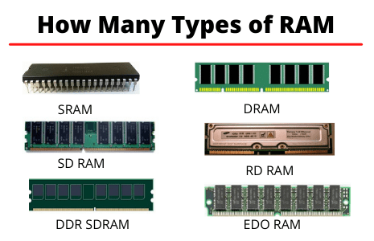  
Source: https://quicklearncomputer.com/types-of-ram/

#### Type of Registers

There are many types of registers:

- **General-Purpose**: They are versatile register that can be used for various purposes. Examples are **accumulator (AC)**, which is used to hold intermediate results during arithmetic and logical operations. Another is **data register (DR)**, used to store the operands and results of arithmetic and logical operations.
- **Specific-Purpose**: Registers that are dedicated for specific tasks.
  - **Program Counter (PC)**: Holds the memory address of the next instruction to be fetched and executed.
  - **Instruction Register (IR)**: Holds the current instruction being executed by the CPU. It temporarily stores the fetched instruction until it is decoded and executed.
  - **Address Register (AR)**: Hold memory addresses needed for data transfer between the CPU and memory. They are used to specify the source or destination memory addresses during data movements.
  - **Stack Pointer**: During program's execution, a [dedicated stack](/computer-and-programming-fundamentals/memory#stack) will be used to store function calls, local variables, intermediate data storage, etc. The stack pointer is the specific [pointer](/computer-and-programming-fundamentals/memory#pointer--reference) that points to the stack. Simply the register contains memory address for the program's stack.
- **Status Register/Flags Register**: Contains individual bits that represent the status or condition of the CPU after an operation. These bits may provide information about the [arithmetic operations in ALU](/computer-organization-and-architecture/alu), such as carry, overflow, zero, and sign indicators.

And many more…

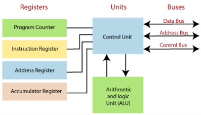  
Source: https://www.tutorialandexample.com/registers

### Memory Hierarchy

**Memory Hierarchy** is the arrangement and organization of different levels of memory in a computer system. The hierarchy consider factors such as cost, capacity, access speed, and latency.

- **Registers**: These are the fastest and smallest storage units located directly within the CPU. Registers hold data that the CPU is currently processing. They have the fastest access times but the smallest capacity.

- **Cache**: Cache memory is a small and fast memory located between the CPU and main memory. It stores frequently accessed data and instructions to reduce the time taken to access them from the main memory. Cache memory is divided into multiple levels, such as L1, L2, and sometimes L3, with each level having larger capacity but slower access times than the previous level.

- **Main Memory (RAM)**: Main memory, typically is RAM modules, is the primary storage used by programs and data during execution. It has larger capacity compared to cache memory but slower access times.

- **Secondary Storage**: Secondary storage devices, such as hard disk drives (HDDs) and solid-state drives (SSDs), provide non-volatile storage for long-term data storage. They have larger capacities than main memory but longer access times.

- **Tertiary Storage**: Tertiary storage refers to external storage devices, such as magnetic tapes or optical disks. They offer even larger capacities, but slower access times compared to secondary storage.

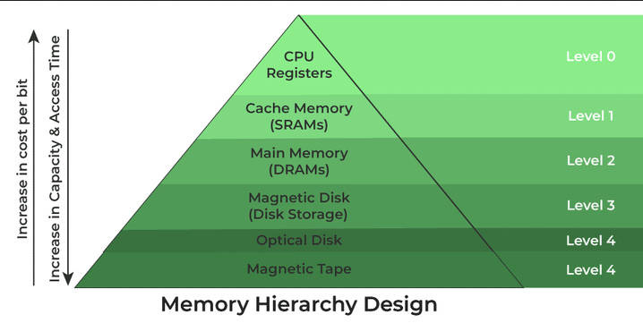  
Source: https://www.geeksforgeeks.org/memory-hierarchy-design-and-its-characteristics/
