**Main Source:**

- **[The Central Processing Unit (CPU) - Crash Course Computer Science #7 — CrashCourse](https://youtu.be/FZGugFqdr60?si=fv-igtfockfyfiRw)**
- **[Instructions & Programs - Crash Course Computer Science #8 — CrashCourse](https://youtu.be/zltgXvg6r3k?si=DZwDzYcoylBP47S7)**

**Control Unit** is the component of CPU that is responsible for coordinating and controlling the activities of the CPU. It fetches instruction from the memory, decode it or interprets the instruction and generates necesarry command and signals for ALU and other components such as the registers and I/O devices. The control unit is also responsible for managing time and synchronization between different component of CPU, ensuring that various operations, such as fetching, decoding, executing, and storing results, occur in the correct sequence and at the appropriate time.

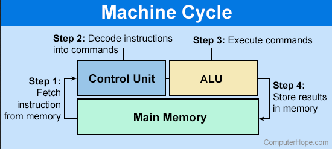  
Source: https://www.computerhope.com/jargon/c/contunit.htm

### Instruction

Everything is binary in computer, to instruct the CPU to do anything, you would need an instruction in binary format. Instruction are defined in structured way, an instruction should have the opcode, or operation code, which is a binary code that represent a specific operation or instruction to be executed by the CPU. You would also need operand fields, and specify memory address or register to identify the location of the data or the operand involved in the instruction's operation.

During execution, the CPU may use various [type of registers](/computer-organization-and-architecture/registers-and-ram#type-of-registers), such as the **instruction register** to hold the current instruction being executed by the CPU.

The specification of an instruction for a CPU is typically defined in a table called **instruction table**. It contains opcode values, along with a description of the operation, the number and type of operands, and any specific addressing modes or flags associated with the instruction.

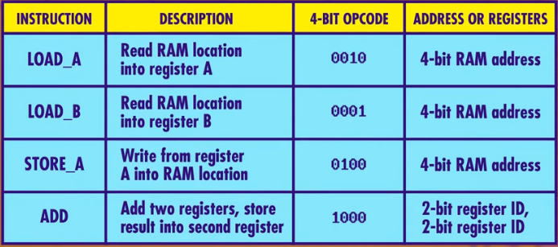  
Source: https://youtu.be/FZGugFqdr60?si=Fz5CKRSen9_BXhDu&t=116

#### Fetch-Decode-Execute Cycle

The CPU executes instruction in a cycle, it goes through three main steps: fetch, decode, and executes. During execution, all the registers will be initialized as 0. The RAM will be used to store the program's instruction and data.

1. **Fetch**:

   - The program counter (PC) (or **instruction address register (IAR)**) register will take an address from the RAM, it will be the memory address of the next instruction to be fetched.
   - The CPU fetches the next instruction from PC.
   - The control unit sends a request to the memory subsystem to retrieve the actual instruction at the address specified by the PC.
   - The fetched instruction, stored in the instruction register (IR), is transferred from memory to the CPU.

   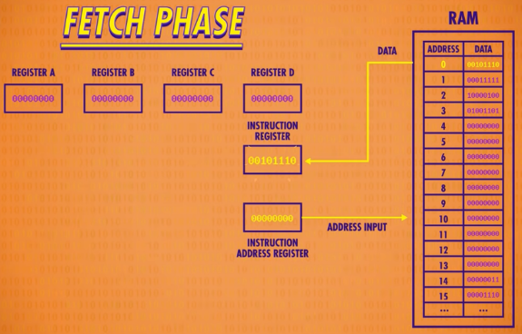  
    Source: https://youtu.be/FZGugFqdr60?si=toaAfVEe9Y676Thc&t=175

2. **Decode**:

   - The control unit decodes the fetched instruction in the IR to determine the operation or task specified by the opcode, along with the memory address or register address if it involve reading/writing to the RAM/registers.
   - The control unit identifies the type of instruction, such as an arithmetic operation, data movement, control flow, or input/output.
   - The specific circuit implemented will vary depending on the instruction, there will be so much logic gates just to determine if it's a specific instruction.

   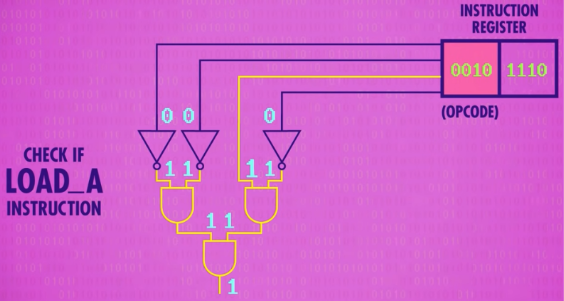  
    Source: https://youtu.be/FZGugFqdr60?si=Tid_16t53px3sCvU&t=212

3. **Execute**:

   - The control unit generates control signals based on the decoded instruction. These signals coordinate the activities of various components within the CPU to execute the instruction.
   - If the instruction involves memory access, the control unit coordinates the transfer of data between registers and memory, either for loading or storing data (e.g., enabling write and storing the input data).
   - If the instruction involves data manipulation, the control unit directs the ALU (Arithmetic Logic Unit) to perform the specified arithmetic or logical operation.
   - If the instruction involves control flow, such as branching or jumping, the control unit determines the next instruction to be fetched based on the outcome of the control flow instruction.

   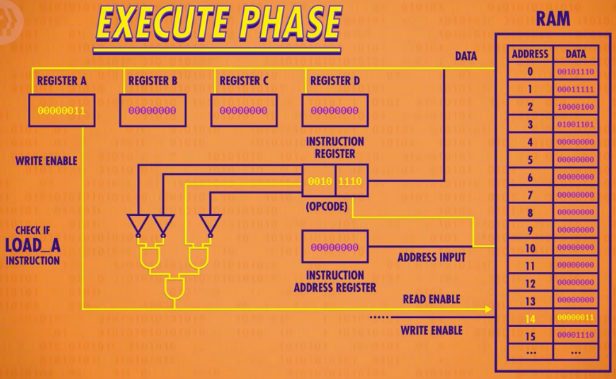  
   Source: https://youtu.be/FZGugFqdr60?si=EaMWcLHwVHvK6s7R&t=248

   In the image above, the LOAD_A instruction tells us to read or load specific address from the RAM and write it to register A.

   The control unit can be abstracted as follows:

   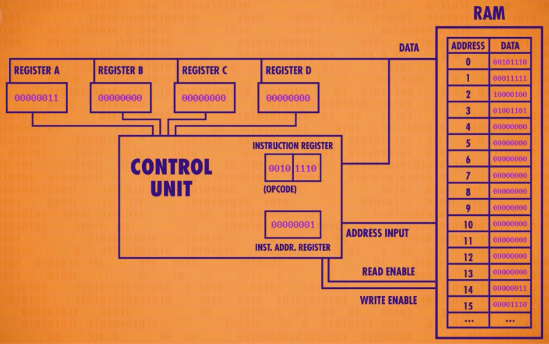  
   Source: https://youtu.be/FZGugFqdr60?si=AYgrxk0nBWGUGVfP&t=281

   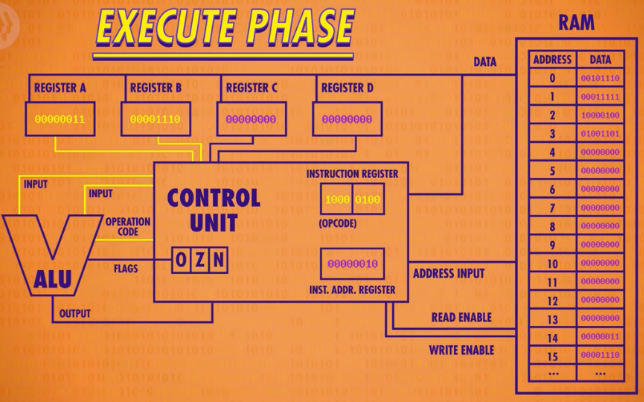  
   Source: https://youtu.be/FZGugFqdr60?si=po5Qm1YG2UPzX5Ur&t=410

   The interaction between control unit and [ALU](/computer-organization-and-architecture/alu), it performs the arithmetic or logical operation according to the control signals and operand received from the control unit. Here's a common example:

   1. First, some binary data (number) is loaded into the register A, using the LOAD_A instruction.
   2. Another binary data is loaded into the register B, using the LOAD_B instruction.
   3. The two number form register A and register B will be added in the ALU, using the instruction ADD.
   4. The result will be stored in some RAM location, using the instruction STORE_A.

#### Clock Cycle

During the fetch-decode-execute cycle, the control unit will utilize a clock. The clock will produces a regular series of electrical pulses, known as **clock cycles**, which represents a discrete unit of time. The purpose of timing between cycle is to ensures that operations within the CPU are executed in a controlled and synchronized manner (e.g., accessing register before we even write onto it).

The clock cycle or clock rate is measured in Hertz (Hz) per second. It determines the speed at which the CPU processes instructions and carries out operations, where higher clock rates generally result in faster execution.

A single fetch-decode-execute cycle is counted as one instruction cycle, which can execute in multiple clock cycle.

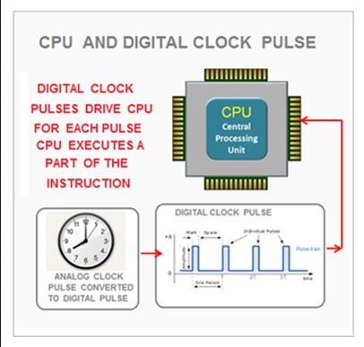  
Source: https://www.learncomputerscienceonline.com/control-unit/

:::tip
A term called **overclocking**, which mean we are configuring our CPU, GPU, or RAM at a higher clock speed than the default settings. The purpose is to achieve higher processing speed.
:::

#### Interrupt & Exception Handling

Control unit is also responsible for handling interruption and exception during program's execution.

Interrupt is a signal that indicates the occurrence of an event that requires the CPU's immediate attention. Interrupts can be generated by various sources, such as devices (e.g., keyboard, timer), external signals, or software-generated events.

When an interrupt happen, the control unit will suspends the execution of current instruction and will transfers control to an **interrupt handler routine**, it is the component that is responsible for handling interrupt event. The control unit will also saves the execution context, including the relevant registers such as the PC. After the handler completes the handling, control unit will continue the execution of the program with the saved context.

Exceptions are unwanted event during program's execution, it will need special handling from **exception handler**. Similar to interruption, the control unit will save the execution context and transfers the control to the exception handler. Once the exception handling is completed, the control unit continue the program's execution.

#### More Instructions

There are still many instructions that computer can execute, it is to handle more complex situation that occurs in a program. There are many more operations such as jump, halt, condition, looping, etc.

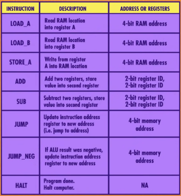  
Source: https://youtu.be/zltgXvg6r3k?si=EXDRnkb43OL_tda1&t=201

- **Halt**: The halt instruction is used to explicitly terminate the execution of a program or a specific section of code. It is very important to halt when your program is done executing, to indicates a program has completed its tasks and ready to exit.
- **Jump**: Also known as goto statement, is an instruction that doesn't continue with the normal sequential flow. You can transfer control to a different part of program, such as "jumping" to specified memory address. Jumps are used to implement [control flow](/computer-and-programming-fundamentals/programming-concepts#control-flow)
- **Condition**: Condition is anything that refer to expressions or logical statements that evaluate to either true or false. They are used to make decision within program, typically to implement the [if-statement](/computer-and-programming-fundamentals/programming-concepts#conditional-statement). Conditional statement will involve logical operation, such as checking if some number greater than other number using various [logic gates](/computer-organization-and-architecture/boolean-logic#logic-gates).
- **Looping**: Looping is the act of repeating an instruction multiple times, it is used to implement loop statement like [for-loop](/computer-and-programming-fundamentals/programming-concepts#for-loop) and [while-loop](/computer-and-programming-fundamentals/programming-concepts#while-loop). Instead of repeating certain task several times, loops allows us to automate it. Looping typically uses jump to enable non-sequential execution and simulate looping behavior.

##### Example

1. LOAD_A 14: Load the number 1 from the memory address 14 in RAM, store it in the register A.
2. LOAD_B 15: Load the number 1 from the memory address 15, store it in the register B.
3. ADD B A: Add together register B and register A, resulting in 2, store the result in register A.
4. STORE_A 13: From register A, store the value to memory address 13.
5. JUMP 2: Jump to the memory address 2, the memory address 2 contains the instruction ADD B A, we are going to do it again the similar way.

This behavior may be repeated forever, because we keep jumping, adding, storing without any condition on when this will end.

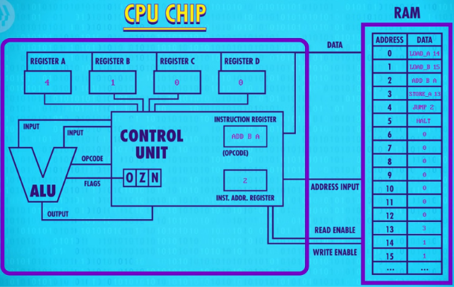  
Source: https://youtu.be/zltgXvg6r3k?si=WpIfH9GUWfWehoz2&t=295

We will need to modify so that the jump statement should not be executed at some point. We can utilize a conditional jump statement, JUMP_NEG, which means we are only going to jump if the number on the registers is negative. Furthermore, we will also subtract the number on registers instead of adding them. This will effectively create a loop where we are going to subtract the number until they are negative.

1. LOAD_A 14, LOAD_B 15: Load number from memory address 14 and 15 to register A and B, respectively.
2. SUB B A: Subtract the number on register B with register A, store the result in register A.
3. JUMP_NEG 5: If the number on register A is negative, jump to address 5, else continue sequential execution.
4. JUMP 2: Because the number is not negative, we will continue to the next instruction, which is to jump to address 2.

This will be repeated until the number on register A is negative.

5. JUMP_NEG 5: After register A is negative, we will jump to address 5.
6. STORE_A 13: Store the number from register A to the address 13.
7. HALT: Stop the program.

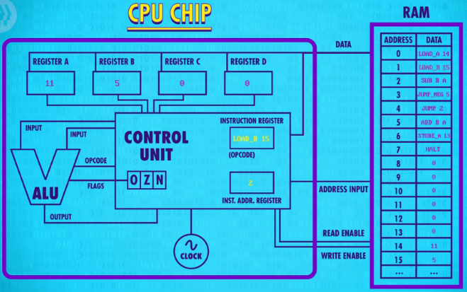  
Source: https://youtu.be/zltgXvg6r3k?si=1Nn9-95QfB123WYP&t=335
