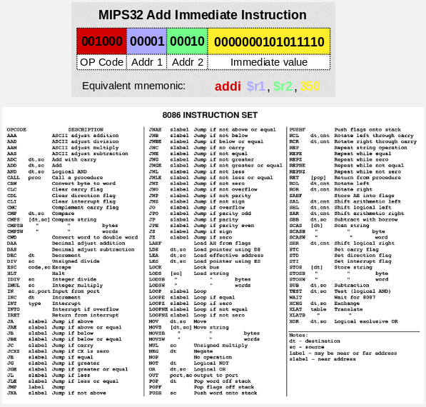
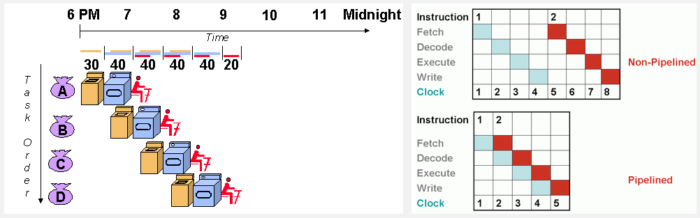
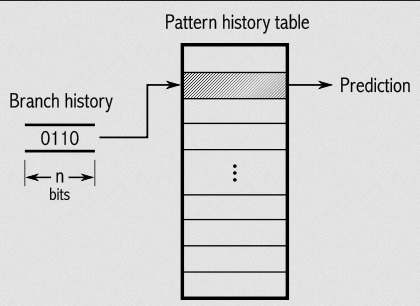
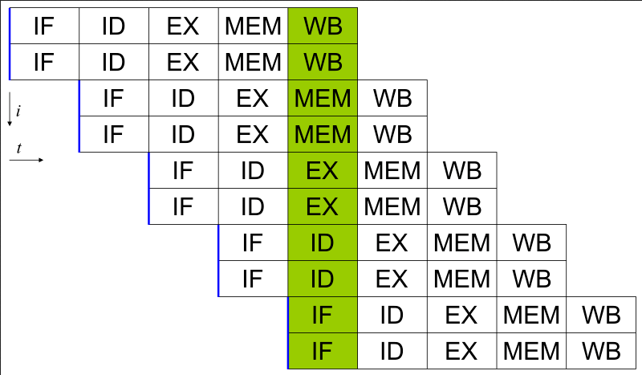
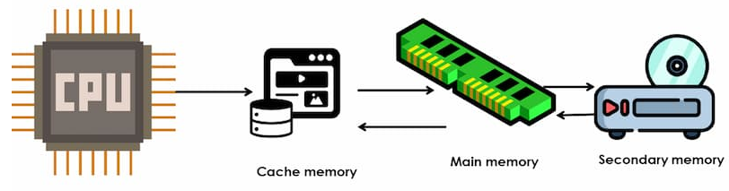
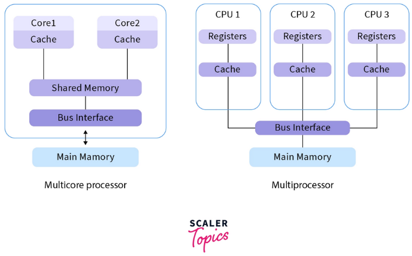

**Main Source :**

- **[Advanced CPU Designs - Crash Course Computer Science #9](https://youtu.be/rtAlC5J1U40?si=wae6I4lznG73wuzx)**
- **[Instruction pipelining - Wikipedia](https://en.wikipedia.org/wiki/Instruction_pipelining)**
- **[Microarchitecture - Wikipedia](https://en.wikipedia.org/wiki/Microarchitecture)**
- **Various Google searches**

There are many things to consider when designing a CPU, such as, in what format should the instructions be, how will each component talk to each other, how will the circuit be structured to lead an efficient execution of instructions, various technique will be employed to facilitate efficient execution of instructions.

### Instruction Set

**Instruction Set** is a collection of instructions that CPU can execute. Instruction set is very important to implement the CPU, it will include the format of the instruction.

  
Source : [top](https://en.wikipedia.org/wiki/Instruction_set_architecture), [bottom](http://mayurkalablogs.blogspot.com/2012/02/8086-instruction-set.html)

An instruction may contain :

- **Opcode** : The operation code or the type of instruction to be executed, such as adding number, subtracting, loading data from memory, etc.
- **Operand** : They are the data or values on which the instruction operates. They can be registers, or memory addresses.
- **Addressing Modes** : Specify how the operands are going to be accessed, we can provide a register that contains the operand, provide the operand from the memory, or even include a value directly (called **immediate value**).

### Microarchitecture

**Microarchitecture** is the implementation and design of the internal components and structures of the CPU. It focuses on how the CPU executes instructions, manages data, and performs computations at the hardware level.

#### Pipelining

Pipeline is the technique used to improve the performance of processors by overlapping the execution of multiple instructions. It is known as achieving parallelism on the instruction-level. The execution of instruction is broke down into a series of smaller stages to enable the concurrent processing of multiple instructions.

In pipeline, stage is often divided by 5 :

1. **Instruction Fetch (IF)** : First stage is to fetch an instruction from memory, typically from the [program counter (PC)](/computer-organization-and-architecture/registers-and-ram#type-of-registers).
2. **Instruction Decode (ID)** : Fetched instruction is decoded, also fetch the operand and register allocation if required.
3. **Execution (EX)** : Stage that executes the instruction.
4. **Memory Access (MEM)** : If the instruction requires memory access, this stage will handle the operation.
5. **Write Back (WB)** : Final stage that will write the result of the instruction execution to the appropriate registers or memory locations.

The pipeline stages work in parallel, meaning while one instruction is progressing through a stage, the next instruction is entering the pipeline and moving to the subsequent stage. The overlap between instruction execution allows multiple instructions to be processed simultaneously.

  
Source : [left](https://cs.stanford.edu/people/eroberts/courses/soco/projects/risc/pipelining/index.html), [right](https://stackpointer.io/hardware/how-pipelining-improves-cpu-performance/113/)

Pipelining can be likened to doing laundry. Instead of waiting for the washing machine to complete the entire wash cycle before using the dryer, we can start washing a portion of the clothes and transfer the already washed portion to the dryer. This approach enhances the efficiency of the laundry process by overlapping washing and drying tasks, similar to execution of tasks in CPU.

However, problems may happen during the pipeline process, these are called **hazards**.

- **Structural Hazards** : Arise when multiple instructions require the same hardware resource simultaneously. It's when two instructions need to access the same functional unit or register simultaneously.
- **Data Hazards** : Occur when an instruction depends on the result of a previous instruction that is not yet available. Data hazards can be further classified into three types : **read-after-write (RAW)**, **write-after-read (WAR)**, and **write-after-write (WAW)**.
- **Control Hazards** : Arise due to conditional branches or jumps that affect the sequential execution of instructions. Control hazards occur when the outcome of a branch or jump instruction is not known in the early stages of the pipeline, causing a potential misprediction. For example, we didn't know that some expression returns false, yet we keep executing the branch that only needs to be executed when the expression returns true.

#### Forwarding

**Forwarding** is the technique to mitigate data hazards, it will bypass the normal data flow and directly forward the necessary data from the producing instruction to the dependent instruction, avoiding the need to wait for the data to be written to a register or memory.

#### Out-of-order Execution

This technique dynamically order and execute instruction based on their availability of operands, rather than strictly following the sequential order of the program.

#### Prediction

**Prediction** is the technique to make educated guesses or predictions about future events, such as the outcome of a branch instruction or the behavior of memory accesses.

Many techniques to predict which branch will likely to be executed, one of them is having a branch history, we can store the history of branch outcomes seen during program execution.

Another use of prediction is to predict the outcome of memory access instructions (loads and stores) in order to optimize the handling of memory dependencies. The speculation can be based on many principles, such as, temporal, which suggests that if a memory location is accessed once, it is likely to be accessed again in the near future. Another is spatial principle, which suggests that if a memory location is accessed, nearby memory locations are also likely to be accessed in the near future.

  
Source : https://en.wikipedia.org/wiki/Branch_predictor

#### Superscalar

Superscalar is an instruction-level parallelism that allows the execution of multiple instructions in parallel within a single clock cycle. It can be employed with pipelining, where each stage of the pipeline can handle multiple instructions simultaneously.

  
Source : https://en.wikipedia.org/wiki/Superscalar_processor

#### Cache & Memory

Memory is the place for storing data and instructions that are actively used by the CPU during program execution. The commonly used memory for random access is the RAM.

Depending on the hardware architecture, the RAM placement can vary. Often times, accessing data from RAM can introduce delay. **Cache** is a small and fast memory component that sits between the CPU and main memory.

Cache typically organize the structure of their memory for more efficient retrieval of data. It may operate on the principle of locality, the temporal locality (recently accessed data is likely to be accessed again) and spatial locality (data located near recently accessed data is likely to be accessed soon).

  
Source : https://www.cloudeka.id/id/berita/web-dev/apa-itu-cache-memory/

:::tip
More about [caching](/backend-development/caching), some may relate to backend development. It includes type of caching, cache invalidation, cache replacement. Also, more about [computer memory](/computer-organization-and-architecture/computer-memory).
:::

### Performance Evaluation

Many aspects and metrics are used to evaluate the performance in CPU design :

- **Instruction Execution Time** : This metric measures the time taken to execute a single instruction or a sequence of instructions.
- **Instruction Throughput** : Refers to the number of instructions executed per unit of time (e.g., each clock cycle).
- **Clock Frequency** : Determines the rate at which instructions are executed. Higher clock frequencies generally lead to faster instruction execution, but they come with trade-offs such as increased power consumption and heat generation.
- **Cycles Per Instruction (CPI)** : CPI measures the average number of clock cycles required to execute one instruction. A lower CPI indicates better efficiency and shorter execution times.
- **Cache Performance** : Evaluating cache performance involve measuring how useful our cache is. For example, how many times have we used the cache (cache hit), how many times the cache doesn't have data we need (cache miss).
- **Branch Prediction Accuracy** : The accuracy of branch prediction, branch instructions are important because they significantly impact CPU performance.

### Multiprocessing & Parallel Computing

Multiprocessing is the technique that utilize multiple processors or CPU cores to execute multiple tasks or processes concurrently. It involves dividing the workload among the processors or cores to achieve parallel execution, thereby improving overall system performance and efficiency.

**Multicore** is when a single CPU contains multiple cores or multiple processing unit. These cores are typically identical and share the same resources. Each core execute instructions independently and perform computational tasks concurrently.

While **multiprocessor** is when a system consists of multiple independent processors, each with its own instruction execution capabilities, registers, cache, and memory subsystem. These processors can be housed on a single chip or on separate chips, interconnected via a system interconnect, such as a shared bus or a high-speed interconnect.

  
Source : https://www.scaler.com/topics/operating-system/difference-between-multicore-and-multiprocessor-system/

Overall, the primary difference is about how they share resources.

Multiple unit of processing in hardware-level plays a role for concurrency in the software-level. [Threading](/computer-and-programming-fundamentals/concurrency-and-parallelism#process--thread), is implemented in the hardware-level by having specific hardware that capable of processing concurrently, and utilized in the software-level by operating system to schedule their execution.
