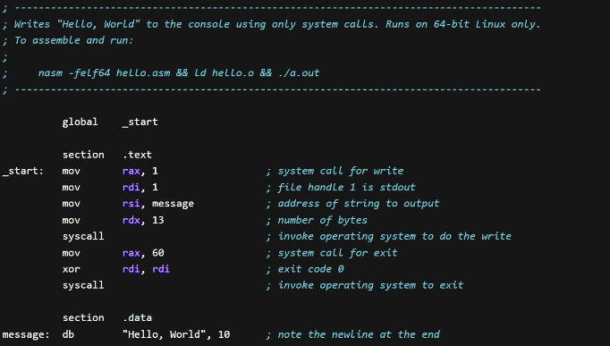

**Main Source :**

- **[Assembly language - Wikipedia](https://en.wikipedia.org/wiki/Assembly_language)**
- **[Assembly Language in 100 Seconds - Fireship](https://youtu.be/4gwYkEK0gOk?si=faihHjHQNrGx28NV)**

**Assembly Language (asm)** is a low-level programming language that is between the machine code (binary instructions understood by the computer's hardware) and high-level programming languages (which is readable by humans). asm is a human-readable representation of machine code instructions, programmers can see the code that interacts directly with the computer's hardware.

Due to the direct interaction with the hardware, asm is specific to a particular computer architecture or processor family. Different processors have their own assembly languages, tailored to their instruction sets, registers, and addressing modes. Therefore, code written in assembly language is not portable across different hardware platforms without modification.

  
Source : https://www.investopedia.com/terms/a/assembly-language.asp

### Translatation to Machine Code

Assembly language uses mnemonic instructions, which are short and easy to remember symbol that represent a single instruction in the machine.

Once assembly language is written, it needs to be translated into machine code, this process is known as **assembly** or **assembling**. An assembler is used to convert the mnemonic instructions and symbolic names into the binary instructions understood by the target processor. The assembler looks up on the instruction table how the mnemonic instructions map to the binary codes. It will also perform other necesarry steps, such as, calculating memory addresses, combining the instruction with the operands, etc.

Assembly language also provide a way for programmers to define instruction that are not executed by the processor but provide instructions to the assembler, they are called **directives**. They help programmer to organize and control the assembly code. Also, in some cases, assembly programs may require multiple source files or external libraries that need to be linked together. This process is called **linking**, it is necesarry to resolve references to symbols and ensures that all required components are properly integrated.

  
Source : https://users.ece.utexas.edu/~valvano/assmbly/index.html

### Instruction

The commons types of instruction in assembly language :

- **Data Movement Instructions** : These instructions move or copy data between registers, memory, and I/O devices.
- **Arithmetic and Logic Instructions** : These instructions perform arithmetic operations such as addition, subtraction, and multiplication; and logical operations such as bitwise AND, OR, NOT, and XOR on data.
- **Control Flow Instructions** : These instructions control the flow of execution within a program. Examples include changing program flow with or without a condition, or jumping to specific part of program after a function finishes its execution.
- **Input/Output Instructions** : These instructions facilitate communication between the processor and I/O devices.
- **Stack and Memory Management Instructions** : These instructions manipulate the stack (adding or removing values) and manage memory operations such as allocating and deallocating memory.

### Syntax & Instructions

Assembly code is typically written line by line, with each line representing a single instruction. Assembly code is divided into several section, there are section for code, which contains the actual logic of the program, section to declare variable and constants, and defining linker.

There are many instruction keyword in asm :

- **Instructions**

  - **MOV (Move)** : Copies the value from one location to another. It is used to transfer data between registers, memory locations, and immediate values.
  - **ADD (Addition)** : Performs addition between two values and stores the result.
  - **SUB (Subtraction)** : Performs subtraction between two values and stores the result.
  - **MUL (Multiplication)** : Performs multiplication between two values and stores the result.
  - **DIV (Division)** : Performs division between two values and stores the quotient.
  - **INC (Increment)** : Increments the value of a register or memory location by 1.
  - **DEC (Decrement)** : Decrements the value of a register or memory location by 1.

- **Bitwise Operations**

  - **AND (Bitwise AND)** : Performs a bitwise AND operation between two values.
  - **OR (Bitwise OR)** : Performs a bitwise OR operation between two values.
  - **XOR (Bitwise XOR)** : Performs a bitwise XOR operation between two values.

- **Registers**

  - **AX, BX, CX, DX, EBX (general-purpose registers)**
  - **AL (accumulator low)**
  - **EAX (extended accumulator)**
  - **SP (stack pointer)**
  - **BP (base pointer)**
  - **SI (source index)**
  - **DI (destination index)**
  - **IP (instruction pointer)**
  - **FLAGS (flags register)**

- **Control Flow**

  - **CMP (Compare)** : Compares two values and sets the flags based on the result.
  - **JMP (Jump)** : Transfers program control to a specified location in the code.
  - **JZ (Jump if Zero)** : Jumps to a specified location if the zero flag is set.
  - **JNZ (Jump if Not Zero)** : Jumps to a specified location if the zero flag is not - set.
  - **JE (Jump if Equal)** : Jumps to a specified location if the equal flag is set.
  - **JNE (Jump if Not Equal)** : Jumps to a specified location if the equal flag is not - set.
  - **CALL (Call)** : Calls a subroutine or function at a specified location. This instruction actually include jumping to the function address and leaving a return address for the stack pointer to return after the subroutine is finished.
  - **RET (Return)** : Returns from a subroutine to the calling code.

- **Stack Operations**

  - **PUSH (Push)** : Pushes a value onto the top of the stack.
  - **POP (Pop)** : Removes a value from the top of the stack.

- **Directives**

  - **DB (define byte)**
  - **DW (define word)**
  - **DD (define doubleword)**
  - **DQ (define quadword)**

- **Data Types**

  - **BYTE** : A single byte of data
  - **WORD** : 16-bit value or two bytes of data.
  - **DWORD** : 32-bit value or four bytes of data.
  - **QWORD** : 64-bit value or eight bytes of data.

#### Example

Example of asm code for adding two number

```assembly
section .data
    num1 db 5     ; Define a variable called num1, which is a byte and has the value of 5
    num2 db 3     ; Define a variable called num2, which is a byte and has the value of 3

section .text
    global _start
_start:
    ; Load the first number into a register
    mov al, [num1]

    ; Add the second number to the first number
    add al, [num2]

    ; Store the result in another variable
    mov [result], al

    ; Exit the program
    mov eax, 1       ; System call number for exit
    xor ebx, ebx     ; Exit status code (0 for success)
    int 0x80         ; Perform the system call

section .data
    result db 0      ; Variable to store the result
```

The syntax is typically `<instruction> <operand1> <operand2>`, where operand can be a register, which is specified by its name, or immediate value.

The `section .data` is a section directive to define and initialize data such as variables, constants, and strings. The `section .text` is the section for program's executable instructions. `_start` is a label that marks the entry point of the program.

### Calling Convention

stack, register
