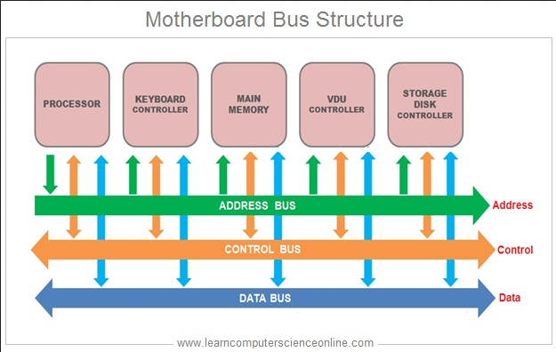
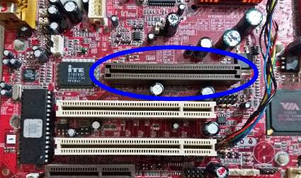

**Main Source :**

- **[System bus](https://en.wikipedia.org/wiki/System_bus)**
- **[Von Neumann architecture - Wikipedia](https://en.wikipedia.org/wiki/Von_Neumann_architecture)**

**Von Neumann architecture** is a fundamental computer architecture design, which consists of CPU including control unit and ALU, memory unit, and input/output devices.

### System Buses

**System buses** is an important component in computer system. It's primary function is to provide a communication pathway used to transfer data, instructions, and control signals between the components of a computer system. It serves as a physical connection that allows different hardware components to interact and exchange information.

The system bus combines several other buses :

- **Data Bus** : The data bus carries the actual data being transferred between components. It is bi-directional, meaning it can transmit data in both directions. The width of the data bus determines the amount of data that can be transferred simultaneously.
- **Address Bus** : The address bus is responsible for transmitting memory addresses. It carries the location information of data or instructions in the system's memory. The width of the address bus determines the maximum addressable memory capacity.
- **Control Bus** : The control bus carries control signals that coordinate and synchronize the activities of various components in the system. It includes signals such as read/write signals, interrupt signals, clock signals, and bus control signals.

  
Source : https://www.learncomputerscienceonline.com/computer-bus/

  
Source : https://winstartechnologies.com/introduction-to-computer-bus/

### Architecture
